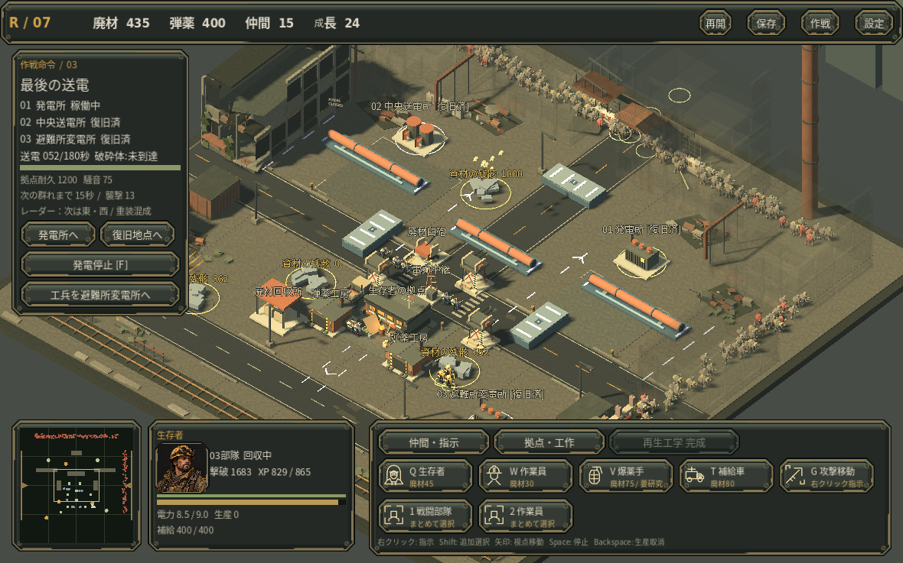

# RECLAMATION

オルタ湾復旧作戦。Godot 4.6.3で動作する、3D斜俯瞰・シングルプレイヤーの短編RTSです。

作業員で残骸を回収し、設備を復旧。発電を始めると機械音に群れが集まります。部隊、防衛塔、補給生産を配置し、共有XPによる生存者の成長で前線を押し返します。

## 開発版 0.6 / 初回試遊候補

- 3つの作戦と異なる通路・遮蔽物・襲撃構成
- 作業員、生存者、爆薬手、補給車 / 廃材銃座、バリケード、弾薬工房、中継、回収所、廃材臼砲
- 廃材回収→生産基盤→再生工学→重火器への拠点成長
- 2本の輸送路・停車判断・予告付き追走群と、大型感染者「破砕体」を含む異なる作戦目標
- 単発の榴弾から7発の砲撃へ伸びる重火器の成長、狙い・反動・装填・作業・倒れる動き
- 部隊や砲弾を遮る建物だけが透過し、戦闘後に戻るRTS用の視界制御
- 弾薬補給と送電容量、工廠の資材消費、生産予約
- 基本12・上級8・決戦4、合計24種の強化
- 電撃連鎖、二世代誘爆、貫通斉射、移動補給などの異なる戦い方
- 敵への集中攻撃、建造物の回収額を確認しての解体
- タイトル、作戦解放、勝敗、再試行、途中保存
- 初回の行動案内、装備の採用後プレビュー、二方向襲撃の予告、工廠の停止理由
- 崩落した街区、継ぎはぎ装備の民間人と感染者、人物・設備イラストを組み込んだ操作パネル
- 52のオリジナル音素材による射撃・着弾・連鎖撃破・工業/感染群の環境音

## 実画面

通常の資源と提示された成長で進めた保存状態を再開し、一時停止して撮影。229体の感染者と、飛翔中の7発の砲弾がある場面です。遮る建物だけが透過します。

## 描画性能の確認状況

前版0.4のクラウド・ソフトウェア描画計測では大群時に約126–132ms/フレームで、滑らかな動作とは言えません。0.5の遮蔽対策後の実GPU性能は未確認です。味方の一括描画で描画呼出を約21%削減しましたが、実GPU・対象Macの性能は未確認です。設定に画質優先/動作優先を用意しています。詳しくは[計測結果](docs/PERFORMANCE.md)。

詳しくは[護衛と火力の成長](docs/V05_GAMEPLAY.md)。

## 実戦からの短い映像

[序盤の射撃と回収](docs/video/early_survivors.mp4) / [正規に成長した砲撃](docs/video/earned_barrage.mp4) / [達成](docs/video/earned_ending.mp4)

いずれも30fps固定のオフライン録画です。実行時のFPSを示す動画ではありません。

## 起動

Godot 4.6.3で `project.godot` を開き、F5を押します。追加プラグインは不要です。

配布ビルドの対応OSと起動方法は、各パッケージの説明を参照してください。操作はPCのマウス・キーボード向けです。

## 操作

| 操作 | 内容 |
|---|---|
| 左クリック / ドラッグ | 部隊選択。Shiftで追加選択 |
| 右クリック | 地面へ移動 / 敵へ集中攻撃 / 回収・復旧・建設再開 |
| G → 右クリック | 攻撃移動。射程に敵を捉えると停止して迎撃 |
| 1 / 2 | 全生存者 / 全作業員を選択 |
| Q / W / V / T | 生存者 / 作業員 / 爆薬手 / 補給車の生産予約 |
| E / R / U / Y / N / B | 銃座 / 防壁 / 工房 / 中継 / 回収所 / 臼砲の配置 |
| J | 再生工学の研究 |
| Esc / 右クリック | 配置モード取消 |
| F | 発電所の起動・停止 |
| Backspace | 最後の生産予約を取消し、資材を返却 |
| 矢印 / ホイール | 視点移動 / 拡大縮小 |
| ミニマップをクリック | 視点を移動 |
| Space | 戦術ポーズ。停止中も指示可能 |
| F6 | 途中保存 |
| Shift+Delete | 選択した建造物の解体確認 |
| 強化画面の1・2・3 | 装備を採用 |

建物を左クリックすると状態を確認できます。工房の稼働切替と、回収額を確認しての解体もここから行います。簡潔な一覧は[操作説明](docs/CONTROLS.md)。

## 復旧と防衛

最初は作業員を残骸へ送り、資材を確保します。施設の復旧費は50。遠方の復旧には生存者を先行させ、拠点にも守備隊を残しましょう。

弾薬は拠点で少量を供給します。工廠は電力2と資材1.5/秒を使い、補給8/秒を生産。補給切れでも予備弾で射撃しますが、威力は低下します。

発電容量は初期6。塔は1、工廠は2、中継は0.5を使用します。送電距離は22m。中継を置くと送電を延長でき、補給圏と次の襲撃方向の情報も得られます。発電前の準備を整え、起動後の大きな襲撃に備えてください。

回収所は自動回収と周辺作業員の回収量増加。稼働中の工房と完成した回収所をそろえると、廃材180・30秒で再生工学を研究でき、発電容量9と爆薬手・臼砲を解放します。詳しくは[ゲームプレイ改修](docs/V04_GAMEPLAY.md)を参照。

## 3作戦

1. 都市に灯を — 発電所と揚水場を復旧し、120秒間稼働
2. 命を運ぶ道 — 復旧した中継所から物資輸送隊を出発させ、東の避難所まで護衛
3. 最後の送電 — 三つの施設を復旧し、180秒の送電と大型感染者の撃破を達成

作戦ごとに部隊の成長はリセットされます。達成記録と設定は保持します。

## 生存者の成長

3候補は重複なし。取得上限と前提を守り、即効性のある戦闘強化を最低1つ提示します。序盤は基本装備、節目では上級装備が候補に入ります。引き直しは初期2回、復旧達成で追加されます。

- 雷光: 導電跳躍 + 高密度蓄電 → 雷光網
- 爆砕: 誘爆装薬 + 広域弾頭 → 連鎖解体
- 機動: 自動回収給弾 + 戦闘補修 → 歩く工廠
- 砲列: 同期砲列 + 貫通芯 → 地平線斉射

## 保存

30秒ごとの自動保存、保存ボタン、F6に対応。提示中の装備、乱数状態、XP、作業命令、生産予約、保留中の爆発、飛翔中の砲弾、研究・輸送隊・破砕体の状態も保存します。タイトルの「作戦を再開」から続けます。

## ソース構成

- `main.gd`: 操作、経済、戦闘、HUD、保存、勝敗
- `campaign.gd`: 作戦設定と達成記録
- `upgrade_catalog.gd`: 24装備、前提、上限、抽選規則
- `actor_visuals.gd`: 生存者・作業員・感染者のモデルと歩行
- `horde_renderer.gd`: 大群のまとめ描き
- `world_art.gd`: 工業地区のモデルと材質
- `tactical_map.gd`: 作戦ごとの通路と遮蔽物
- `tests/`: 回帰テスト
- `docs/QA_REPORT.md`: 検証した内容と限界
- `licenses/`: フォントとエンジンのライセンス

## テスト

通常の実行例:

`godot --headless --path . -- --self-test`

`godot --headless --path . --script res://tests/check_campaign.gd`

`godot --headless --path . --script res://tests/check_upgrade_catalog.gd`

`godot --headless --path . --script res://tests/check_upgrade_draw_rules.gd`

テスト用のユーザーデータは、実プレイの保存フォルダから分けてください。

## 素材と権利

地区・部隊・施設・装備図解・効果音は本プロジェクト用に生成した素材です。フォントはNoto Sans CJKとDejaVu、エンジンはGodot。各ライセンスと権利表示を `licenses/` に同梱しています。

開発版です。長時間・複数端末の性能試験、複数人の初見試遊、各OSの正式配布審査は完了していません。
