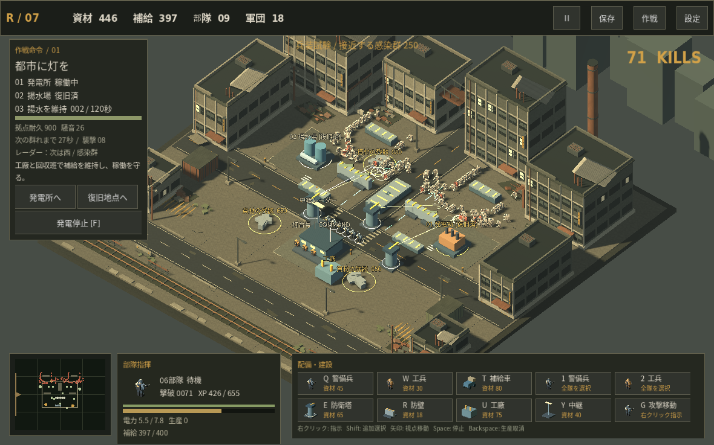

# RECLAMATION

オルタ湾復旧作戦。Godot 4.6.3で動作する、3D斜俯瞰・シングルプレイヤーの短編RTSです。

工兵で残骸を回収し、設備を復旧。発電を始めると機械音に群れが集まります。部隊、防衛塔、補給生産を配置し、共有XPによる軍団改装で前線を押し返します。

## 開発版 0.3

- 3つの作戦と異なる通路・遮蔽物・襲撃構成
- 工兵、警備兵、補給車 / 防衛塔、防壁、工廠、中継レーダー
- 弾薬補給と送電容量、工廠の資材消費、生産予約
- 基本12・上級8・決戦4、合計24種の強化
- 電撃連鎖、二世代誘爆、貫通斉射、移動補給などの異なる戦い方
- タイトル、作戦解放、勝敗、再試行、途中保存
- 初回の行動案内、装備の採用後プレビュー、二方向襲撃の予告、工廠の停止理由
- 手続き生成の工業地区、兵士・感染者、装備図解、効果音

## 実画面

250体を配置した兵装・描画試験の途中。通常プレイの到達記録とは区別しています。

## 起動

Godot 4.6.3で `project.godot` を開き、F5を押します。追加プラグインは不要です。

配布ビルドの対応OSと起動方法は、各パッケージの説明を参照してください。操作はPCのマウス・キーボード向けです。

## 操作

| 操作 | 内容 |
|---|---|
| 左クリック / ドラッグ | 部隊選択。Shiftで追加選択 |
| 右クリック | 移動、回収、復旧、未完成の建物の建設再開 |
| G → 右クリック | 攻撃移動。射程に敵を捉えると停止して迎撃 |
| 1 / 2 | 全警備兵 / 全工兵を選択 |
| Q / W / T | 警備兵 / 工兵 / 補給車の生産予約 |
| E / R / U / Y | 防衛塔 / 防壁 / 工廠 / 中継の配置 |
| Esc / 右クリック | 配置モード取消 |
| F | 発電所の起動・停止 |
| Backspace | 最後の生産予約を取消し、資材を返却 |
| 矢印 / ホイール | 視点移動 / 拡大縮小 |
| ミニマップをクリック | 視点を移動 |
| Space | 戦術ポーズ。停止中も指示可能 |
| F6 | 途中保存 |
| 強化画面の1・2・3 | 装備を採用 |

建物を左クリックすると状態を確認できます。工廠は選択パネルで稼働・停止を切り替えます。

## 復旧と防衛

最初は工兵を残骸へ送り、資材を確保します。施設の復旧費は50。遠方の復旧には警備兵を先行させ、拠点にも守備隊を残しましょう。

弾薬は拠点で少量を供給します。工廠は電力2と資材1.5/秒を使い、補給8/秒を生産。補給切れでも予備弾で射撃しますが、威力は低下します。

発電容量は初期6。塔は1、工廠は2、中継は0.5を使用します。送電距離は22m。中継を置くと送電を延長でき、補給圏と次の襲撃方向の情報も得られます。発電前の準備を整え、起動後の大きな襲撃に備えてください。

## 3作戦

1. 都市に灯を — 発電所と揚水場を復旧し、120秒間稼働
2. 鉄路の再接続 — 資材600を回収し、貨物中継所を150秒間稼働
3. 明日への送電 — 資材300を回収し、中央送電所を210秒間防衛

作戦ごとに軍団の改装はリセットされます。達成記録と設定は保持します。

## 軍団改装

3候補は重複なし。取得上限と前提を守り、即効性のある戦闘強化を最低1つ提示します。序盤は基本装備、節目では上級装備が候補に入ります。引き直しは初期2回、復旧達成で追加されます。

- 雷光: 導電跳躍 + 高密度蓄電 → 雷光網
- 爆砕: 誘爆装薬 + 広域弾頭 → 連鎖解体
- 機動: 自動回収給弾 + 戦闘補修 → 歩く工廠
- 砲列: 同期砲列 + 貫通芯 → 地平線斉射

## 保存

30秒ごとの自動保存、保存ボタン、F6に対応。提示中の装備、乱数状態、XP、作業命令、生産予約、保留中の爆発も保存します。タイトルの「作戦を再開」から続けます。

## ソース構成

- `main.gd`: 操作、経済、戦闘、HUD、保存、勝敗
- `campaign.gd`: 作戦設定と達成記録
- `upgrade_catalog.gd`: 24装備、前提、上限、抽選規則
- `actor_visuals.gd`: 兵士・工兵・感染者のモデルと歩行
- `horde_renderer.gd`: 大群のまとめ描き
- `world_art.gd`: 工業地区のモデルと材質
- `tactical_map.gd`: 作戦ごとの通路と遮蔽物
- `tests/`: 回帰テスト
- `docs/QA_REPORT.md`: 検証した内容と限界
- `licenses/`: フォントとエンジンのライセンス

## テスト

通常の実行例:

`godot --headless --path . -- --self-test`

`godot --headless --path . --script res://tests/check_campaign.gd`

`godot --headless --path . --script res://tests/check_upgrade_catalog.gd`

`godot --headless --path . --script res://tests/check_upgrade_draw_rules.gd`

テスト用のユーザーデータは、実プレイの保存フォルダから分けてください。

## 素材と権利

地区・部隊・施設・装備図解・効果音は本プロジェクト用に生成した素材です。フォントはNoto Sans CJKとDejaVu、エンジンはGodot。各ライセンスと権利表示を `licenses/` に同梱しています。

開発版です。長時間・複数端末の性能試験、複数人の初見試遊、各OSの正式配布審査は完了していません。
