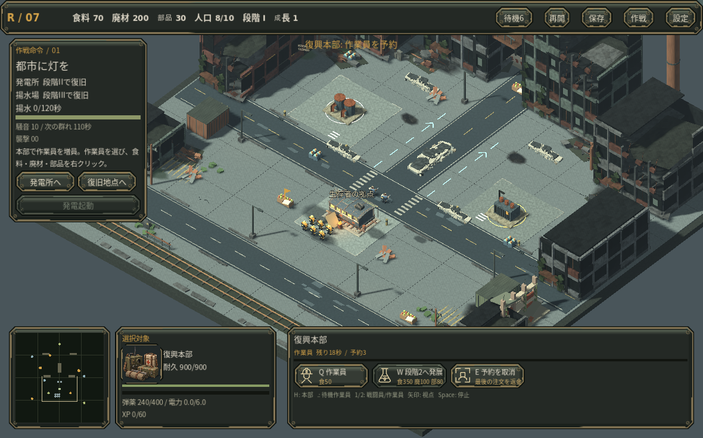

# RECLAMATION

オルタ湾復旧作戦。Godot 4.6.3で動作する、3D斜俯瞰・シングルプレイヤーの復興RTSです。

食料・廃材・部品を集め、住居と生産施設を建て、三段階の拠点へ発展させます。発電と産業を支える拠点を育て、作業員と拡張先を守ります。共有XPで成長する部隊で、復旧・感染源討伐・送電の三作戦を進めます。

[品質改善の範囲と採用基準](docs/QUALITY_ROADMAP.md)

## 開発中 / 単体の射程を地面で読む

歩兵・爆薬手・移動迫撃車を1人だけ選ぶと、地面の細い破線で実射程を表示します。迫撃車を護衛する位置から、歩兵の攻撃が届かない理由を通常倍率で読めるようにしました。[同じ獲得済み状態の前後・実操作・確認範囲](docs/SELECTED_WEAPON_RANGE.md)。公開は0.58のままで、この小checkpointだけではPagesを更新しません。

## v0.58 / 広い街を読み、部隊へ戻る

広域M2の選択部隊には、代表1人の既知の経路と指示先をミニマップへ残します。拠点へ視点を戻しても進軍先を見失いにくくし、停止・到着・選択変更では消えます。未知の道や感染源を先に表示せず、到達を保証する線ではありません。[通常操作・スマホ幅・追加処理の範囲](docs/SQUAD_ROUTE_READABILITY.md)。

共同菜園を完成させた担当は、明示の次命令がなければ、その菜園で食料採取を始めます。枯渇した旧採取先へ戻って停止する手間を減らしました。予約命令と運搬中の資源は保持します。[同じ通常費用の場面と命令優先の確認](docs/GARDEN_WORK_HANDOFF.md)。

貨物地区を鋸歯屋根の倉庫・倒壊上屋・管制塔付き荷捌き棟へ造形し直しました。[通常距離の比較](docs/FREIGHT_DISTRICT_IDENTITY.md)。疾走体には前傾した身体と独自の走行姿勢を用い、小さい表示でも通常感染者と動きを区別しやすくしました。[同じ実戦映像と負荷](docs/RUNNER_MODEL_WIP.md)。近接攻撃の通常距離の判別性は未確認です。

053以降の4つの意味ある改善をまとめた更新です。敵数・戦闘性能・費用・強化抽選は変更していません。疾走体200体のクラウドllvmpipe比較ではフレーム平均63.96→48.89ms、描画準備CPUは2.14→2.98msでした。単一条件の比較であり、実GPU/Web全体の高速化や30fps動作を保証しません。実Web・スマホ・Mac・実GPU、人間初見と音の実聴は未確認です。

## v0.53 / 仕事と再進軍先を見失わない

選択した部隊が採取・復旧・移動など何をしているかを、PCの既存命令見出しへ表示します。弾薬工房も補給満杯・手動停止・未給電などの状態を同じ場所で読めます。[部隊の状態表示](docs/DESKTOP_ORDER_HEADING.md)・[工房の状態表示](docs/FACTORY_STATUS_FEEDBACK.md)。

段階不足の設備復旧を指示すると採取を中断して現地で待機してしまう不具合を修正しました。必要段階をその場で伝え、現在の仕事・運搬・予約を保ちます。[実操作からの再現と修正](docs/RESTORATION_ORDER_PREREQUISITE.md)。

食料の荷積み、廃材の束、部品の機械を通常距離で見分けやすい造形に変更しました。[同じ場面の比較と追加描画量](docs/BULK_RESOURCE_ART.md)。発見済みの感染源は視界を失っても最後に見た外形が暗い霧の下に残ります。未知の拠点や現在のHP・反撃状態は見えません。[記憶表示の確認](docs/DISCOVERED_NEST_MEMORY.md)。

048以降の小checkpointをまとめた更新です。通常費用のネイティブ操作で内政→段階II→発電→工房、偵察→感染源発見→小部隊の損失まで確認しました。再建の試行は敗北しており、勝利や人間の楽しさを証明する結果ではありません。敵・費用・強化性能は変更していません。資源模型と記憶表示には小さい描画量の増加があり、FPS改善は主張しません。実Web・スマホ・Mac・実GPU、人間初見と音の実聴は未確認です。

## v0.48 / 前線を整え、部隊をまとめ直す

部隊の既存命令欄から護衛相手を指定できます。強化選択中の保存をスマホ幅で再開したとき、資源・命令HUDが候補を隠す不具合を修正しました。[同じ保存データの修正前後と確認範囲](docs/RESTORED_MOBILE_GROWTH.md)。小さい変更はGitHubに保存・再読込確認し、Pagesは約5版ごとのまとまりで更新します。公開版と開発checkpointは区別します。

待機中の作業員だけをまとめて選び、働いている採取班を動かさず再配置できます。第2作戦では、北西の廃棄倉庫を有償で復旧し、前線の資源搬入所として使えます。新設する場所の自由と、固定施設を早く復旧する選択です。[通常費用の復旧・搬入と画面の確認範囲](docs/FRONTIER_DEPOT_REBUILD.md)。[専用モデルで復旧前後を形から読めるようにした比較](docs/LOGISTICS_SHED_ART.md)。

感染源の丸い塊を、破れた倉庫を侵食する一体の造形へ変更しました。警戒する開口と破壊後の瓦礫を通常距離で読めます。[同じ戦場の比較と負荷](docs/INFECTED_WAREHOUSE_ART.md)。成長候補を補充する系統へ影響する8枚は、その既存効果を採用前に表示します。[抽選を変えない説明改善](docs/GROWTH_FAMILY_CLARITY.md)。

この版は公開043からの累積更新です。回収できた確定ソースを基盤に再実装・検証しており、失われた以前の未公開候補と同一ではありません。クラウド上の実Godot画面、限定した通常費用の指揮、保存再開、合成タッチを確認しました。実Web・iPhone/Android・Mac・実GPU、人間初見と音の実聴は未確認です。商用品質の完成を示す版ではありません。

## v0.43 / 運河の先を探索し、感染源を破壊する

第2作戦を192×160mの広域マップへ変更しました。通常倍率のままスクロールして偵察し、遠方の資源地に集積所や防衛を築き、発見した感染源を破壊します。未踏域と探索済みの記憶を分け、未知の巣を地図や照準へ出しません。[実際の進行・画面・測定と限界](docs/FRONTIER_MISSION.md)。通常費用のAI指揮で約13分の勝利と、その保存からのネイティブ再開・決着を確認しました。人間の楽しさや実スマホ/Web性能の検証とは区別しています。第2作戦の旧途中保存は読み込みません。

## v0.42 / 補給の詰まりと敗北前の出来事を読む

弾薬消費が補給を上回る状態と、予備弾で射撃している状態を既存HUDへ短く表示します。敗北画面には直前に実際に失った施設・作業員などを最大3件残し、スマホ幅でも再挑戦へすぐ戻れるようにしました。[表示例・確認範囲](docs/SUPPLY_AND_RETRY.md)。資源量、戦闘性能、敵数、作戦条件は変更していません。

## v0.41 / 感染者の支持足を滑らせない

通常感染者の接地している足が上体と一緒に滑る問題を修正しました。歩行ポーズの支持と足の戻しを作り直し、移動速度や攻撃時刻、描画方式を維持しています。[同じ実戦映像・測定と限界](docs/SUPPORT_GAIT.md)。通常倍率の姿勢は確認しましたが、人間による動作の自然さの評価や実機性能を保証するものではありません。

## v0.40 / 成長で何が変わるかを絵で読む

射程、連射、貫通、連鎖、回収など、24の強化と3つの補給効果に対応する図解へ変更しました。既存の人物・装備絵を使い、効果の違いを補います。候補抽選と性能は変えていません。[同じ実プレイの前後画像と操作確認](docs/GROWTH_DIAGRAMS.md)。スマホでは既存の文字カードを保ち、表示しないPC用画像の生成を省きます。人間初見の理解度や実スマホでの検証は未確認です。

## v0.39 / 人物の形と動作を再構築

基本兵・爆薬手・作業員の関節と装備を作り直し、移動・射撃・作業・運搬の表示を統合しました。通常感染者は共通ポーズ間をGPUで補間し、歩行を移動距離に合わせます。PCの選択パネルを読みやすく組み直し、日本語フォントは表示を維持したまま必要な文字へ縮小しました。

これは公開v0.38と回収できた制作元からの新しい再構築版です。失われた旧候補と同一の復元ではありません。[再構築範囲](RECONSTRUCTION_20261008.md) / [感染者の同場面画像・測定・限界](INFECTED_RECONSTRUCTION.md)。

同じ実戦保存を進めた状態一致、銃口と実弾道の一致、タッチ入力の合成検証、クラウド上の通常クリックによる増員・採取・搬入・建設取消/配置拒否を確認しました。全キャンペーンをこの版で通し直したわけではありません。実スマホ・実ブラウザでのプレイ、実GPU性能、音の実聴と人間初見の評価は未確認です。クラウドのソフトウェアGPUでは依然重く、今回の短い比較でもFPS改善は証明していません。

## v0.38 / 内政から登録部隊へ戻る

タッチの選択画面から部隊を登録・呼出できます。内政を挟んでも、もう一度囲み直さず同じ部隊へ視点ごと戻ります。PCと同じ登録・保存を使います。[実画面と同じ場面の操作比較](docs/TOUCH_GROUPS_V38.md)。実スマホ/Safariの検証は未完了です。

## v0.37 / タッチ操作と生存者の動作

タッチ用の選択・指示・建設・生産・成長・保存画面を実装し、歩行・射撃・作業の動作を改善しました。[実画面、操作確認、比較映像](docs/TOUCH_AND_MOTION_V37.md)。実iPhone/Safari・Android端末・実GPU・音の実聴は未検証です。クラウドでの合成タッチ検証を実端末の動作保証とは扱いません。

## v0.36 / 大群の撃破動作

爆風の後に感染者の倒れる動作を残し、大群を崩した結果を読み取りやすくしました。古い表示枠を再利用し、標準96体・軽量32体の上限を維持します。[同じ実戦の前後画像・映像・確認範囲](docs/DEATH_REACTIONS_V36.md)。スマホ操作はこの版には含まれません。

## v0.35 / 重火器は密集を狙う

爆薬手・移動迫撃車・固定迫撃砲が、射程内の群れへ自動で砲撃します。手動集中攻撃を優先し、威力や既存の大斉射は維持。[同じ実戦保存の映像・結果・追加コスト](docs/HEAVY_AIM_V35.md)。この比較では撃破数は同じで重火器の弾薬消費が減りましたが、全滅速度は速くなっていません。

## v0.34.2 / 建設から防衛へすぐ切替

建設プレビュー中でも C/V/H/待機作業員の選択キーで対象を切り替えられます。支払済み工事や実行中の仕事は保持します。[同じ入力での実画面比較](docs/SELECTION_INTERRUPTS_V34_2.md)。

## v0.34.1 / 重いフレームでも発砲を表示

新しい銃口閃光と弾道が、遅いフレームでは表示される前に失効する問題を補正しました。通常60fps相当の前後画像は同一で、受理済みの短い演出を最初の描画で一度表示します。[実描画の前後と確認範囲](docs/FIRST_SUBMISSION_V34_1.md)。描画速度や実ブラウザ性能の向上を証明したものではありません。

## v0.34 開発版 / 銃撃と施設まわりの移動

銃口と弾道がずれて見える問題を修正しました。実モデルの先端と移動・反動に演出を合わせ、誤った軸へ伸びていた射線も直しています。[同場面の前後画像と確認範囲](docs/WEAPON_ALIGNMENT_V34.md)。

発電所などの内部へ兵が入らず、施設外周の到達できる位置で復旧します。建物の角で射程外に止まる敵も修正しました。[移動・復旧・保存の検証](docs/MISSION_SITE_NAVIGATION.md)。施設内部に兵がいる旧保存は読み込めません。

中央送電所と変電所は異なる専用モデルと選択肖像を持ちます。[前後比較](docs/POWER_FACILITIES_V33.md)。通常UIのキャンペーンでは最終作戦21分23秒・3315撃破で、街が点灯する全3作戦の結末を確認しました。[操作と検証の範囲](docs/PLAYTHROUGH_FINAL_OPERATION.md)。施設ナビ修正後の全キャンペーン通しや、人間初見・実GPU/Web/Mac・音の実聴評価は未確認です。商用品質の完成を示す版ではありません。

## v0.33 / 電力施設を形で区別

中央送電所と避難所変電所を異なる専用モデルへ置き換え、選択欄にも同じ形を表示します。[同じ実戦保存での前後比較](docs/POWER_FACILITIES_V33.md)。この変更をv0.34へ統合し、最終作戦の通常操作で復旧と達成を確認しました。

## 開発候補 0.32 / 壊れそうな施設を見分ける

重傷の建物に局所的な炎と煙を出し、修理すると消えるようにしました。危険を知るために建物を順に選択する手間を減らすための表示です。[同じ実戦保存の比較・通常修理・描画コスト](docs/CRITICAL_BUILDING_DAMAGE.md)。

第2作戦は新規開始から通常操作で13分19秒・1368撃破の達成を確認しました。車列への護衛指示は1回で最後まで継続し、最終作戦の解放も保存されています。[通し操作と限界](docs/PLAYTHROUGH_V32.md)。

## 開発候補 0.31 / 遠くの仕事と部隊へ直接指示

街区図から直接指示し、内政と防衛を往復するときのカメラ移動を減らします。Shift作業予約・攻撃移動・集合地点も同じ操作を使えます。発展条件も、建設・工事完了・給電を区別して次の作業を示します。[操作と同じ場面の前後比較](docs/MINIMAP_COMMANDS.md)。

第1作戦は通常操作の保存から続行し、17分17秒・1,720撃破で達成しました。[結果と確認範囲](docs/PLAYTHROUGH_V31.md) / [戦闘再生（8秒、オフライン出力）](docs/media/earned_horde_v31_offline.mp4)。実ブラウザ/GPUでの性能、人間の初見評価、音の実聴は未確認です。

## 開発候補 0.30 / HUDの裏の描画を省く

画面上で見えない3D部分の処理を省き、標準画質・敵数・影を保ったまま描画負荷を抑えます。同じ停止場面の全画素一致と、通常進行する保存状態の一致を確認しました。クラウドの測定ではフレーム中央値が下がりましたが、遅いフレームや実GPUでの改善は未確認です。[実測値・画面・限界](docs/HUD_RENDERING_V30.md)。

## 開発候補 0.29 / 戦場の文字を整理、重複画像を共有

現在の目標・選択中の対象・必要な費用を読みやすくし、常時の操作説明を既存メニューへ移しました。同じ画像を使う3Dモデル間でテクスチャを共有し、同場面の画像割当量を52MiB削減しています。標準画質と敵数は維持しています。[実画面の前後・測定結果・限界](docs/CLARITY_PERFORMANCE_V29.md)。ユーザー環境でのFPS改善は未確認です。

## 開発候補 0.28 / 内政の配分を読む

食料・廃材・部品の既存表示に、現在の採取担当人数を加えました。運搬中も同じ担当として表示し、建設中の人や未来の予約を混ぜません。備蓄が十分でも採取担当が減っていることに気づき、増員や再配分を判断できます。[実際の再配分と確認範囲](docs/RESOURCE_STAFFING_V28.md)。

## 開発候補 0.27 / 採取場の危険へ対応する

感染者の近くをクリックすると作業員への指示が無言で消えていた問題を修正しました。離れた作業員が攻撃されたときも、既存の通知と地図から現場を確認できます。通知を押しても選択・命令は変わりません。[同じ場面の修正前後と確認範囲](docs/WORKER_SAFETY_V27.md)。

## 開発候補 0.26 / 作業員の連続命令

Shiftで建設・修理・採取を順番に予約できます。搬入後に次の仕事へ進むため、内政の完了を見張って毎回指示し直す手間を減らせます。通常の指示や停止で予約を解除でき、運搬中の資源は保持します。[操作・実画面・確認範囲](docs/WORKER_QUEUES_V26.md)。

## 開発候補 0.25 / 建設と部隊操作を分かりやすく

建設中は資材・骨組み・部分屋根の段階を表示し、完成済みの施設と区別できます。集中攻撃後の兵士は通行可能な場所で少しずつ間隔を取り、個別選択と部隊分割を行いやすくしました。建築ボタンには不足している前提施設を直接表示します。

実戦後の街へは短い画面切替で移り、停止した感染群や砲弾が生活再建の演出に残らないようにしました。結果ボタンは演出中も操作できます。[実操作・比較画像・確認範囲](docs/PLAYABILITY_V25.md)。

### 取り戻した街を見せる結末

作戦達成後は街を暗い全面パネルで隠さず、水を汲む人、物資を受け取る人、明かりの戻る窓を見せます。結果と次の操作は下部に残り、演出の終了を待つ必要はありません。[実画面と検証範囲](docs/RESTORED_CITY_ENDINGS.md)。

通路を塞がれて採取・搬入できない作業員も、既存の待機ボタンとピリオドキーで探せるようにしました。輸送中の侵入方向と予告時間が欠落する表示不具合も修正しています。[実際の内政から配送までの評価](docs/CONVOY_PLAY_REVIEW.md)。

離れた建物が攻撃されると、建物名と地図の位置を短く表示します。クリックで視点を移し、部隊の選択と命令は保ちます。途中保存の再開では、保存時の視点と拡大率も戻ります。[操作と確認範囲](docs/COMMAND_AWARENESS.md)。

作業員が建設・修理で重ならないよう、到達可能な作業位置へ分散するようにしました。[同じ命令による実画面比較](docs/WORK_POSITIONS_REVIEW.md)。

第一作戦の給水設備を、圧力タンク・ポンプ・補修配管を持つ専用モデルへ作り直しました。選択欄にも同じモデルの画像を使い、戦場の設備と操作対象を結び付けています。[実画面と制作・確認範囲](docs/WATER_STATION.md)。

新しい作戦と再挑戦では成長の抽選と戦闘用乱数が変わり、途中保存の再開では提示中の候補と乱数状態を保持します。描画専用の乱数は戦闘から分離しました。保存形式は3で、旧形式の途中保存は読み込みません。[再挑戦と再現方法](docs/RUN_VARIATION.md)。

公開済み0.10を基盤に、移動・保存・成長選択・時間処理を再構築した開発候補です。失われた0.18.1の完全復元ではありません。到達不能な命令で障害物を直進しない移動、壊れた保存の検証と退避、あとで選べる強化、描画速度に依存しない時間進行を実装しました。

選択した作業員の実際に検証済みの経路と搬入先を表示します。最終作戦は初期送電60秒と破砕体の撃破を条件にし、撃破後の固定待ち時間を短縮しました。これらの変更と現時点の確認範囲は[再構築候補の記録](docs/RECOVERY_V19.md)にまとめています。以下の0.9/0.10の通し試験結果は基盤版の履歴であり、現候補の通し達成を示すものではありません。

## 拠点経済と選択対象ごとの操作

- **3資源の採取・運搬・搬入**。作業員が持つ荷物は、完成した本部か資材集積所へ届けて初めて備蓄に加わります。共同菜園は作業員が採取する再生可能な食料源です。
- **住居と人口**。本部の人口上限は10、完成した住居1軒で+5。住宅を失って上限を超えても既存部隊は消えず、新しい部隊の完成が空きを待ちます。
- **建物ごとの生産予約**。本部は作業員と発展、訓練所は生存者と爆薬手、車両工房は補給車と移動迫撃車を生産します。それぞれの先入れ先出し予約は独立し、費用は予約時に支払い、取消時に返却します。
- **三段階の発展**。I「開拓地」→II「復興拠点」→III「機械化都市」。必要施設を完成させ、本部で費用と研究時間を使って発展します。既に予約した作業員がいれば、その後に研究が進みます。
- **選択対象に対応するコマンド**。作業員は建築、戦闘員は戦闘、生産施設は自分の予約だけを扱います。同じQキーでも、本部なら作業員、訓練所なら生存者、戦闘部隊なら攻撃移動になります。画面のボタン表示を確認してください。
- 住居、集積所、共同菜園、訓練所、車両工房、移動迫撃車に、編集可能なBlender原型から作った立体モデルを追加しました。

第1/3作戦の途中保存は形式3、第2作戦は広域探索用の形式4です。互換のない過去の途中保存は読み込まず、新しい作戦から開始します。保存先は `user://settlement_v2/` です。作戦達成記録と設定は別ファイルに保存します。

## 起動

Godot 4.6.3で `project.godot` を開き、F5を押します。追加プラグインは不要です。操作はPCのマウス・キーボード向けです。配布ビルドの対応OSと起動方法は各パッケージの説明を参照してください。

## 操作

| 操作 | 内容 |
|---|---|
| 左クリック / ドラッグ | 1対象 / 複数部隊を選択。Shiftで追加・解除 |
| 部隊を選んで右クリック | 地面へ移動、敵へ集中攻撃、仲間を継続護衛 |
| 作業員を選んで右クリック | 資源採取、建設再開、修理、設備の復旧 |
| 生産施設を選んで右クリック | 集合地点を設定。本部で資源を指定すると新しい作業員は採取へ向かう |
| 下部に表示されたキー | 選択対象のコマンド。未選択施設から生産する共通ショートカットはない |
| H / ピリオド(.) | 本部 / 次の待機作業員を選択・表示 |
| Ctrl+1〜9 | 選択部隊、または選択した味方建物1つを番号へ登録。既存の登録を置換 |
| 1〜9 | 登録グループを呼出。現在の選択を置換。同じ番号を素早く2回押すと視点を移動 |
| C / V | 戦闘員 / 作業員をまとめて選択 |
| Backspace | 選択した生産施設の最後の予約を取り消し、支払った資源を返却 |
| Esc / 右クリック | 建築配置を取消 |
| 矢印 / ホイール | 視点移動 / 拡大縮小 |
| ミニマップをクリック | 視点を移動 |
| Space | 戦術ポーズ。停止中も指示可能 |
| F6 | 途中保存 |
| Shift+Delete | 選択した建造物の解体確認 |
| Tab / 上部の強化表示 | 獲得した強化の選択画面を開く |
| 強化画面の1・2・3 / Esc | 提示装備を採用 / 同じ候補を保留して戻る |

発電の切替は復旧した発電所、弾薬工房の稼働切替はその工房を選択して行います。詳しくは[操作説明](docs/CONTROLS.md)。

## 0.9の実画面

ネイティブ実行で食料を支払い、時間制の予約を進めた場面。[住居の完成](docs/screenshots/v09_completed_house.png)、[訓練所の予約](docs/screenshots/v09_barracks_queue.png)、[資源枯渇後の待機](docs/screenshots/v09_depleted_workers.png)、[新しい採取場への指示](docs/screenshots/v09_explicit_expansion.png)、[給電中の車両工房](docs/screenshots/v09_vehicle_workshop_queue.png)も確認できます。これらの静止画は性能測定ではありません。

## 最初の拠点を育てる

初期部隊は作業員6人と生存者2人、備蓄は食料220・廃材200・部品30です。作業員を食料3・廃材2・部品1に分け、本部から増員しつつ、住居、訓練所、集積所を建てると基本の流れが分かります。これは固定の攻略手順ではありません。

作業員は運搬にも時間を使います。集積所を資源の近くに置くと往復が短くなります。資源が尽きた際の自動再配置は作業員の14m以内にある同種資源に限り、残っていなければ荷物を搬入して待機します。離れた採取場への拡張は、護衛と集積所を用意して自分で指示してください。建築を終えた作業員は、別の命令を出していなければ直前の採取へ戻ります。

住居2軒、訓練所、集積所が完成すると段階IIを予約できます。費用は食料350・廃材100・部品80、基準研究時間は70秒です。段階IIIには給電中の弾薬工房と完成した車両工房が必要で、食料800・廃材400・部品250、基準100秒を使います。研究も本部の生産待ち行列を共有します。

段階IIで発電所の復旧、爆薬手、工房や固定迫撃砲が利用可能になります。段階IIIで移動迫撃車と残りの作戦施設の復旧へ進みます。弾薬工房は電力と廃材を使って弾薬を作り、車両工房の予約も給電中に進みます。住宅・輸送・防衛への支出と発展費用の配分を判断してください。

詳しくは[経済ガイド](docs/ECONOMY_GUIDE.md)。数値の定義は `settlement_rules.gd` にまとめています。

## 三つの作戦と部隊の成長

1. **都市に灯を** — 発電所と揚水場を復旧し、120秒間稼働
2. **感染港を拓く** — 運河の先を偵察し、資源地へ進出。群れを生む感染源を発見して破壊
3. **最後の送電** — 三つの施設を復旧し、60秒の送電と大型感染者「破砕体」の撃破を達成

作戦ごとに部隊と拠点の成長はリセットされ、達成記録と設定は保持します。群れを倒して共有XPを得ると、重複のない3候補から装備を選びます。基本12・上級8・決戦4の合計24種に、電撃連鎖、二世代誘爆、貫通斉射、移動補給、多連装砲撃などがあります。取得上限と前提を守り、引き直しは初期2回、復旧達成で追加されます。

味方や砲弾を遮る建物の選択的な透過、集中攻撃、解体の返金確認、襲撃予告、輸送隊の停車・再発進、52のオリジナル音素材も含みます。

## 保存

30秒ごとの自動保存、保存ボタン、F6に対応。備蓄、運搬中の荷物、採取・建築・護衛命令、建物ごとの予約・支払額・集合地点、発展、提示中の装備、乱数、敵、飛翔中の砲弾、輸送隊と作戦目標を保存します。タイトルの「作戦を再開」から続けます。

形式2では形式1の旧チェックポイントを読み込まず、現在のプレイ状態も変更しません。0.8セーブの自動変換はありません。テストや異なる版の実行ではユーザーデータを分離してください。

## 確認状況と限界

通常の初期資源から実際の採取・建築・予約・戦闘・獲得した強化を使う加速シミュレーションで、作戦1は20分07.9秒、作戦2は19分32.4秒、作戦3は29分13.0秒で達成しました。作戦3では採取地と住宅の損失からの再建に時間を使いました。全作戦が15〜25分に収まるという結果ではありません。作戦1は資源枯渇時の近距離再配置修正前、作戦2・3は修正後の経済を使用し、最終の照準・表示調整より前の結果です。

ネイティブの実画面でも、本部と訓練所の有料・時間制生産、単体選択、住居の建設と人口増加、作業員の採取復帰、集合地点、資源枯渇後の待機と明示的な遠方採取への復帰を確認しています。獲得済みの段階III保存からは、車両工房のコマンド・迫撃車予約の支払額・取消返金も確認しました。ただし、上記の全作戦達成は描画/UI処理を止めた自動命令による機構確認で、初見の人による通しプレイや性能測定ではありません。詳しくは[0.9の検証範囲](docs/QA_V09.md)。

実GPU・実Macでの性能、v0.10 Web配布物の起動・入力・保存・連続プレイ、音の聴感、初見プレイヤーの難易度評価は別途確認が必要です。0.8のクラウドllvmpipeでは終盤5秒のオフライン描画がGPU平均約303ms/フレームでした。この値は0.9の性能測定ではなく、動画の固定30fpsも実行時FPSの証拠ではありません。[以前の計測](docs/PERFORMANCE.md)と[残る確認](docs/ROADMAP.md)を参照してください。商用品質の完成宣言ではありません。

## ソースとテスト

- `main.gd`: 選択、命令、戦闘、HUD、保存、勝敗
- `settlement_rules.gd`: 資源費用、人口、建物、三段階の発展
- `settlement_economy.gd`: 採取、荷物、搬入、建築後の採取復帰
- `settlement_production.gd`: 建物別FIFO、人口待ち、取消と返金
- `campaign.gd` / `upgrade_catalog.gd`: 作戦、達成記録、24装備と抽選
- `actor_visuals.gd` / `structure_visuals.gd` / `resource_visuals.gd`: 部隊・施設・資源の表示
- `horde_renderer.gd` / `baked_infected_renderer.gd`: 感染群のまとめ描き
- `tactical_map.gd` / `world_art.gd`: 通路、遮蔽物、地区の描画
- `tests/`: 回帰テスト。現行の例: Linux上の独立したテスト用XDG_DATA_HOMEで `godot --headless --path . --script res://tests/check_run_variation.gd`
- `tests/check_v09_economy_travel.gd`: 実移動を含む採取・枯渇後待機・再配置の回帰
- `art_source/`: 編集可能なBlender原型と生成スクリプト
- `licenses/`: 元の素材由来情報とフォント・エンジンのライセンス

テストは実プレイから分離したプロジェクトコピーとユーザーデータで実行してください。テスト用の資源・建物配置や襲撃停止は回帰条件のためで、通常プレイの達成記録ではありません。

## アート・権利・公開

地区・部隊・設備・図解・効果音は本プロジェクト用の素材です。フォントはNoto Sans CJKとDejaVu、エンジンはGodot。由来と同梱ライセンスは `licenses/`、モデルの仕様は[制作アート](docs/PRODUCTION_ART.md)を参照してください。

[0.8の画面](docs/screenshots/v08_earned_overview.png)と[以前の砲撃映像](docs/video/earned_barrage.mp4)は旧版の記録です。0.9の新しい操作・経済の画面やリアルタイム性能を示すものではありません。

完成した版の公開とGitHub Pagesへの配信は[公開手順](docs/PUBLISHING.md)を参照してください。ソース更新だけでは配信しません。

開発中：PCの同兵種ダブルクリック選択と、スマホの選択メニュー内で兵種を絞る操作を追加しました。通常の混成部隊での確認範囲は [操作の検証](docs/UNIT_TYPE_SELECTION.md) を参照してください。公開版とは別のソース保存です。
