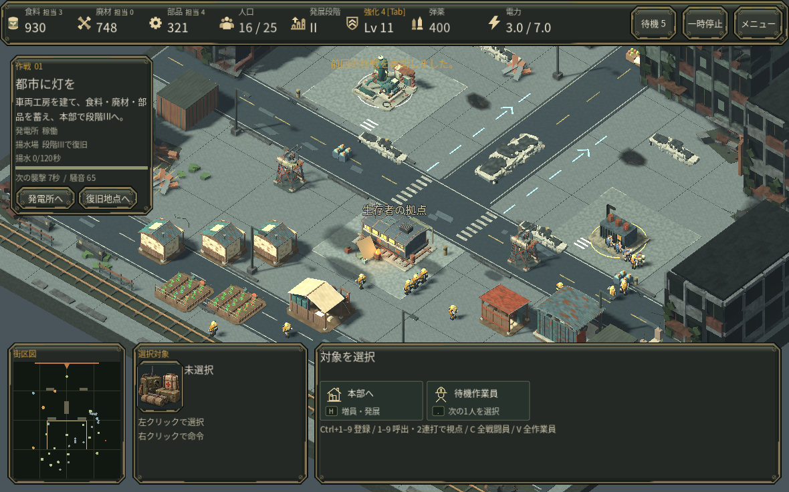
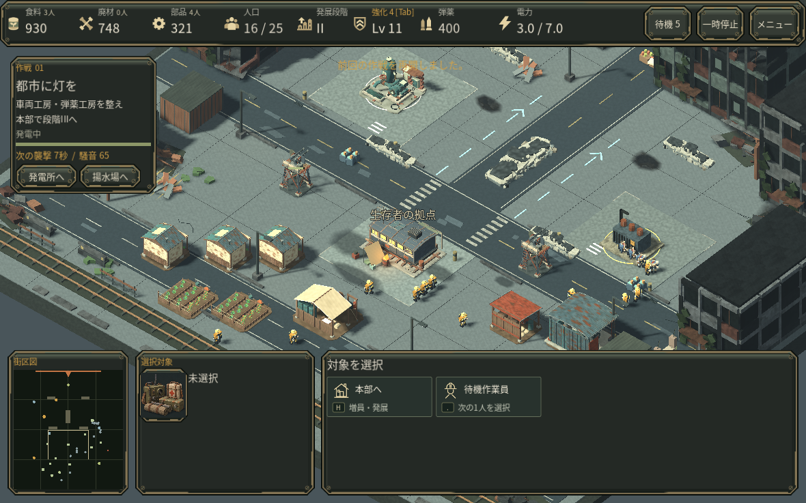

# 文字の整理と画像共有 / v0.29

## プレイヤーが見る変更

常時表示の長い操作説明と将来段階の条件を減らし、現在の目標、選択対象の名前・指示・HPへ情報を絞りました。費用、不足する施設、人口制限、生産キュー、進行中の作業予約、攻撃予告は残しています。操作一覧は既存メニューで確認できます。採取担当人数は短い「N人」表記です。作業員一人を選ぶと採取対象の資源名も現在の指示に表示します。

同じ実プレイ保存、視点、180論理フレーム後の比較です。自動生成の戦闘見本ではありません。

## 測定して直したこと

14個のGLBモデルが同一画像を個別にインポートしていました。画像のバイト列・デコード後RGBA・インポート設定を照合し、同じPNGを参照する標準glTF外部URIへ変更しました。モデル形状、画像の画素、材質設定は変更していません。元の重複PNGは編集用ソースに残し、使わない25ファイルを配布対象から除外しています。

- Godotのテクスチャ割当カウンタ: 199,436,770 → 144,910,831バイト。54,525,939バイト（52.0MiB、27.3%）減。実機VRAMやプロセス全メモリの値ではありません。
- 同条件Web PCK: 90,682,200 → 61,170,084バイト、32.54%減。これはダウンロード対象量の削減で、FPS改善率ではありません。比較パックは最終版の一人選択時の短い資源名表示とバージョン文字列追加前です。
- 標準画質と敵数は維持。同じ保存からの6回の測定で、終了時の位置・HP・命令・資源・乱数など保存状態は完全一致しました。

## 重さの診断と限界

Godot 4.6.3 / OpenGL Compatibility / llvmpipe LLVM19.1.7のクラウドソフトウェア描画です。最初の成分別診断ではフレーム平均259.65msに対しスクリプト7.31ms、シミュレーション2.11ms、UI2.29ms、実経路探索0.00041msでした。3Dを診断目的で非表示にすると17.46msとなり、この環境では描画が支配的でした。診断の非表示設定は製品へ入れていません。

同条件の最終3D比較では平均315.46→228.70msでしたが、ホスト変動が大きい単一ペアです。UI単独のABBA比較でも一貫した時間短縮は出ていません。FPSの改善率やブラウザの重さ解消は未確認です。測定値は [JSON](PERFORMANCE_V29_MEASUREMENTS.json) に残しています。性能向け画質設定は既存メニューから明示的に選択でき、標準設定を下げていません。

実際の1180×737画面で対象選択、費用・不足条件、操作一覧、画質設定を確認しました。最新の一人選択資源名は計測後の表示変更であり、計測時の無選択状態には影響しません。人間の初見評価、ユーザーのブラウザ/GPU、macOSでの実行、音の実聴は未確認です。

## アセットを再出力するとき

BlenderからのGLB出力と最初のGodotインポート後に `python3 scripts/share_model_textures.py` を実行します（Pillowを使用）。同一画像と設定だけを共有し、幾何形状を保持することを検査します。対応表は [SHARED_MODEL_TEXTURES.json](SHARED_MODEL_TEXTURES.json)。`tests/check_shared_model_textures.gd` は実際のインポート済みモデルが共通Texture2Dを参照することを検査します。

## 一次資料

- [Godot: 計測から始める最適化](https://docs.godotengine.org/en/4.6/tutorials/performance/general_optimization.html)
- [Godot: Performanceカウンタ](https://docs.godotengine.org/en/4.6/classes/class_performance.html#enum-performance-monitor)
- [Godot 4.6.3: glTF画像のURI読込実装](https://github.com/godotengine/godot/blob/4.6.3-stable/modules/gltf/gltf_document.cpp)
