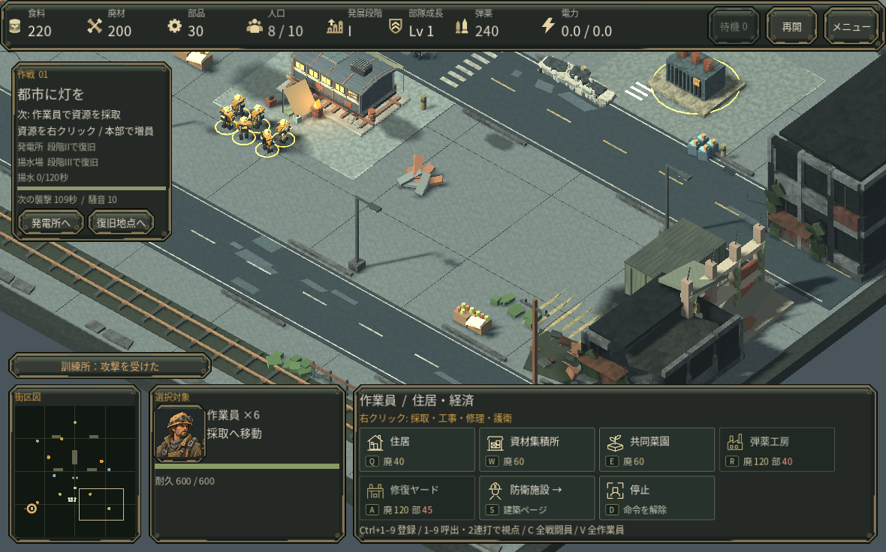
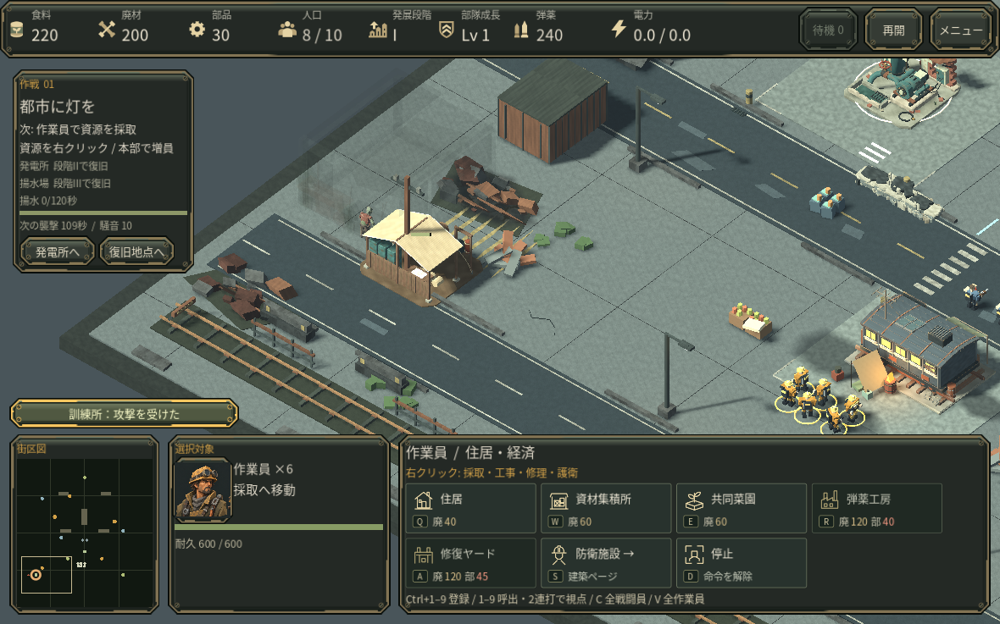
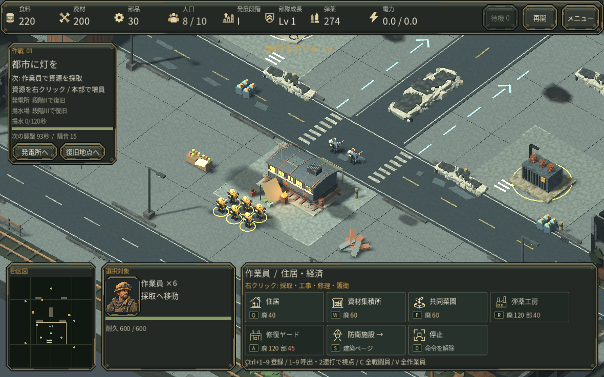

# 現場へ戻る操作

内政を見ている間に離れた訓練所が壊され、被害に気づくのが遅れた実プレイを基に改善しました。

建物が攻撃を受けると、ミニマップの上に建物名と状態が短く表示され、地図の同じ場所を示します。クリックすると視点だけを現場へ移します。選択部隊と採取・移動命令は変わりません。耐久が危険になった時と喪失時は状態を更新し、建物が消えた後も直前の場所を確認できます。表示は短時間で消えます。

壁と防御塔への通常の打撃はこの通知から除き、本部への危険を優先します。警告音は既存の保護された音声系統を使い、連打しません。音の実聴評価は未実施です。

## 保存した視点で再開

途中保存には視点と拡大率を記録します。再開直後から同じ場所を表示し、選択と採取命令は別々に保持します。視点の値が壊れている保存は、進行中の世界を変更する前に拒否します。

通常の新規作戦で6人へ採取命令を出し、視点(0,0,8)・拡大率30で保存しました。プロセスを終了し、タイトルの「作戦を再開」から、同じ視点・6人の選択・採取命令へ戻ることを実操作と保存内容で確認しています。

## 検証範囲

Godot の実ゲーム画面で通知からの視点移動、採取部隊の選択維持、表示の期限を確認しました。上の画像は、外側の訓練所と三体の感染者を配置した制御シナリオです。その後の被害と移動は通常のゲーム処理で進めています。通常資源による作戦通し達成の画像ではありません。

同じ25秒の戦闘を通知あり・なしで進め、保存された戦闘、経済、命令、乱数状態が一致することも確認しました。クラウドの Linux / llvmpipe による描画で、実 GPU、macOS、Web、初見の人による使いやすさは未確認です。

## 参考にした開発事例

- [Factorio FFF-363](https://www.factorio.com/blog/post/fff-363): 対象の状態を見える場所に示し、場所に結び付ける通知。
- [Factorio FFF-280](https://www.factorio.com/blog/post/fff-280): 地図上の直接操作と操作結果の分かりやすさ。

通知の秒数や優先順位は本作で調整した値です。他作品の挙動をそのまま再現したものではありません。
