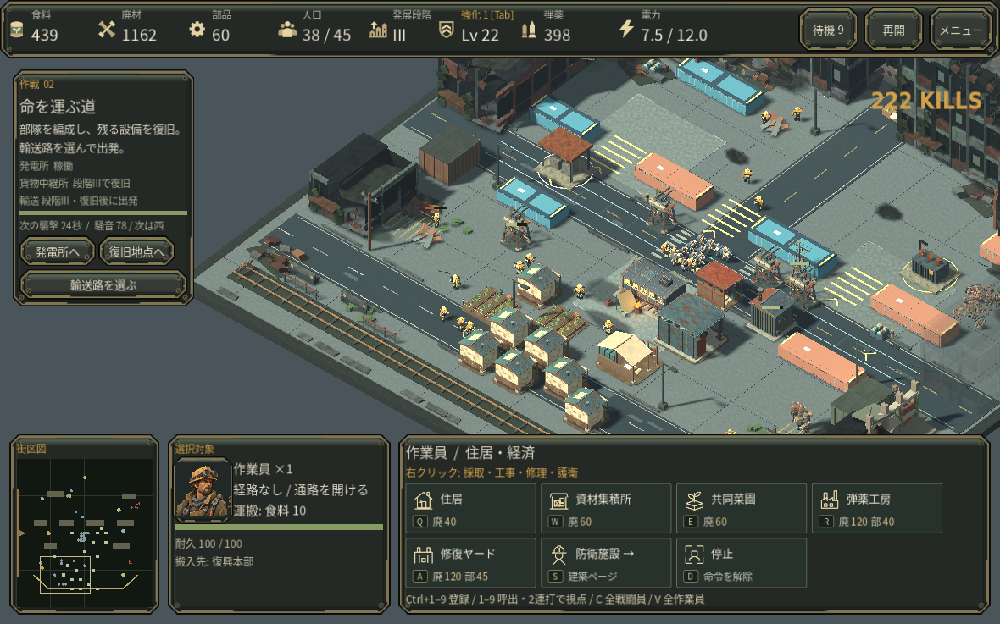
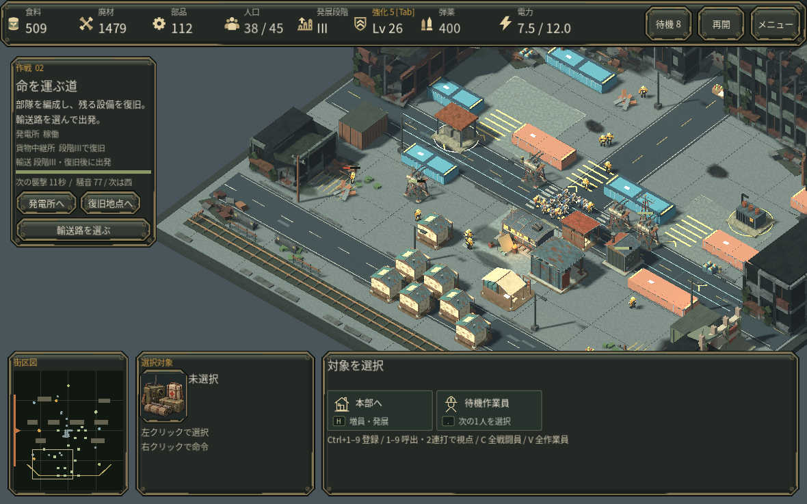
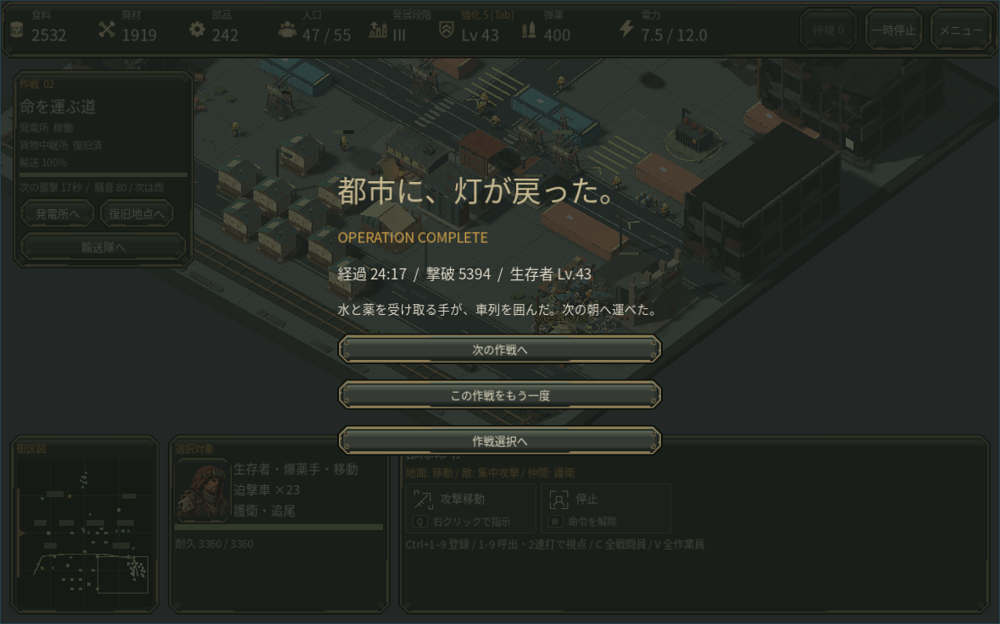
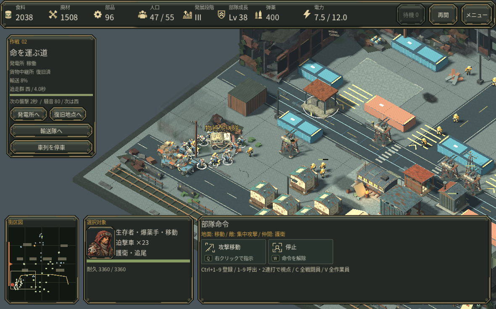

# RECLAMATION second-operation earned play assessment

Result: the complete settlement-to-convoy loop is winnable through ordinary commands. The base-side route delivered at **23:58.90**, with one persistent escort order and full convoy health. No actor positions, resources, upgrades, damage, or progression were forced.

## Scope and method

Fixed seed **202610051042**, isolated current source snapshot. The second operation was selected directly as a test fixture; campaign unlocking was not tested. This is headless simulation of normal production, construction, harvesting, restoration, research, route choice, and unit orders, including actual HUD updates. It does not replace native visual/input review. The only game-source change during this assessment was the separately integrated authored direction labels for convoy warnings; combat, economy, routes, and timing stayed unchanged.

## Earned progression

| Event | Mission time |
|---|---:|
| Training shelter ordered | 0:00 |
| First two houses ordered | 0:35 / 1:00 |
| Resource depot ordered | 1:30 |
| Age II research ordered / completed | 6:20 / 7:30 |
| Generator restored / enabled | 7:56.50 / 8:00 |
| Age III research ordered / completed | 14:20 / 16:00 |
| Blocked economy inspected; passages reopened | 17:00.05 |
| Cargo relay restored | 22:02.50 |
| Army staged; earned prelaunch saved | 22:05.05 / 22:40.05 |
| Base-side convoy delivered | 23:58.90 |

The army at launch had 16 guards, 4 grenadiers, and 3 siege carts, supported by 18 workers. Seven workers died across the full economy route; one watchtower and one relay were destroyed and replaced. Two gardens were deliberately dismantled to reopen passages. No soldiers or convoy were lost. Total paid command costs were 3,620 food, 3,455 salvage, and 970 parts, with 60 salvage recovered by normal garden dismantling.

The opening required repeated housing, recruitment, harvesting, and production decisions. Generator activation and outward harvesting caused real worker and infrastructure losses. The longest measured enemy-free interval after the 17-minute checkpoint was 28.20s; median was 23.60s. Those were combat gaps, not complete inactivity: rebuilding, production, restoration, and earned card choices continued. The large economy stall came from enclosed workers, not an unavoidable timer or insufficient map resources.

## Three player-facing findings

1. **Convoy warnings were missing a required direction field.** Actual HUD code attempted to read it during each warning countdown. Adding authored west/east/south labels fixes the read; the successful earned route and both southern comparisons exercised all three warnings without this script error.

2. **Blocked workers were omitted from the idle-worker control.** At the earned 17:00 checkpoint, 9 of 18 workers had valid gather orders but no route, including all four parts workers. Roughly 990 parts remained at the east deposit. Legal garden/house placements had enclosed the HQ exit and some collectors. Selecting a worker could explain the obstruction, but the idle counter/cycle did not help find them. Ordinary garden dismantling reopened the passages and parts deliveries resumed. Include blocked workers in the existing selection aid; preserving player-created enclosures and bounded resource retargeting is appropriate.

3. **Escort choice protects cargo, while this developed army makes the final trip forgiving.** From the same earned prelaunch, both comparison branches first moved the army back to base normally and waited the same 40 seconds. The southern route with one escort order won in **44.75s at 1,200/1,200 HP**. Leaving the army at base also won, in **44.55s at 1,047/1,200 HP**. All 23 troops survived and all three encounters fired in both branches. The original base-side escorted trip took **78.85s at full HP**. Route and escort choices have measurable consequences, but this one late-game state does not support a broad difficulty conclusion or a balance buff.

## Saved review states

The earned expansion checkpoint preserves the obstructed economy at 17:00.05. The earned prelaunch checkpoint preserves the fully paid settlement and staged army at 22:40.05. Both have verified checksums in the separate audit record. No live project changes, export, freeze, or publication were performed by this assessment.

## Native follow-up on the corrected candidate

The earned expansion checkpoint was resumed in the actual Linux game. The existing idle-worker shortcut selected a blocked collector and showed the route obstruction. Both gardens were dismantled using their ordinary confirmation buttons. Existing parts orders resumed and displayed stock increased from 60 to 112. The remaining waiting workers included collectors whose gardens had been removed; they were not silently sent to a distant resource.

The earned prelaunch was also resumed natively. The route dialog charged the normal 80 salvage, a single right-click assigned all 23 selected combat units to escort, and the base-side convoy completed at 24:17 with no reissued escort order. This is a native final-leg review of an earned save, not a full manually played 24-minute campaign. Audio used Dummy output; real hardware and human-first-play usability remain unverified.

The corrected short warning was separately inspected in the native renderer. The replay used the unmodified earned prelaunch, normal paid route selection and escort orders, then paused automatically when the real countdown first appeared. This inspection pause is test-only.

