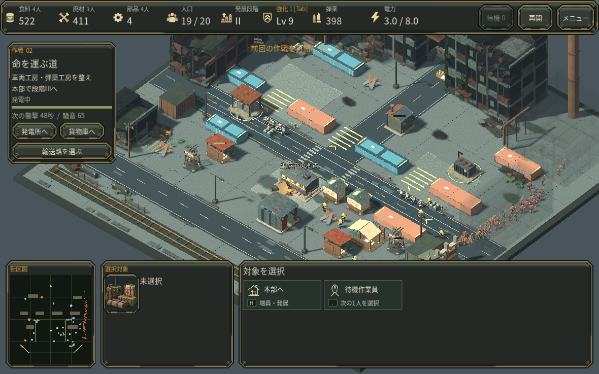
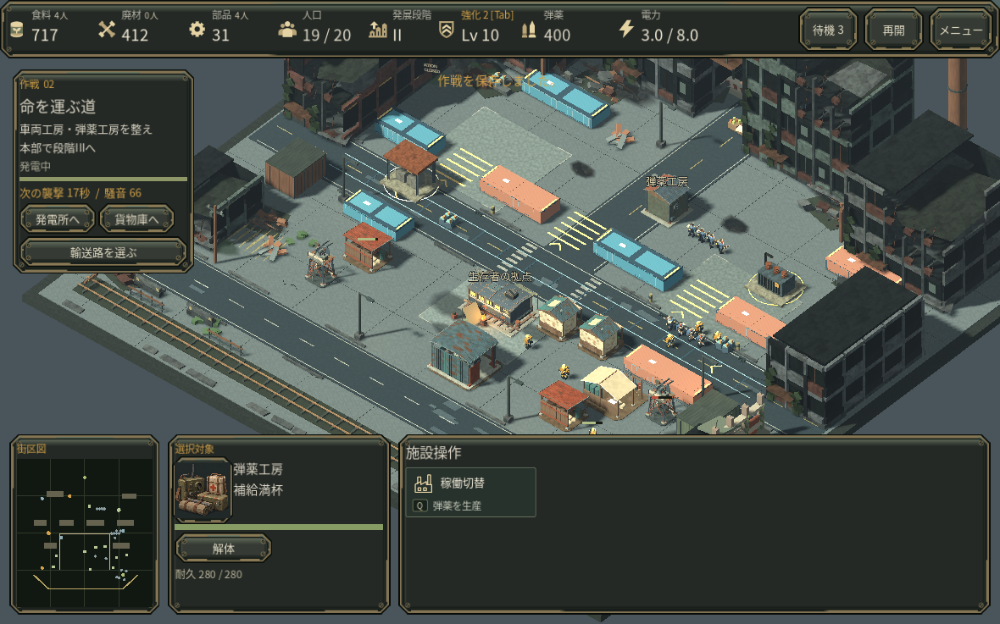

# 危険な損傷を建物自体で示す

第2作戦の通常操作中、弾薬工房が耐久1/280でも普通の外見のままになっていました。30pxの耐久バーでは残りの色が約0.11pxとなり、選択するまで危険を見落としやすい状態でした。

完成した味方建物の耐久が30%以下になると、屋根・機器の一部に炎と短い煙を表示します。工事中には出ず、修理で30%を超えたときや建物の除去で消えます。途中保存を開いた直後や戦術停止中も、現在の耐久から表示します。通常の煙突の排気と位置を分けています。新しい警告文・光源・ダメージ効果は追加していません。

## 同じ実戦保存・同じカメラで比較

通常操作で到達した第2作戦518.85秒の保存を、カメラサイズ54のまま読み込みました。比較中のゲーム保存状態は完全一致しています。炎・煙は描画専用で、戦闘・経済・乱数・保存項目を変更していません。

その保存から通常の部隊命令で護衛を配置し、作業員2人に修理と採取復帰を指示しました。工房は1→280/280へ回復し、炎は消え、作業員は予約した採取へ戻りました。この短い再生は、通し達成記録とは別の操作確認です。

## 描画量と確認範囲

既存の炎・煙MultiMeshを使い、1棟につき炎1枚と煙2枚、画面内で最大16棟・48枚に制限しています。既存バッチに予約枠を設け、激しい戦闘や簡易エフェクト設定でも損傷表示を失わないようにしました。新しいマテリアル・テクスチャ・バッチはありません。見えるバッチが増えれば描画呼び出しは増えます。

同じ停止中の実戦場面でABBA比較を行い、各側100フレームを採りました。llvmpipeソフトウェア描画で、描画呼出336→338、エフェクト表示更新CPU中央値0.086→0.193ms、全フレーム中央値120.736→122.660msでした。平均は122.877→134.659ms、p95は144.909→198.794msで、変更後の最初の区間に大きなホスト変動がありました。速度改善や無負荷とは扱いません。[生の測定値と範囲](measurements/v32_critical_damage_cost.json)。実GPU・Webの速度は未確認です。

機構テストでは境界値、修理、削除、工事中除外、停止中の重複防止、簡易エフェクト、混雑時の予約枠、保存状態の非変更を確認しました。実際の屋根位置と通常修理の見え方はLinuxネイティブ画面で確認しています。人間の初見で危険を見つける速さは未評価です。
