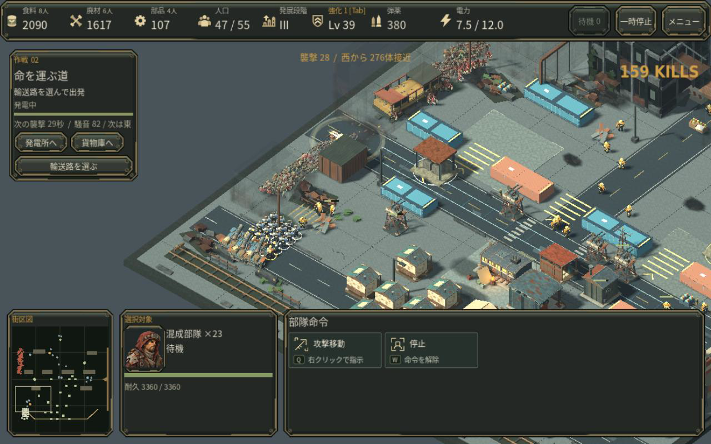

# 大群を倒した手応えを残す

銃撃では短い後ずさり、爆風では低い押し出し、電撃では一瞬の硬直から倒れる動作を加えました。爆発時に古い死体で表示枠が埋まり、新たな撃破動作がほとんど出ない問題も修正しています。一定時間を過ぎた古い表示を入れ替え、始まったばかりの動作を保護します。表示上限は標準96体・軽量32体を維持します。

[同じ実戦保存の変更後12秒映像](media/v36_death_reactions_offline.mp4)。第2作戦の通常プレイで獲得した保存を変更せず再開し、同じカメラ・時間で比較しました。Godotのオフライン30fps出力であり、実行FPSの証拠ではありません。黄色いバスの下で、爆発後にも倒れる群れが残り、徐々に消えることを通常倍率で確認しました。

最初の試作は通常画面で変化が乏しく採用を見送りました。原因を計測すると、20秒の同じ276撃破のうち、爆発による169体に対して表示へ受理された動作は29体だけでした。古い表示枠の再利用後は137体です。この数は表示枠への受理数で、各体が実際に画面内で見えた保証ではありません。3種類の死因を通常倍率で確実に見分けられるとは評価していません。

81時点の保存状態比較で、HP・資源・弾薬・成長・波・ゲーム乱数・カード乱数は一致しました。多くの動作を出すため表示専用乱数は変わります。弾道の表示用原点以外のシミュレーション状態を変えていません。[比較結果](measurements/v36_death_reactions.json)。接地や方向に目立つ不整合は確認した画面にはありませんが、全姿勢を保証するものではありません。

## 確認方法

`tests/check_corpse_motion.gd` は純粋な動作計算、`tests/check_corpse_budget.gd` は表示上限・新しい動作の保護・画質切替を検査します。`tests/check_death_admission.gd` と `tests/trace_death_motion_state.gd` は同梱の実戦保存を使います。必ず空の独立したXDG_DATA_HOMEで実行してください。既存の保存がある場合は拒否します。

[Factorio開発記事](https://www.factorio.com/blog/post/fff-325)の攻撃・破壊対象ごとの反応、[Riotの描画とゲームの読みやすさ](https://www.riotgames.com/en/news/valorant-shaders-and-gameplay-clarity)の優先度を参考に、追加の大きな閃光ではなく感染者の動作を改善しました。素材やシェーダーを流用していません。

人間の初見評価、実Web/macOS/GPU、音の実聴評価は未確認です。今回の確認を商用品質の完成や実ブラウザ性能の改善とは扱いません。
