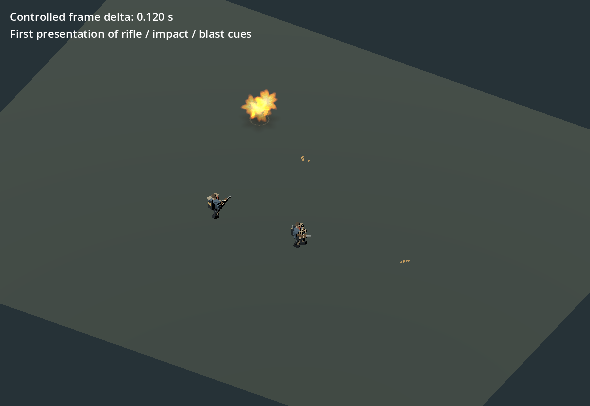
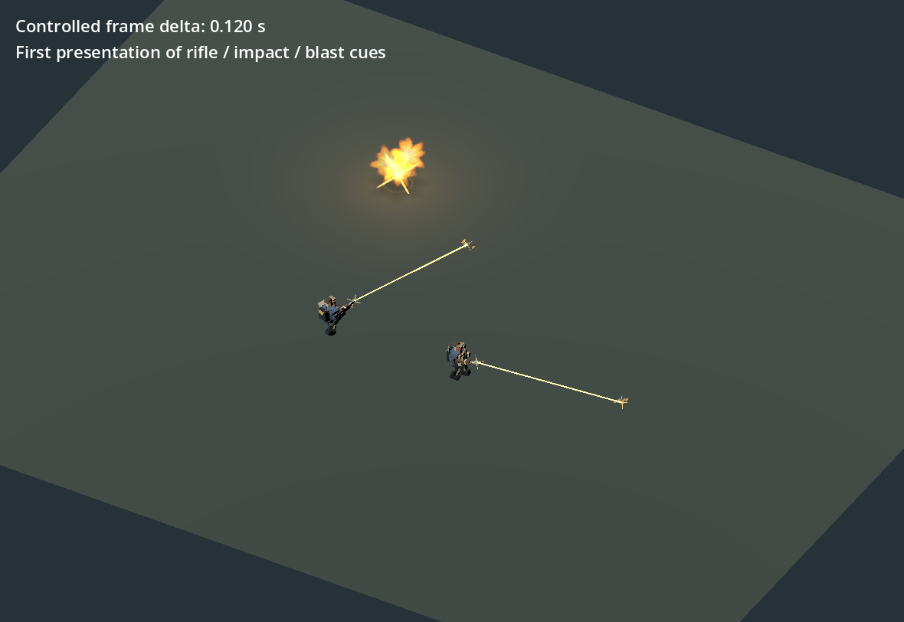

# 重いフレームで発砲が消える問題を補正

銃口の位置修正に続けて、フレーム処理が遅いと発砲が表示前に消える問題を確認しました。ゲームの射撃処理が短い閃光と弾道を生成した直後、描画フレーム全体の経過時間が引かれていました。実FXを120ms/200msの更新で調べると、新しい閃光・弾道の描画提出数がゼロになりました。

受理された新しい短い演出が初回提出前に失効した場合だけ、60fps相当の初回表示を一度出します。実際の寿命は従来通り減らし、失効した演出を保存用のpoolに残しません。古い演出や煙を引き延ばす変更ではありません。爆発の光にも同じ補正を適用しますが、既存の2灯の再利用・上書き規則は維持します。

正常な60fps相当では前後のPNGがバイト単位で一致し、連続50更新の粒子状態・寿命・乱数・光も一致しました。複数の同時発砲、上限、ゼロ時間更新、古い演出の非復活、弾道両層と軌跡の提出を確認しました。[値と確認範囲](measurements/v34_1_first_submission.json)。独立のソースレビューでも提出数の上限と寿命を確認しています。

これらの画像は実Godotで描画した検証用sceneです。フレーム経過を指定して症状を再現しており、ユーザーのブラウザのFPSを測ったものではありません。描画速度そのものを上げる修正ではなく、受理済みの射撃が表示から抜け落ちる問題の修正です。敵数・威力・弾薬・操作・成長は変更していません。既存の上限で受理されなかった演出や、画面外の演出の可視化を保証するものではありません。
