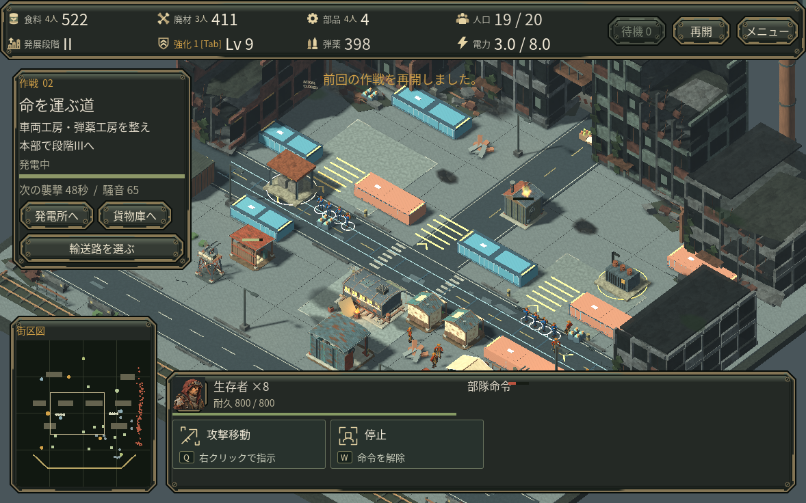
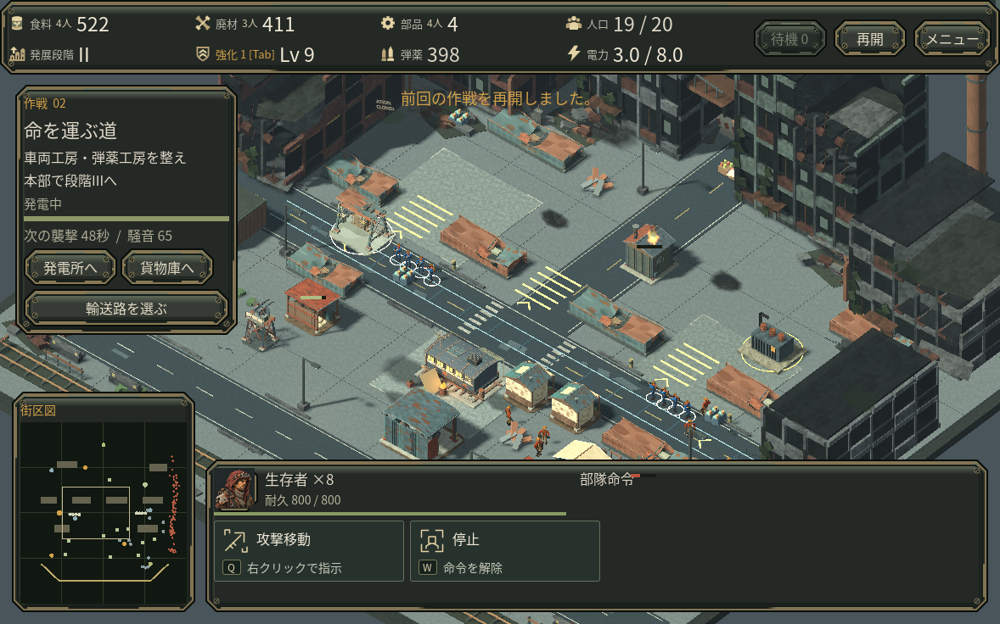

# 貨物ヤードのアート試作

未公開の統合checkpointです。v0.42を基に、第2作戦の旧コンテナ列を、壊れた屋根・曲がった側面を持つ貨物残骸へ変更しました。貨物中継所も、荷と巻上機が見える民間のガントリーとして制作しました。既存の8遮蔽物と中継所の位置・ナビゲーション境界は変えていません。資源配置案はこのcheckpointへ適用していません。

[編集可能な原本・由来](../art_source/freight_yard/PROVENANCE.md) / [統合仕様](../art_source/freight_yard/INTEGRATION.md)

通常倍率の同じ獲得済み保存を150描画フレーム、固定論理時間1/60秒で比較し、全保存状態が一致しました。敵数、戦闘、資源、乱数は変更していません。

llvmpipeの1組の計測では平均draw calls376.94→386.10、primitives202731→208811、texture memory約+8.4MB。壁時計の平均103.68→104.86msという小差だけから、速度変化を断定しません。これはクラウドのソフトウェア描画で、実Web/スマホ/GPUの性能検証ではありません。[記録](media/freight_yard/comparison.json)

同じ場面での視認性を確認する段階であり、次版全体の作戦設計や通常操作の採用判定・配布はまだ完了していません。
