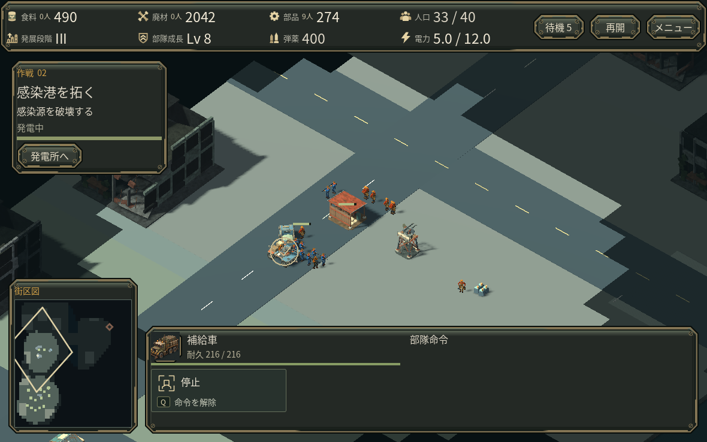
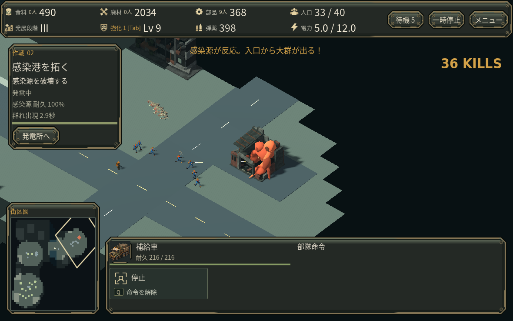
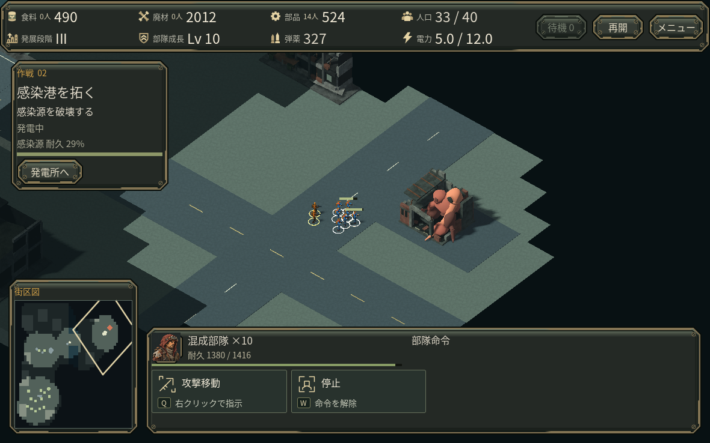
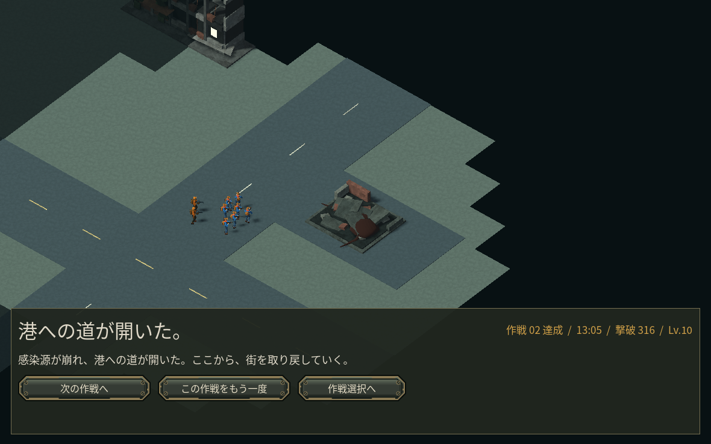

# 感染港を拓く — 広域探索の第2作戦

第2作戦を、輸送路の護衛から「偵察・資源地への進出・感染源の破壊」へ作り直しました。第1作戦の復旧防衛、第3作戦の送電と破砕体撃破は保持しています。正式な商用品質の完成を示す版ではありません。

## プレイヤーの判断

- 作戦区域は60×60mから192×160mへ拡大。カメラは通常のRTS倍率のまま移動し、運河の二つの橋を通って街区を開きます。
- 見えていない場所は未踏域、偵察済みで現在見えていない場所は暗い記憶になります。未知の感染源を地図や自動照準へ表示しません。既に発見した感染源の場所は地図へ残り、現在の耐久は視界内だけで読めます。
- 初期資源に加えて二つの遠方採取地があります。通常の資材集積所・防衛塔・部隊を使い、長い搬入路と採取班を守ります。資源総量は食料4800・廃材6600・部品2800です。
- 感染群は巣の西・南の入口から現れます。初攻撃時は3秒の反応予告があります。巣の破壊が勝利条件で、輸送車や残り防衛時間は要求しません。段階IIIは勝利の必須条件ではありません。
- 既存の部隊登録・作業予約・ミニマップ命令・タッチ操作を使います。新しい専用操作モードは増やしていません。

## 通常費用の進行と実画面

AIによる5秒間隔の指揮を1回実施。初期6作業員・2守備兵から始め、見えていない資源・巣・敵配置を命令判断へ渡さず、通常の採取・搬入・建設・育成・研究だけで進めました。資源や部隊の注入、HP変更、移動の瞬間移動はありません。

205秒に前線集積所、225秒に防衛塔が完成。240秒に東岸へ渡り、偵察で感染源を発見しました。段階IIは270秒、段階IIIは605秒に完了し、785.55秒で感染源を破壊しました。本部は1000/1000、最終編成は14作業員・12守備兵・爆薬手2・迫撃車1・補給車1、316撃破/Lv10です。

前線集積所には食料1600・廃材2200・部品556.19を実際に搬入。初期採取地が枯れた後の発展を支えました。襲撃への作業員の退避・復帰は各14回で、損失はありませんでした。購入額は食2530・廃2140・部640、別に弾薬工房が廃54.75を消費。返金はありません。迫撃車は道中で射撃し橋を移動していましたが、歩兵に追いつく前に巣が破壊されたため、巣への砲撃参加とは扱いません。

この途中保存をクラウドのネイティブGodotで再開し、地図をクリックして前線と目的地を往復、一時停止を解除して既存の命令のまま警戒・出現・撃破・結果画面まで確認しました。再開後は自動の命令・購入を追加していません。途中からの指揮が違うため、通しAI記録と決着時刻は同一ではありません。

AIの成功は人間の楽しさ、初見の分かりやすさ、最適戦略や難易度の適正を証明しません。早期攻撃と十分な研究後の攻撃の優劣比較も未実施です。

## 移動・視界・保存・失敗の確認

実mainで広域移動、未知対象の除外、発見、巣への集中攻撃、砲撃の一度だけのダメージ、保存/再開、壊れた発見情報の拒否と現在状態の保持、HQと巣の同時破壊では敗北になることを確認しました。

別の制御された命令例では、初期守備兵1人を実キャンプへ進ませ、通常の敵ダメージで失いました。5Hz視界更新後に現在視界は消え、探索した地形は保持。残った部隊への再指示と実際の保存/再開が通り、その後に防備を行わなければ通常の襲撃で本部が破壊されました。これは危険な命令を与えた検証で、初見プレイヤーの行動例ではありません。

合成タッチでは広域ミニマップへのタップでの視点移動、明示的な命令、選択の保持、ドラッグ後の誤命令防止、回転時の接触取消、縦画面への再配置を確認しました。実スマートフォンを操作した検証ではありません。

第1/3作戦は、同じseedの開始25秒・各11時点で、保存されるゲーム状態がv0.42と完全一致しました。両作戦の全編をこの版で通し直したわけではありません。M2の旧途中保存との互換はありません。

## 描画と処理の範囲

地形は4街区・14棟の破損建築、二つの橋と運河、既存の貨物アセットで構成。巣は破損した倉庫を感染塊が侵食した新しい独自モデルで、生存/破壊後それぞれ2メッシュです。新しい個体物理やライトは追加していません。

床の縞は重なった床面の影投射が原因とネイティブ比較で確認し、床同士の投影だけ止めました。床が建物・人物から受ける影は保持しています。地面には既存の控えめな舗装素材を再利用し、平面専用の1サンプル描画へ変更しました。

クラウドllvmpipe、1180×737、同じ780.40秒の停止保存/カメラで各150フレームを測定しました。無地床は平均44.53ms、3方向投影の舗装試作は51.05ms、採用した平面投影は44.75ms（p95 51.89ms）でした。採用版は約291描画呼出・約89,940三角形です。別の霧非描画ブロックは平均41.06msでした。順序付きの小さな比較であり、実GPU/WebのFPS改善や測定差の統計的確定とは扱いません。

通常の遠征保存を25秒進めた500ステップのheadless測定では、1ステップ平均4.93ms/p95 8.26ms/最大17.02ms。経路探索の1ステップ上限は味方8・敵32を越えませんでした。これは味方30/敵約45の一場面で、最大密度の全機種保証ではありません。巣側の生存敵上限は180、遠い休眠キャンプは接近/攻撃まで移動経路を要求しません。目を離した稼働中の敵を凍結する実装ではありません。

実Web・Mac・iPhone/Android・実GPU・音の実聴・人間初見の楽しさは未確認です。クラウドブラウザはWebGL2不足で起動確認できず、設定回避は行っていません。

技術参照: [Godotの空間シェーダーとワールド座標](https://docs.godotengine.org/en/stable/tutorials/shaders/shader_reference/spatial_shader.html)、[Godotの経路探索負荷の注意点](https://docs.godotengine.org/en/stable/tutorials/navigation/navigation_optimizing_performance.html)。元の素材・モデル制作情報は既存のlicensesとart_source、および各制作資料に残しています。
