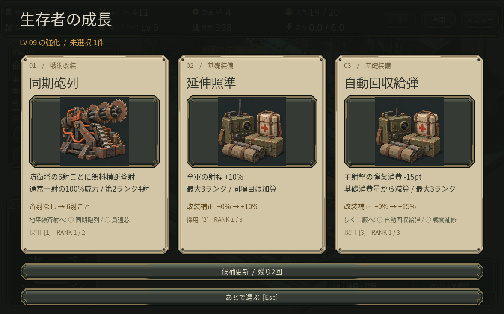
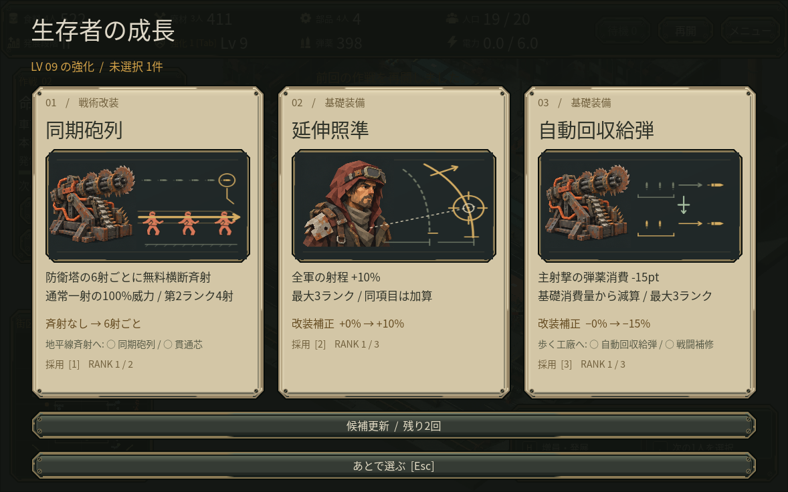
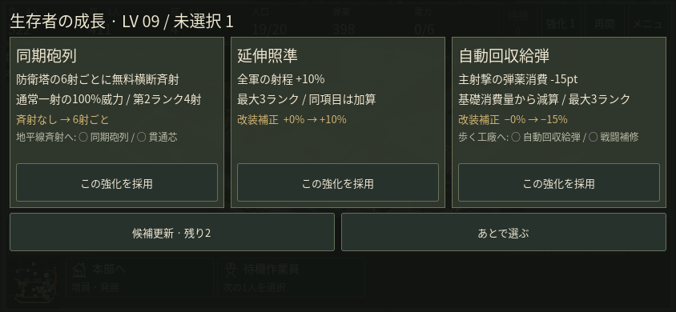

# 成長候補を絵で見分ける

射程・建設速度など異なる効果に同じ補給箱が表示され、連射強化には電力設備が表示されていました。進行用の系統名を絵にも流用していたためです。強化24種と補給3種のIDから絵を直接選び、既存の人物・装備絵に効果の図解を重ねます。系統、抽選、性能、費用は変えていません。

## 同じ実プレイ保存

第2作戦の実プレイ保存、8分38秒の3候補です。実描画は1178×736です。

変更前:

変更後:

図の上を実クリックして射程強化を採用し、ランク1への一度だけの適用と保存を確認しました。候補更新、保留、再表示、採用、保存再開の全セーブ項目は変更前と一致しました。

## 誤った約束を避ける

独立レビューを受け、貫通は元の1体と追加1体、斉射は各列6体に修正しました。弾薬は補充ではなく同じ射撃に使う消費量の減少、回収は収量ではなく速度として示します。一時的な生産強化には砂時計を付けています。図は仕組みを示す概略で、正確な数値とランク条件は既存の本文・増分欄に残しています。

## スマホと検証範囲

合成844×390表示では従来の文字カードと大きな採用ボタンを維持します。見えないPC用図を先に生成する処理は省きました。強化画面を開いたまま保存して新しいシーンへ読み戻す場合も、候補・抽選状態・3つの採用ボタンを維持することを確認しました。

実スマホ・実ブラウザでのプレイや人間初見の理解度は未確認です。新しいGPU性能の改善は主張しません。図は選択画面だけの静的な画像です。製作元はtools/build_upgrade_diagrams.py、表示層はupgrade_diagram.gdです。図形はこのゲーム用の自作、人物・設備絵は既存の出典・利用条件を引き継ぎます。
