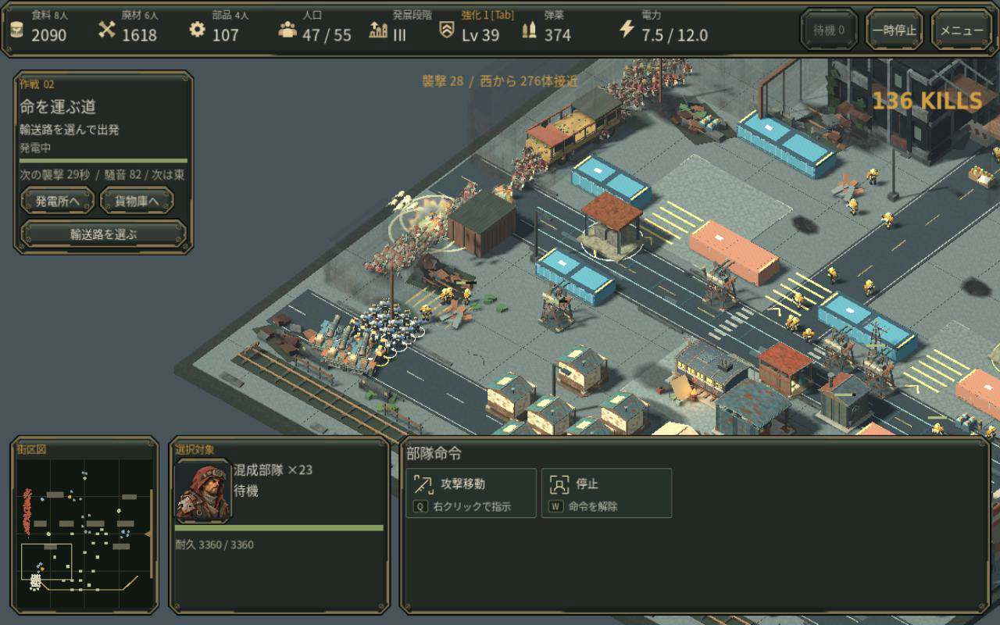
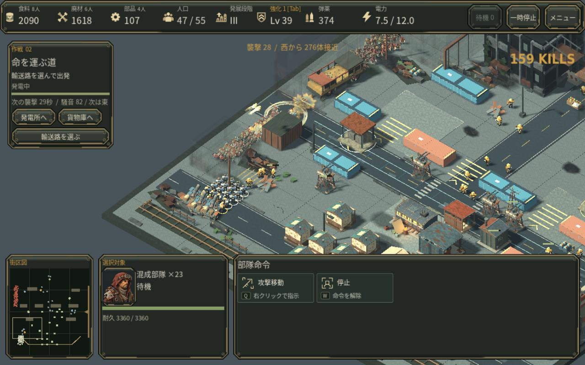

# 重火器が群れの中を狙う

爆薬手・移動迫撃車・固定迫撃砲の自動射撃は、今の射程内で爆風が多くの感染者を捉える位置を選びます。歩兵と監視塔は近い脅威を撃ち、重火器は密集を崩す役割です。手動で集中攻撃を指定した相手を優先します。

変更は主目標の選択だけです。威力・射程・弾数・弾薬単価・連射間隔・飛翔時間・強化効果は維持し、追加弾や大斉射の配置も変えていません。装甲敵などに弾を集中する既存の組合せを弱めないためです。

## 同じ実戦保存の比較

第2作戦の通常プレイで獲得した爆薬手4人・移動迫撃車3台を含む保存を、現行の検証付きローダーから変更せず読み込みました。従来の最寄り目標と新方式を同じコード・保存・カメラで比較しています。

[従来の12秒映像](media/v35_heavy_aim_before_offline.mp4) / [新方式の12秒映像](media/v35_heavy_aim_after_offline.mp4)。同じ保存から7.5秒進め、その後をGodotのオフライン録画で描画しています。30fpsの動画仕様は実行性能の証拠ではありません。

30秒のシミュレーション再生では、両方とも276体を撃破。重火器の主射撃は10→7回、消費弾薬は30→21でした。発射時の爆風範囲内の敵数は平均14.2→49.4体です。ただし群れが消える時刻は約0.5秒遅く、処理速度や勝利速度の向上とは言えません。連鎖・誘爆・他の射撃も含む結果なので、全撃破を重火器に帰属させません。[計測値と限界](measurements/v35_heavy_aim.json)。

## 確認した範囲

- 爆薬手・車載砲の実発射で、手動集中攻撃が自動の密集目標より優先されることを確認。
- 固定迫撃砲は給電時のみ発射。威力・半径・飛翔時間・消費は既存値を維持。
- 7発斉射と保存再開を確認。旧テストの成長ランクと前提条件を現行の保存検証に合わせ、テストデータを正しました。
- 同じステップの位置情報を共有し、死亡は毎回確認。射程外・死亡済みの目標は選びません。候補24か所、評価64体の近似なので、常に数学的な最密点を保証する機能ではありません。

照準処理には追加コストがあります。この実戦再生の有効照準クエリは中央値10μs・最大541μsでした。人工的な3000体のdebug計測では最初の検索8.90ms、8回共有検索21.72msで、従来の8回検索10.85msより増えています。実ブラウザFPSの改善は主張しません。

独立した画面レビューでは、西側の列の奥に弾道と爆発が移ることを確認しました。役割の違いが見える小さいが実際の改善であり、派手さが別段階になった、人間がより楽しいと確認できた、とは扱いません。

## 参考にした開発資料

- [Age of Empires公式 Military & Economy](https://www.ageofempires.com/learn-to-play/military-and-economy-aoe2/): 兵種・攻城兵器ごとの用途を区別する考え方を参考にしました。固有ユニットや美術・数値の複製はしていません。
- [GDC AI Positioning and Spatial Evaluation](https://www.gdcvault.com/play/1021647/AI-Positioning-and-Spatial-Evaluation): 公式講演概要が述べる、意図した戦い方に合わせた空間評価と実行コストへの配慮を適用しました。講演動画の視聴はしていません。
- [Age of Empires IV Weapons Masterclass](https://support.ageofempires.com/hc/en-us/articles/4418736198292-6-Weapons-Masterclass): 面攻撃半径や攻撃の準備/発射を別の要素として扱う資料を参照。RECLAMATIONの既存の威力・飛翔時間を変えず照準だけを比較しています。

人間の初見評価、実Web/macOS/GPU、音の実聴評価は未確認です。
