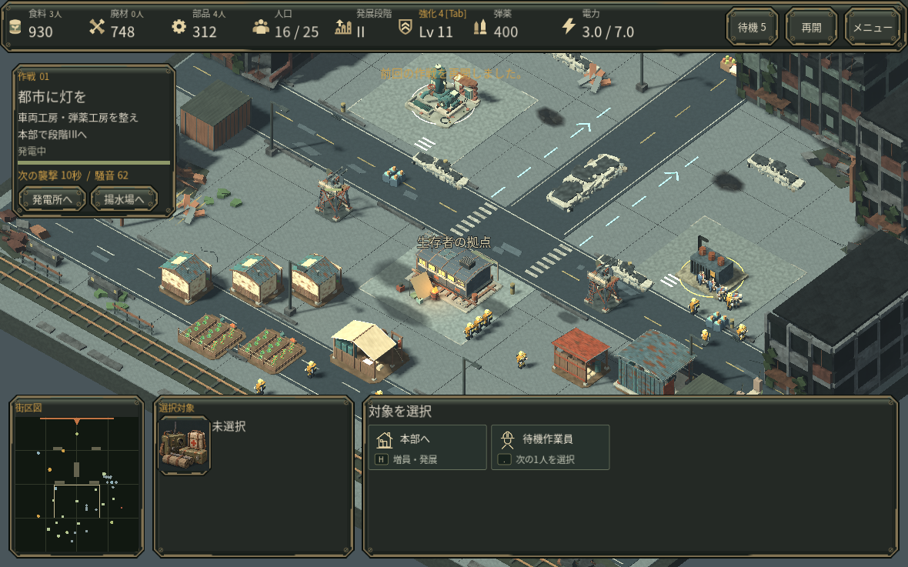
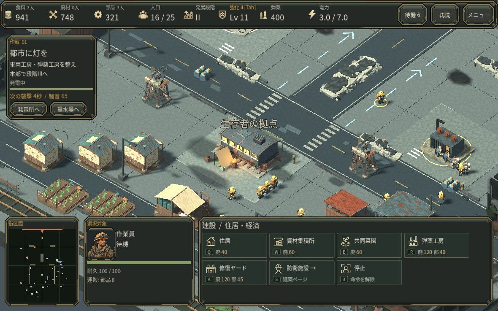

# 見えない描画の削減 / v0.30

不透明なHUDパネルの裏で見えない3Dのピクセル処理を、近接する影なしの深度マスクで省きます。既存の地形・敵・材質・影の投射元・解像度を変更しません。枠の透過部分を避け、パネルが非表示・半透明・回転・クリップされた場合や、メニュー・タイトル・成長カード・結果画面では保守的に無効化します。プレイヤーが設定する新しい操作はありません。

## 確認した結果

- 通常カメラ、ズーム26/85、両方向のパン、1100×800への変更、HUD非表示/半透明、メニュー、タイトルの10条件で、マスク有無の全画素と保存状態が一致しました。[画素比較結果](measurements/v30_pixel_gate.json)
- Godot4.6.3 Compatibility / llvmpipe LLVM19.1.7のソフトウェア描画です。同一プロセスの静止ABBAと逆順BAABでは、両順序ともマスク側のフレーム中央値が低くなりました。各200標本の合算中央値155.01→133.18ms、平均185.69→148.26ms。ただし区間間のホスト負荷変動が大きいため、実GPUの改善率へ外挿しません。[ABBA](measurements/v30_static_abba.json) / [BAAB](measurements/v30_static_baab.json)
- 普通に戦闘・内政更新を行う比較では、同じ保存から各150論理フレームを復元してA/B/B/Aを実施。各240標本の中央値164.064→141.825ms、平均180.130→173.510ms、p95 315.870→314.522msでした。中央の1区間ではマスク側が遅く、tail改善は確認できていません。[全測定値](measurements/v30_live_abba.json)
- ライブ4区間の終了時刻679.8秒、16人・13敵、全保存状態は一致。影primitive35,229、Canvas描画116、テクスチャ割当144,910,831バイトは不変。マスク自体は描画1回・三角形10個を追加します。script_cpuの範囲外で実行されるマスク更新も、frame_msには含まれます。
- ライブBの最初の区間の33標本でprimitive数が通常より520〜1,040少なくなりました。既存の感染者ポーズ位相とbatch境界が原因の可能性がありますが、draw単位のIDは記録しておらず未確定です。もう一方のBは全標本が期待する+10三角形のままで中央値136.206msでした。ゲーム状態一致と、同一sceneでの画素完全一致は別々に確認しています。

通常起動へ統合後、Continue、作業員選択、建築プレビュー、取消、右クリック移動、進行/一時停止、メニュー、既存画質設定の切替、ズームを実画面で確認しました。入力やパネル境界の欠けは見られません。

## 再現と未確認

`tests/check_hud_depth_mask.gd` は投影・安全余白・可視性条件をheadlessで検査します。native用の `review_hud_depth_mask.gd`、`bench_hud_depth_mask.gd`、`bench_live_hud_depth_mask.gd` は同じゲーム保存を使用します。`tests/fixtures/earned_v029_profile.json` を隔離したXDG_DATA_HOME内の `godot/app_userdata/RECLAMATION — オルタ湾復旧作戦/settlement_v2/checkpoint.json` にコピーしてから実行してください。自身の進行データへ上書きしないでください。`check_live_hud_depth_frames.gd` は150callbackと同一進行を確認します。計測中はGodotを1プロセスだけにし、大きい圧縮やハッシュ処理を並行させません。

ユーザーのブラウザ/GPUでの改善率、macOS・Webの実プレイ、人間初見の遊びやすさ、音の実聴は未確認です。ソフトウェア描画の遅いフレームが解消したとは扱いません。

## 一次資料

- [Godotの描画優先度](https://docs.godotengine.org/en/4.6/tutorials/3d/standard_material_3d.html#render-priority)
- [Compatibility描画順キー](https://github.com/godotengine/godot/blob/4.6/drivers/gles3/rasterizer_scene_gles3.h)
- [Performanceカウンタ](https://docs.godotengine.org/en/4.6/classes/class_performance.html)
