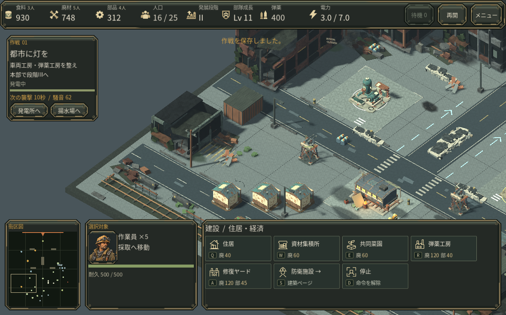
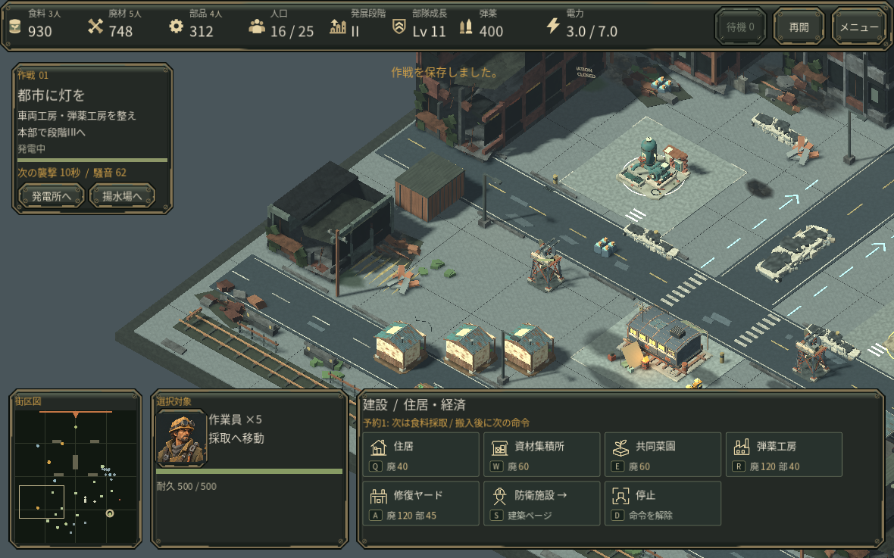

# 視点を動かさずに遠くへ命令する

v0.31開発中のソース保全です。以下の操作は検証済みですが、配布版の生成と中盤の通し操作は継続中です。

以前の街区図は左クリックで視点を移すだけでした。止まった採取担当5人を遠方へ戻す場面で、右クリックしても命令が出ず、視点を移して資源を探し直す必要がありました。

街区図の右クリックも、戦場と同じ命令処理へ渡すようにしました。選択中の部隊の移動・集中攻撃・護衛、作業員の採取・建設/修理、Shiftの作業予約、生産施設の集合地点に対応します。建物の配置中は、戦場と同じく右クリックでプレビューだけを取り消します。視点と選択は維持し、受理した指示は街区図に短い輪で示します。説明パネルは追加していません。

Qで明示した攻撃移動は、敵付近をクリックしても集中攻撃に変えず、指定地点までの命令を維持します。通常の右クリックによる集中攻撃は残ります。

## 同じ保存・同じクリックの比較

通常操作で得た第1作戦677.3秒の保存を、それぞれ隔離したデータ領域から再開しました。マウス/キーボード操作はAIが実施したもので、人間の初見テストではありません。

同じShift右クリックで旧版の予約数は0、改善版では選択5人全員に食料採取を1件予約できました。通常の右クリックへ切り替えると5件の予約を置き換え、食料担当が3人から8人になります。視点、選択、時刻、費用、XPは比較中不変でした。[比較記録](measurements/v31_minimap_comparison.json)

独立したheadless確認では実際のViewport入力を含め、通常移動・採取・予約・護衛・集中攻撃・攻撃移動・集合地点・配置取消と、各モーダル/タイトル/結果中の操作拒否を確認しています。通常右クリックの戦闘指示も維持されています。実Web/Macでの操作、人間の初見評価は未確認です。
