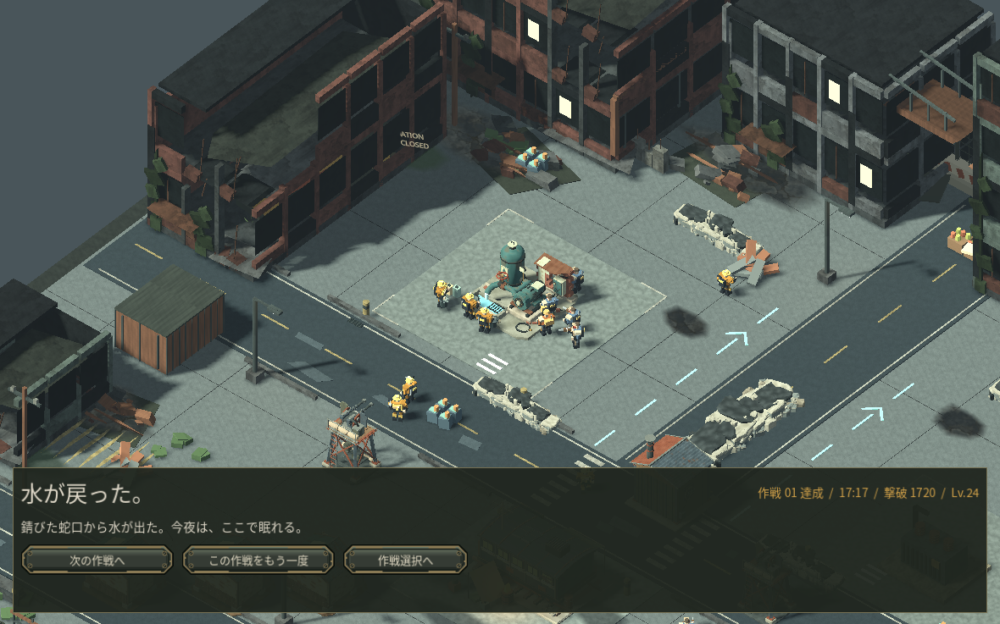

# 第1作戦の通常操作と戦闘再生

通常のマウス・キーボード操作で進めた第1作戦を、677.3秒の保存から改善版で続行しました。資源、兵数、カードを追加する操作はしていません。AIによる実操作であり、人間の初見プレイではありません。判断中には戦術停止を使っています。

- 枯渇していた採取場の5人を再配置し、搬入で経済を回復。
- 弾薬工房を再建して給電し、本部から段階IIIへ発展。兵士・爆薬手の生産を並行。
- ミニマップから部隊・作業員・集合地点を指示し、2人の復旧班と護衛を揚水場へ。復旧後の採取も予約。
- 護衛を置かなかった西の採取班5人と、離れていた部品採取班2人を失いました。警告への操作対応が遅れた失敗として記録し、これを理由に難易度を下げていません。
- 貫通、斉射、連鎖を選んだ軍で群れを撃破。作戦達成はゲーム内17分17秒、1,720撃破、Lv24。次の作戦の解放保存も確認しました。

[達成保存の記録](measurements/v31_campaign_completion.json)。主な命令確認は保存からの継続で行い、画面表示だけの最終修正は別の本部画面と条件別テストで確認しています。

## 同じ実戦保存からの短い映像

[戦闘再生を見る（8秒、音声あり）](media/earned_horde_v31_offline.mp4)

これは通常操作で到達した124体の群れの保存を、Godot Movie Makerでオフライン再生した映像です。30fpsは出力形式で、実機の動作速度の証拠ではありません。元のカメラ・標準画質・部隊・強化・敵配置を使い、停止を解除して再生しています。群れは8秒の再生中に撃破されています。

音声はゲームの出力を含め、音量の正規化はしていません。デコードと非無音は確認しましたが、音の実聴評価は未実施です。[映像の出所とハッシュ](measurements/v31_movie_provenance.json)。Movie Makerの性質は [Godot公式説明](https://docs.godotengine.org/en/4.6/tutorials/animation/creating_movies.html) に従っています。

ユーザーのブラウザ/GPU、macOSでの操作、人間の初見評価は引き続き未確認です。第2・第3作戦をこの版で新たに通し操作したとは扱いません。
