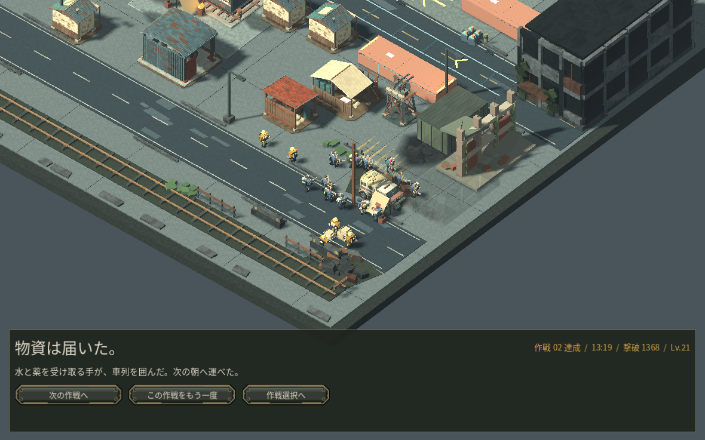

# 第2作戦を新規開始から通常操作で達成

第1作戦の達成で実際に解放された第2作戦を、新しい作戦として開始し、通常のマウス・キーボード操作で最後まで進めました。資源・部隊・カードの追加、時間加速はありません。AIによる操作で、判断中は戦術停止を使っています。人間の初見プレイの所要時間や楽しさの証拠ではありません。

- 3分16秒：住宅2・集積所・訓練所を整え、段階II研究を開始。
- 6分48秒：発電開始。東西の襲撃に防衛を分け、工房と車両工房を建設。
- 8分39秒：段階III研究を開始。途中で危険になった工房を修理しましたが、後の防衛配置では工房を失いました。
- 12分00秒：貨物中継所を復旧し、輸送準備完了。守備兵12人、作業員5人、本部耐久1000/1000。資源採取の護衛が遅れ、複数の作業員を失っています。
- 南側の短い道を選び、廃材80を支払い。部隊選択を保ったまま輸送隊へ視点移動し、12人へ右クリック1回で継続護衛を指示。最初だけ車列を停車して集合を待ち、再発進後は護衛命令を出し直していません。
- 13分19秒：物資を届けて作戦達成。1368撃破、Lv21。最終作戦の解放が保存されたことも確認しました。

この通し操作はv0.31の最終候補で行いました。v0.32の変更は損傷表示のみで、同じ実戦保存を使って表示と修理を別に確認しています。強化は自然に提示された候補から選び、電撃・爆発・貫通を組み合わせました。過去の別経路の準備22分40秒を、必ず必要な待ち時間とは扱いません。今回の結果を理由に戦闘や経済の数値は変更していません。

[達成記録](measurements/v32_campaign_after_mission2.json)。次の優先確認は、解放された最終作戦の通常操作と、そこで実際に見つかる大きな操作・体験上の問題です。実ブラウザ/GPU、macOS、人間の初見、音声の実聴評価は未確認です。
