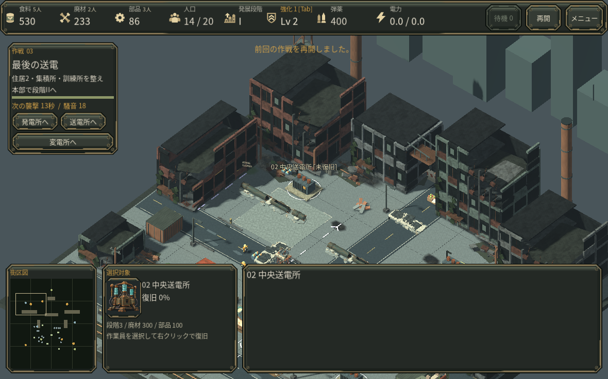
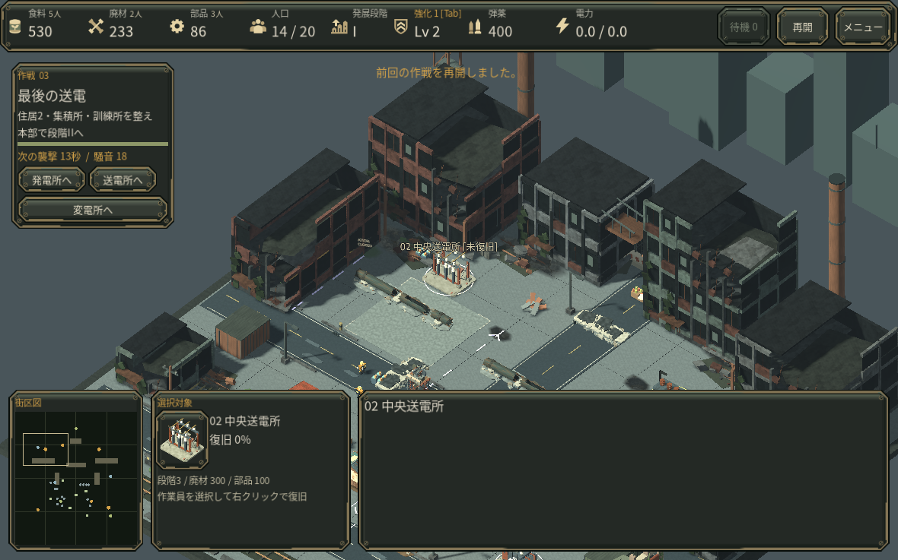
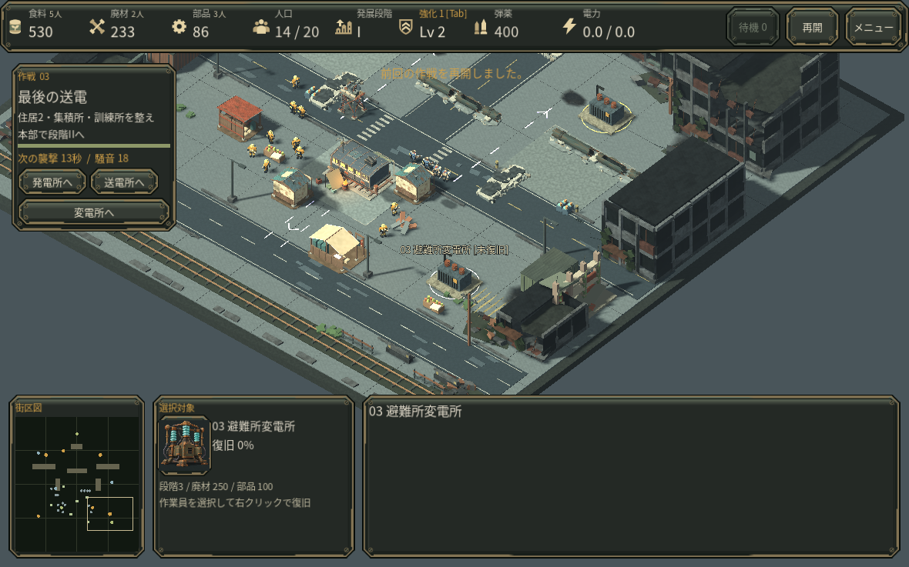

# 送電所と変電所を形で見分ける（開発中）

最終作戦で発電所・中央送電所・避難所変電所がほぼ同じ外見だったため、中央送電所と変電所を専用のBlenderモデルへ置き換えました。中央は開いた母線と遮断器、避難所側は変圧器のタンク・放熱板・碍子・油槽を持つ形です。元の発電所はそのままです。選択欄の肖像も、それぞれの実モデルから描画しています。

通常操作で到達した最終作戦286.95秒の保存を、同じカメラ・配置で比較しました。比較の各組で保存状態は一致し、施設の位置・種類・費用・作業位置・進行は変えていません。既存の復旧状態API、未変更の発電所、衝突・照明を追加しないモデル契約も確認しています。その後、新モデル付きの通常操作で両設備を復旧し、最終作戦と全3作戦の結末まで確認しました。[通し操作の範囲と記録](PLAYTHROUGH_FINAL_OPERATION.md)。

中央は3888、避難所側は3744三角形で、各1つの不透明PBR面です。既存の材質3枚を同じTexture2Dとして共有し、GLBへの画像の重複埋込みはありません。実画面比較では描画呼出数は変わらず、モデルの増分として各画面で5000三角形が増えました。これはFPSが同じという証拠ではなく、実GPU・Web速度は未確認です。選択肖像は256pxの小さいPNGです。[比較値と確認範囲](measurements/v33_power_art_comparison.json)。

[元データ・制作手順・資料の出所](../art_source/power_facilities/PROVENANCE.md)。形の理解にはメーカー公開資料を参照し、形状・配列・補修部品・UVは独自に制作しています。新しいゲームルールは追加していません。READMEの古い最終作戦180秒表記も、実際の60秒条件へ訂正しました。

初回の形状比較はv0.33の保全点で行い、v0.34へ統合しています。実ブラウザ確認は未実施です。
