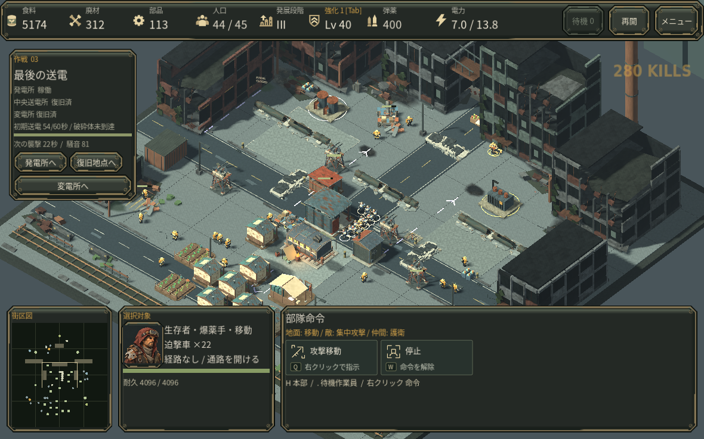
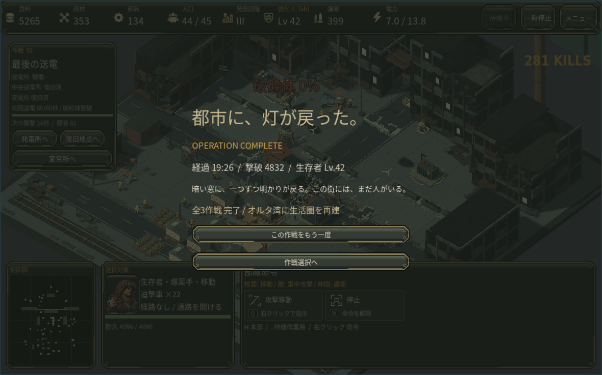

# 0.19 再構築候補

## 土台と変更

公開済み0.10.0、commit c7fc9da7cd7cb1970b6e48a866384e391bb49ba1 の全追跡ファイルを照合した上で作成。0.18.1の完全なソースと配布物は回収できていないため、その版を復元したとは扱わない。

- 移動経路が空・到達不能な場合は停止し、上限つき再探索を行う。地形変更で再評価する。作業員の採取・搬入の完了は実際の到着を必要とする。
- 保存を適用する前に構造と参照を検証し、失敗時に現在の世界を消さない。一時ファイルと退避コピーを使い、書込み結果を読み返す。保存失敗を成功と表示しない。
- XP獲得時の強制中断を取り除き、獲得した強化を上部表示またはTabから選ぶ。Escで候補を保留し、保存後にも候補・未選択件数を保持する。
- 論理処理を20Hzに固定し、描画のみ補間する。ポーズ・勝敗・再開時の時間残りを持ち越さない。
- 単独選択した作業員には現在の検証済み経路だけを描く。未探索・到達不能な目的地へ線を捏造しない。
- 最終作戦は段階III、全設備、送電、60秒の初期安定化、破砕体撃破を必要とする。敵の強さや獲得済み強化はこの変更で弱めていない。

## 確認の範囲

クラウドのGodot 4.6.3で起動し、通常の採取と搬入、作業員の経路表示を操作で確認。強化操作専用の制御状態では、開く・保留・採用・保存・プロセス終了・通常起動からの再開を実画面で確認した。この強化状態は自然なプレイで獲得した証拠ではない。

通常の開始プレイでは防衛を薄くした本部が3分51秒で失われた。新候補の第3作戦は、通常資源と通常命令だけを使う加速シミュレーションで19分24.95秒に達成した。段階IIIは12分23秒、全設備復旧は18分22.10秒、破砕体は19分17.10秒に出現し撃破と同時に勝利した。作業員3人を失い、軍・建物の損失はなかった。第1・第2作戦の通し達成は現候補では未確認。最終作戦の条件付き終了は制御された実シーンで確認し、設備不足・送電停止・本部死亡時の勝利を防ぐ。

実GPU、macOS、Web配布物の現在版での起動、音の実聴、初見の人による評価は未確認。クラウド描画はllvmpipe、音声はDummy出力。商用品質の完成宣言ではない。

通常資源で獲得した19分05秒の保存をネイティブ実行で再開し、19分26秒・4832撃破の達成画面まで確認した。初見プレイヤーによる通しプレイではない。

通し試験で、合法な位置にある未完成中継器へ作業員が到達できない経路選択の欠陥を発見した。担当する作業員は生存し、別の作業員でも再現。到達可能な施設外周を選ぶよう修正し、その同じ獲得済み保存から通常再開すると19分23.70秒に完成することを確認した。別作業員への通常指示でも完成し、遠隔建設や障害物通過を必要としない。

その後の統合版では同じ命令ルートが16分31.80秒で達成し、破砕体撃破から勝利まで0.35秒だった。一方、別の中継器配置が全周封鎖されて作業不能になり、停電した車両工房の予約状態をセーブ検証が拒否する問題を発見した。封鎖された配置は支払い前に拒否し、選択作業員から到達可能な作業場所があるかを確認するよう修正した。セーブは実際の生産状態に合わせて検証を修正し、停電・未完成・停止中の有料予約で残り時間と費用を保持することを確認した。これら最後の修正は対象となる条件で検証し、さらに全作戦の通し試験を重ねたという主張はしない。

## 部隊操作と大群の探索負荷

Ctrl+1〜9で選択部隊または建物を登録し、数字で呼び出す。二連打は視点移動。C/Vで全戦闘員/作業員を選ぶ。成長カードの1〜3を優先し、選択画面内でCtrl+数字を押しても採用しない。既存の情報欄に短い操作説明を載せ、追加の常設パネルは設けない。実画面で作業員・軍・本部の登録と呼出し、保存、プロセス再起動後の本部呼出しを確認した。二連打の時間境界は入力テストで確認し、GUI自動操作の遅延では実証していない。

行き止まりの感染群が空経路を毎回再探索する欠陥を修正した。封鎖した500体の制御場面で、旧処理は1論理ステップに13,000回のAStar呼出し、新処理は10秒合計500回・1ステップ最大32回。開通すると0.85秒以内に全501体が経路を得た。実際の統合シミュレーションでも1秒以内に移動再開し、壁と本部への攻撃が続く。これは探索呼出し数の試験で、実GPUのフレームレート保証ではない。

## 再構築できていないもの

後期版の全ての美術、楽曲構成、開始乱数と作戦開始配置、演出・誘導を再現できたとは扱わない。現候補には公開済みの既存アセットを使用し、回収できたソースから一部を適用した。各機能は今後の実装・検証を経て追加する。

## 判断に利用した公開資料

- Valve, The AI Systems of Left 4 Dead: https://cdn.akamai.steamstatic.com/apps/valve/2009/ai_systems_of_l4d_mike_booth.pdf 。難度とペースを分けて考え、強い成長を一律に弱めず戦闘後の待ち時間を短縮した。
- Wube, FFF-280: https://www.factorio.com/blog/post/fff-280 。検証済み経路と指示先を区別する経路表示へ応用した。
- Wube, FFF-363: https://www.factorio.com/blog/post/fff-363 。選択対象の稼働・停止状態と目的地を主要画面に表示する考え方を参照した。

資料はスライドと記事を読んだもので、講演動画を視聴したとの主張はしない。
