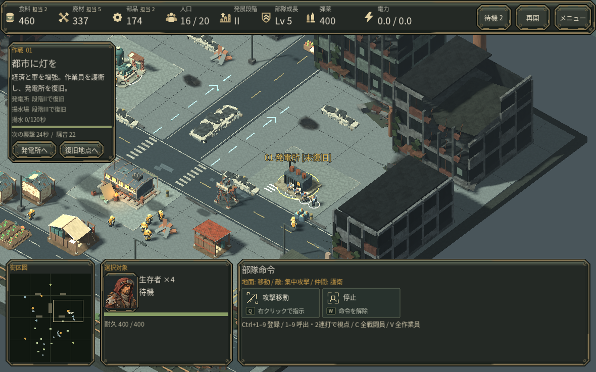
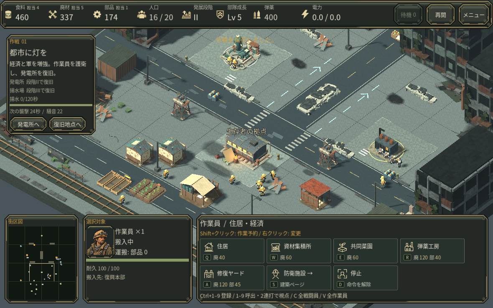

# 資源ごとの担当人数

食料・廃材・部品の既存欄へ「担当 N」を加えました。備蓄量と担当人数を分け、現在どこへ人を回しているかを戦場から目を離さず確認できます。収入速度の表示ではありません。

採取へ向かう人、採取中の人、搬入中の人を現在の担当へ含めます。建設・修理・設備復旧や停止中の人、未来の採取予約、採取先を失った枯渇待機は含めません。別の資源へ配属し直した人が古い荷物を持っていても、新しい担当を表示します。経路・搬入待ちでは既存の「待機」と重なる場合があります。

## 実際の内政で確認

通常操作で作業員を増やし、襲撃での損失後に補充し、菜園や監視塔を建設した第一作戦392.55秒の保存を使用しました。12人のうち、採取担当は食料2・廃材5・部品2、残りは建設1人と待機2人です。旧表示の備蓄460/337/174だけでは見えなかった配分が読めます。

部品担当1人を発電所の復旧へ出すと部品1へ変わりました。待機中の2人を菜園へ回すと食料4へ変わり、そのうち1人が以前の部品を搬入中でも食料へ正しく含まれます。画面の幅や戦場の面積は増減していません。

確認は1180px幅のクラウドLinux実画面・通常入力と、集計がゲーム状態を変えないことを含む限定した回帰試験です。初見の人間による評価、実GPU・Mac・Webの実行、音声の実聴は未確認です。保存の再現用状態は tests/fixtures/v28_earned_staffing.json にあります。

公式AoE資料の適用根拠は[開発資料](DESIGN_REFERENCES.md)に記載しています。元作品の画像やUI素材は使用していません。
