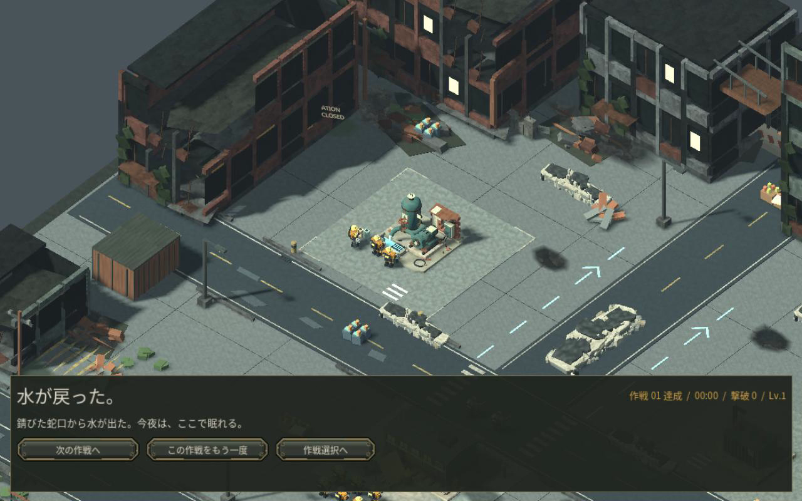
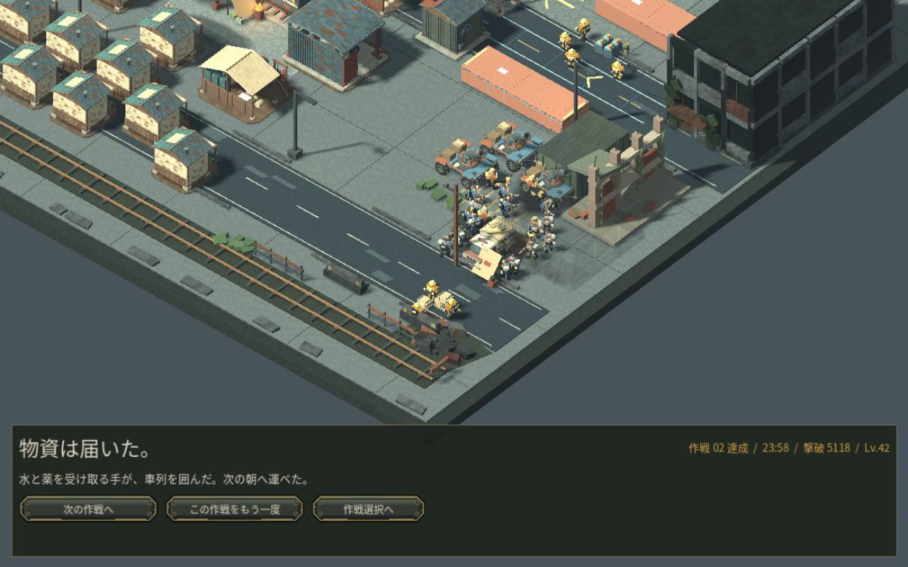
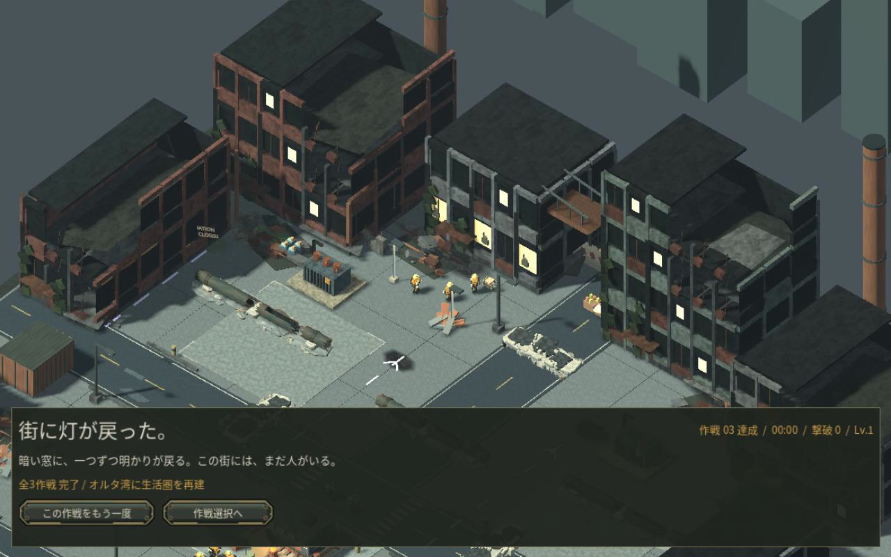

# 取り戻した街を見せる結末

作戦達成直後の暗い全面パネルをやめ、実際の街を見せながら結果と次の操作を下部に表示します。給水・輸送・送電に、それぞれ異なる約5.6秒の動きを付けました。次の作戦、再挑戦、作戦選択は最初から操作でき、演出を待つ必要はありません。

## 水を取り戻す

復旧したポンプの実際の出口から水が戻り、住民が容器へ汲みます。これは第一作戦の構図を確認するために完了を設定した検証画面です。通常プレイでの達成証拠ではありません。

[7秒の動きとエンジン出力音声](media/v24_water.mp4)

## 物資を届ける

育成・採取・建設で得た第二作戦の輸送直前保存から、通常の積込み費用・迂回路・一度の護衛指示で最終区間を再生しました。実際の輸送隊は満耐久で到着しています。護衛が集まる場所を避けて受取人と荷物を配置し、車両から荷を運びます。実際の部隊や輸送車の位置、命令、能力は変更しません。

[7秒の動きとエンジン出力音声](media/v24_cargo.mp4)

## 灯を戻す

既存の建物の窓が灯り、人影と街路の住民を見せます。第三作戦の構図確認は完了を設定した検証で、全作戦を人が初見で遊んだ証拠ではありません。

[7秒の動きとエンジン出力音声](media/v24_power.mp4)

## 確認したことと限界

- 街が見える実画面、荷受人と護衛の分離、結果と操作の可読性を確認しました。
- 次の作戦・各作戦の再挑戦・作戦選択への実際のボタン信号、演出前から操作できることを確認しました。実ウィンドウでも第一作戦の結果ボタンをマウスで押し、第二作戦の新しい拠点へ進むことを確認しました。
- 達成記録の保存失敗では途中保存を保持し、再試行成功後に記録してから途中保存を片付けます。
- 演出で資源、部隊、敵、進行時間、乱数状態は変更しません。敗北時の操作は従来のままです。
- 動画は Linux / Mesa llvmpipe 上の Godot Movie Writer による固定30fpsのオフライン描画です。ゲームの実時間フレームレートを示しません。音声はエンジンから記録した48kHzステレオで、実聴による音質評価は未実施です。
- 実GPU、macOS、Web上の実行と、初見の人による体験評価は未確認です。商用品質の完成判定ではありません。

新しい小物と人物配置は本作向けのオリジナル制作です。[制作元の記録](../licenses/Reclamation-Aftermath-Provenance.md)。
