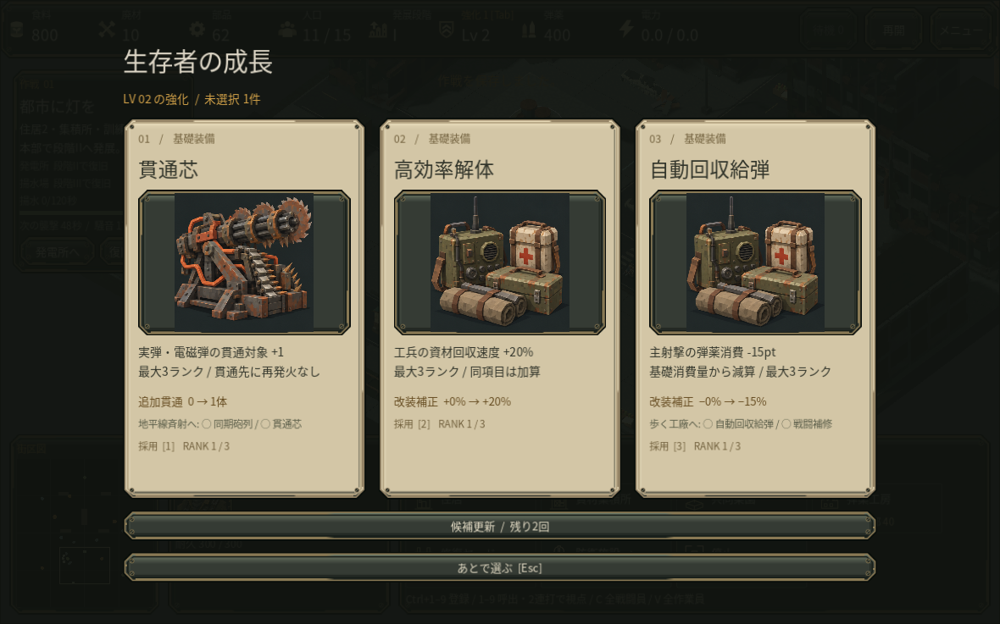

# Fresh run variation candidate

This is new implementation on the reconstructed v0.19 baseline, not recovered v181.

## Behavior

- Starting a mission or retrying normally chooses a fresh nonnegative 63-bit run seed. A persistent randomized seed generator avoids relying on clock resolution for fast retries, and an immediate repeat seed is rejected.
- The same run seed and mission derive independent combat, card, and visual streams through domain-separated SHA-256 seed derivation. Scrap-pile decoration now uses only the visual stream. World art, particles, and audio already have private generators.
- Fixed terrain, starting units and resources, resource totals, wave counts, enemy statistics, upgrade eligibility/weights, and earned build effects are unchanged. Randomness affects existing card choices, combat cooldown/critical draws, and existing spawn-position draws.
- Schema 3 checkpoints require run_seed, rng, card_rng, and visual_rng as canonical decimal strings. The loader restores the saved identity and all three stream states after object reconstruction. Offered cards are restored by ID without drawing again. Old schema 2 checkpoints are intentionally unsupported; no player migration infrastructure was added.
- A successful resume skips the fresh opening's headquarters selection, preserving saved actor selection even in a first-second checkpoint.
- Atomic JSON writes now request full numeric precision. Godot's JSON parser can still change the final floating-point bits of an ordinary cooldown. This is not a guarantee of identical world trajectories after load: navigation is intentionally rebuilt. Seed/RNG strings and subsequent draws, cards, orders, resources, selected actors, and earned build values are covered separately.

## Reproduction

Normal play needs no new UI. Read the current seed from the saved checkpoint's run_seed string, or inspect main.run_seed.

Run with Godot user arguments: `godot --path . -- --run-seed=9007199254740993`.

Use `start_mission(mission_index, seed)` from a test/developer call for a particular attempt. Explicit function seeds take precedence over command-line seeds. A command-line override intentionally reproduces subsequent retries; remove it for ordinary fresh retry randomness. Resume always uses the checkpoint seed even if the command line differs. Reproduction applies to the same game version and mission with the same input/event sequence.

## Verification

Godot 4.6.3, headless, isolated XDG_DATA_HOME for every run:

- `tests/check_run_variation.gd`: 66 passed, 0 failed. Eight actual scene retries had eight distinct seeds and eight distinct opening card offers in the final sample. The test requires variation across the sample, not an impossible promise that random choices never repeat. It covers deterministic cards/cooldowns/waves/crit rolls, 2,500 extra visual draws and scrap geometry, unchanged starting world/balance, earned build and visible/postponed-card restoration, selected actors and target relationships, exact next 128 draws for each of three streams, and malformed seed/state rejection. The seed fixture exceeds 2^53 to catch JSON integer precision mistakes.
- `tests/check_run_seed_cli.gd`, with `-- --run-seed=123457`: passed actual startup, deterministic retry, explicit override priority, and checkpoint identity priority.
- Existing checkpoint integrity: 53 passed, 0 failed, including interrupted/failed writes, nested validation, cards, relationships, paid queues and completion recording.
- Existing production waiting checkpoints: 49 passed, 0 failed.
- Existing deferred growth, upgrade draw rules, construction-access checks, and application `--self-test --run-seed=123457`: passed.

No GUI, exported package, browser or publication testing was performed. The environment prints existing Fontconfig cache warnings and some existing ObjectDB shutdown warnings. Final focused tests have no script errors. The earned schema-2 fixture was not changed, migrated, or claimed as supported by schema 3.

## Integrated native review

On the cloud native Godot build, an ordinary new first mission built a training shelter and house, produced two defenders and another worker with paid queues, and gathered food and parts. The outer training shelter was lost when it was left outside the effective defense position; the HQ and units survived. At 4:11.50 and 18 kills the first earned offer was pierce / salvage / supply. The actual scene was saved, the process stopped, and normal title-screen Continue restored those same three choices and the selected three workers. Choosing pierce once then saving left one rank and no pending choice. No XP/resource grants were used for this native review.

This covers a real opening and save continuation, not a full campaign or first-time human difficulty assessment. Native audio uses Dummy output; target GPU, macOS and Web remain unverified. Eight-seed variation and exact continuation draws were verified separately by the deterministic tests above. The archived schema-2 earned approach fixture remains unchanged on disk; its navigation regression now adapts only version/seed metadata in memory and is explicitly a derived test fixture, not an untouched schema-3 earned save or a player migration.
