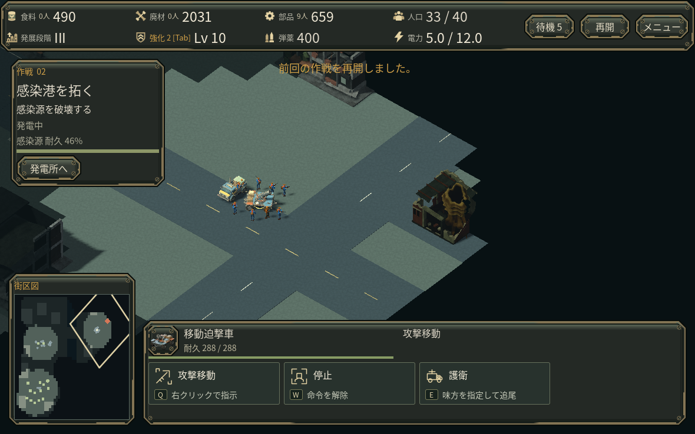
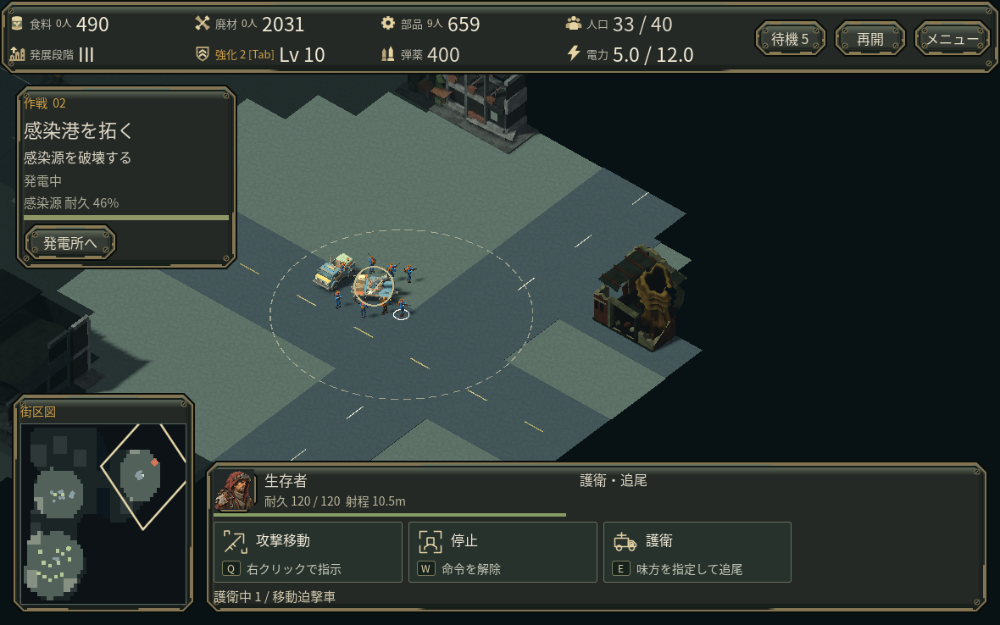
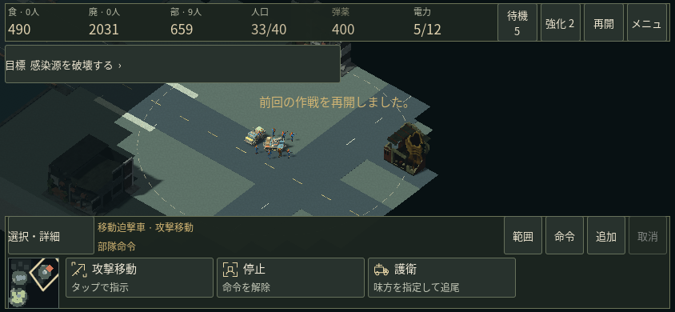

# 単体選択で射程を読む

歩兵・爆薬手・移動迫撃車を1人だけ選ぶと、既存の耐久欄へ射程を表示し、地面に同じ距離の細い破線を出します。複数選択・作業員・死亡・選択解除・成長選択・タイトル・結果・既存オプション画面では消します。射程の強化も反映します。

[同じ獲得済み状態での攻城比較](SIEGE_ROLE_REVIEW.md)では、砲車を護衛する歩兵が巣の19〜25m手前に留まりました。迫撃車22mと歩兵10.5mの違いを、数値だけでなく通常倍率の地面から読めるようにする変更です。円は射程の距離を示し、射撃・命中・移動到達を保証しません。未知の敵や地形を読む処理はありません。

## 確認範囲

同じ通常費用の途中保存・カメラで表示だけを切り替え、保存される状態が完全一致しました。クラウドの実Godot画面で、迫撃車を部隊登録→全軍選択で輪が消える→歩兵をクリックすると小さい輪→登録した砲車へ戻る操作を確認しています。耐久・位置・敵数・費用・抽選・ダメージは変えていません。

実射程、補間中の位置、強化、単体/複数/作業員/死亡/成長選択の切替、保存再開を限定回帰しました。試験中に未取得の強化を0ランクとして書いた初回試験は、保存形式に反する試験側の誤りとして修正し、正常な未取得状態へ戻して再実行しています。

スマホ幅では通常タッチHUDを増やさず、射程値は既存の選択詳細へ入ります。横幅844×390の詳細画面でも値が欠けずに見えることを確認しました。合成タッチ設定の描画確認であり、実スマホ/Webの検証ではありません。

描画は1メッシュ・128三角形。半径が変わるときだけ形を組み直し、移動は補間位置への平行移動です。影・独自ライト・経路検索・敵検索は追加しません。深度を書き換えず、既存の霧より先に描き、建物や霧で隠れます。固定幅の線は遠いズームでは細くなります。追加描画コストはあり、FPS改善は主張しません。

実Web・スマホ・Mac・実GPU、人間初見の理解度は未確認です。
