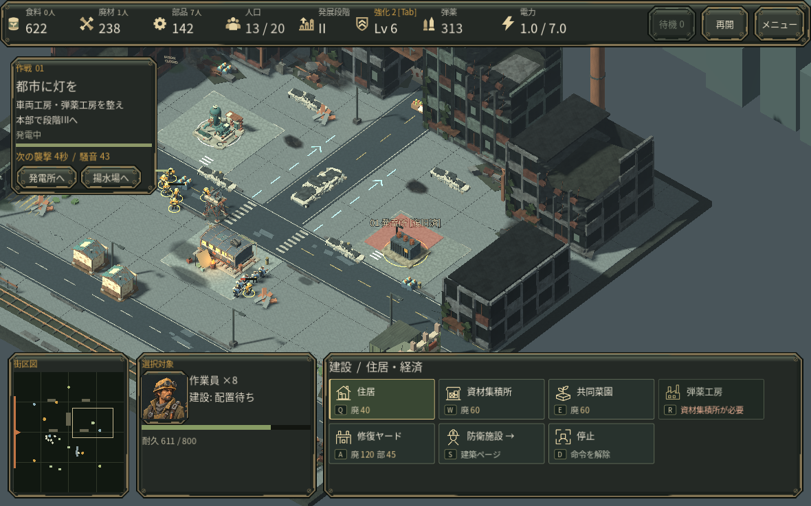
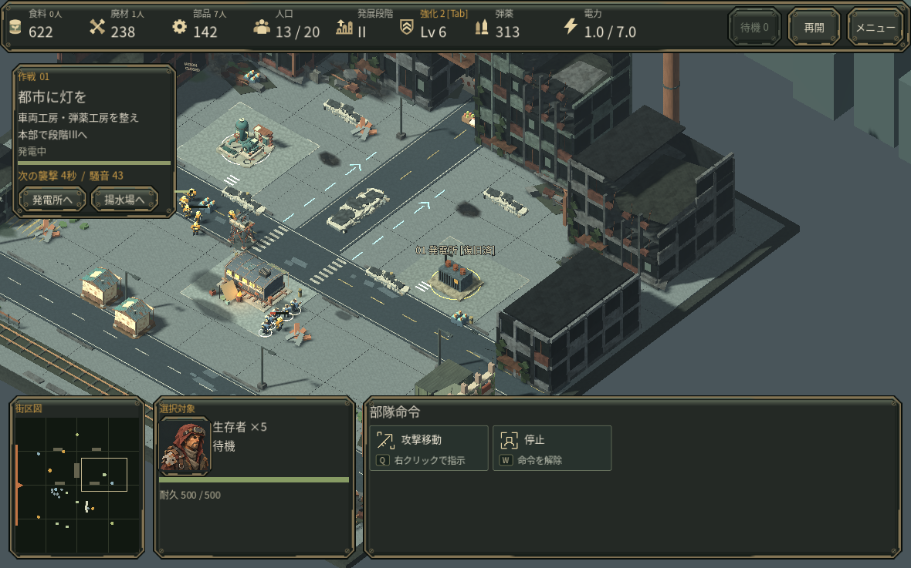

# 建設から防衛へ直接切り替える

住宅などの配置プレビュー中に C を押すと、作業員のまま切替を受け付けず、その後の右クリックも配置取消に消費されていました。数字の部隊グループでは直接切替できたため、操作の不整合でした。

C（戦闘班）、V（作業員）、H（本部）、.（待機作業員）で配置や攻撃移動の照準を解除し、対象を選択します。待機作業員ボタンも同じ扱いです。すでに支払った工事予約や部隊の実行中命令は取り消しません。

## 同じ保存と入力による実画面

V→Q（住宅）→C の同じ入力です。変更前は8作業員と配置待ち、変更後は5戦闘員と部隊命令になります。変更後の右クリックは実際に5人へ移動命令を出しました。停止時刻・備蓄は同一、既存建物と作業員の状態はJSON往復の微小な浮動小数誤差を除いて保持されています。

入力ディスパッチを通じ、建設/照準中の4キー、建設種類切替、Esc/右クリック取消、支払済み予約の保持、待機ボタン、モーダルと文字入力の遮断を確認しました。既存部隊グループの回帰も通過しています。テスト終了時に既知のObjectDB警告が出ますが、スクリプト/実行エラーはありません。

同じ0.34.1ベースの通常UIでは、新規作戦から内政・段階II・6人による発電所外周での復旧・起動まで確認しました。AI操作と戦術停止を含むクラウド上の検証です。人間の初見評価、実Web/macOS操作、実GPU性能、音の実聴は未確認です。
