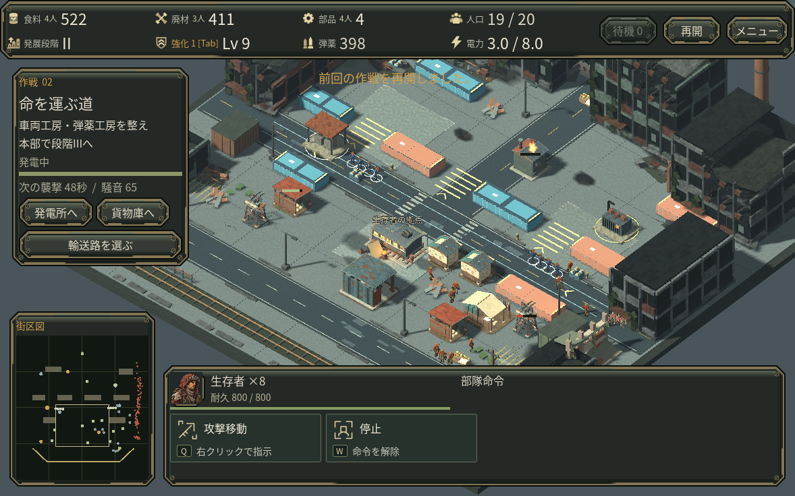
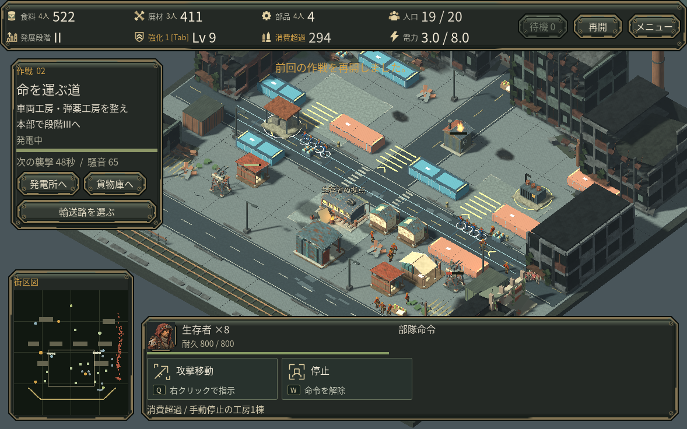
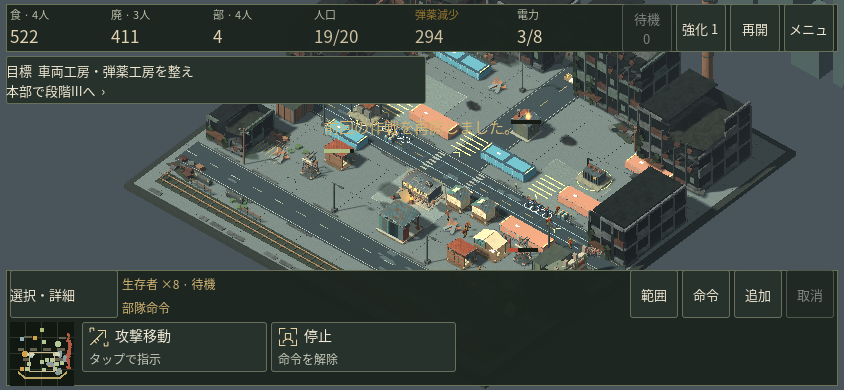
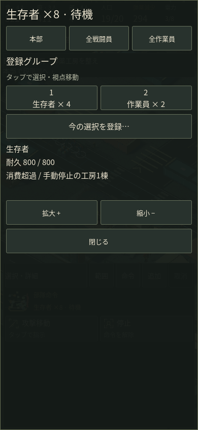
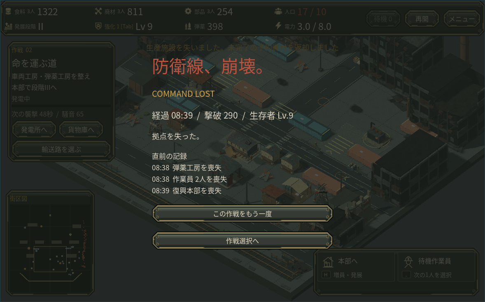
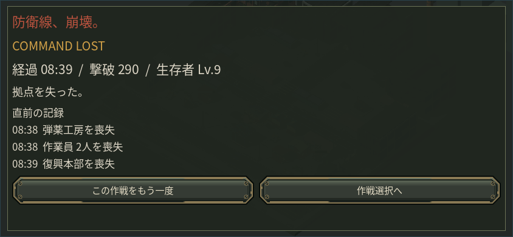
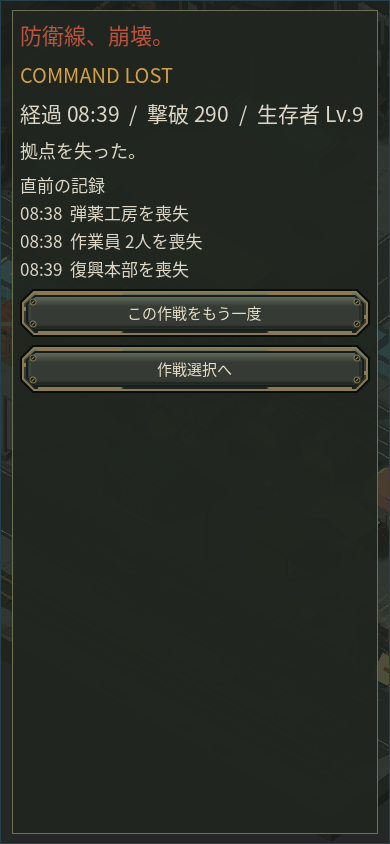

# 補給の状態と再挑戦

## 補給を読む

弾薬の数字だけでは、現在の戦闘で減り続けているのか、工房の補給が追い付いているのか分かりませんでした。通常時のHUDはそのままにし、継続的な消費超過だけを既存の弾薬見出しへ出します。PCでは「消費超過」、スマホでは弾薬の種類が分かる「弾薬減少」です。実際に予備弾で射撃した場合は「予備弾使用」と表示します。

戦闘部隊や弾薬工房の選択中は、既存欄に現在の工房状態も示します。スマホでは既存の「選択・詳細」で読めます。PCのコマンドにカーソルを合わせたときは、そのコマンドの費用や不足理由を優先します。新しい通知音・常時の収支表・自動選択は追加していません。

記録するのは上限400まで実際に補給された量、割引後に実際に使った弾薬、予備弾射撃です。購入や返金を生産として数えません。直近12秒を観測し、継続した消費超過を通常13秒目から表示、直近3秒で回復すれば解除します。これは残り時間の予測ではありません。保存再開後は新しい観測を始め、前の停止理由を持ち越しません。

現在の工房状態は別の事実です。たとえば「手動停止の工房1棟」は、その工房だけが過去の消費超過を引き起こしたという断定ではありません。

以下は同じ保存を背景に使った表示確認用の制御fixtureです。消費履歴と備蓄を設定して表示を比較しており、自然なプレイで不足が発生した証拠ではありません。

## 敗北前の事実を残す

敗北画面に、直前120秒の確定した施設・輸送隊・補給車・作業員の損失を最大3件表示します。近い時刻の作業員損失は人数にまとめます。未完成の施設は建設中と記し、少ない記録を無理に3件へ増やしません。故意の解体、退場前に回復した人物、推測した敗因は含めません。

記録は小さな有限配列として途中保存に含まれます。別作戦・別の再挑戦へ持ち越しません。通常の死亡処理と敗北確定時に記録し、敵の一撃ごとに新しい全体走査はしません。

以下は損傷を与える制御fixtureから、実際の死亡処理と敗北処理を通した画面です。スマホでは敗北画面に使える高さを確保し、横画面の再挑戦と作戦選択を横並びにしました。勝利後の街を見せるレイアウトは維持します。

## 確認範囲

- 同じ獲得済み保存を400固定ステップ進め、追加した履歴以外の全保存項目が一致しました。資源、位置、HP、乱数、成長、戦闘結果を変更していません。
- 実際の射撃・補給処理で、上限を超えた見かけの補給を数えないこと、割引後の消費、予備弾、ポーズと再読込を確認しました。
- 実際の解体・死亡・回復・保存・再開・同時損失・再挑戦の経路を検証しました。HP0の未除去人物を含む保存は既存の検証で拒否され、直前の正常保存が保たれます。
- クラウドのネイティブGodotで1178×736、844×390、390×844を描画しました。横画面の再挑戦ボタンをマウスで操作し、新しい作戦へ戻ることを確認しました。
- 画面の供給不足と敗北は制御fixtureです。AIの固定ステップ比較やマウスによるタッチレイアウト確認は、人間初見・実スマホ・実Web・Mac・実GPU・音の実聴の代わりではありません。
- 少量の状態記録と表示処理が増えています。実行時性能の改善や負荷ゼロは主張していません。既存の終了時ObjectDB警告は原因未確定です。

一次資料の適用は[設計資料](DESIGN_REFERENCES.md)、承認済みの大きな改善範囲と未採用試作は[品質改善計画](QUALITY_ROADMAP.md)に記載しています。
