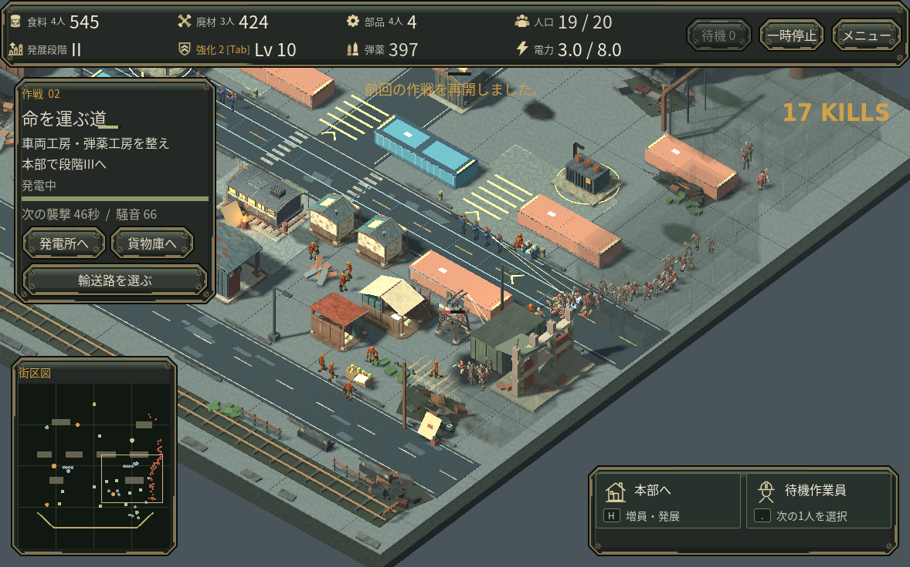

# 通常感染者の足を接地させる

歩いている上体に対して、地面に置いたはずの足が滑っていました。元のポーズを実際の移動距離に重ねると、左足の接地区間で約28cmの滑りを確認できました。通常倍率で使う低詳細モデルでも同じ問題がありました。

歩行ポーズだけを制作段階で修正しました。接地中は足をその場に残し、左足は長く体重を支え、右足は低く戻す非対称な歩行です。同じ区間の直進時の滑りは1mm未満になりました。モデルの移動速度、攻撃時刻、判定は変えていません。ランタイムの骨/IK処理も追加していません。

## 同じ実戦・同じカメラ

[変更前の4秒映像](media/support_gait/before_offline40fps.mp4) / [変更後の4秒映像](media/support_gait/after_offline40fps.mp4)

これは同じ第2作戦の保存、同じカメラサイズ42、実際のゲーム更新処理で出力した比較です。映像は40fpsのオフライン出力で、実行環境がリアルタイム40fpsだったという意味ではありません。クラウドのソフトウェアGPUで約28秒/27秒かけて4秒分を記録しました。

通常倍率の確認では足・膝の破綻や極端な屈みは見つかりませんでした。変化は小さなキャラクターの姿勢に現れます。細かな切替時の滑らかさや人間の主観評価は未確認です。4秒進めた全セーブ項目は変更前後で一致し、兵は実際に近接攻撃も受けています。

## 範囲と限界

- 歩行時の腰を約9cm下げ、膝を曲げた支持姿勢にしています。通常感染者が対象で、生存者・疾走体・重装感染者の新モデルを追加する変更ではありません。
- 32ポーズ、近景3337/遠景520三角形、共通描画方式、素材とUV対応を維持しています。描画速度の改善は主張しません。
- 立ち/攻撃/死亡の書出しにはごく小さい丸め差があり、完全に同一のバイト列ではありません。位置差は0.5マイクロメートル未満です。
- 接地評価は形状からの推定で、体重/力学のシミュレーションではありません。曲がる時の擦れや、意図した低い足の戻しは残ります。
- 実スマホ/Web/Mac・実GPU・音の実聴は引き続き未検証です。

制作元と詳細な測定は[編集可能な歩行生成処理](../art_source/infected_reconstruction/source/support_gait.py)と[測定報告](../art_source/infected_reconstruction/SUPPORT_GAIT_REPORT.md)にあります。Godotの[root motionの説明](https://docs.godotengine.org/en/stable/tutorials/animation/animation_tree.html)とEpicの[distance matching](https://dev.epicgames.com/documentation/en-us/unreal-engine/distance-matching-in-unreal-engine)を参照しました。移動距離で位相を進める既存処理は維持し、その位相に合っていなかった制作側の足の軌道を直しています。
