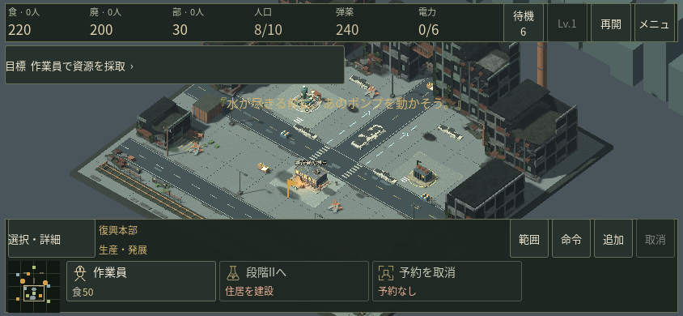
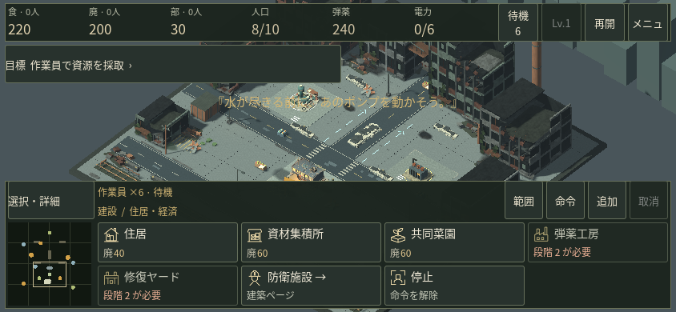
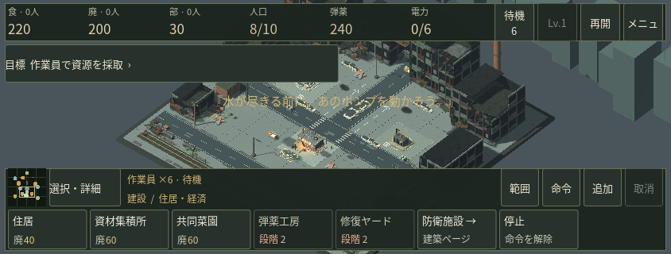
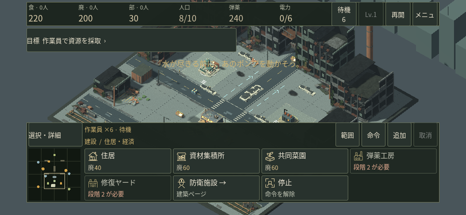
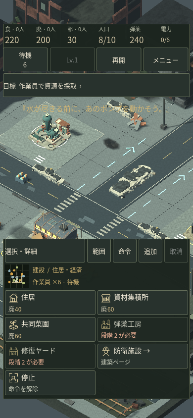
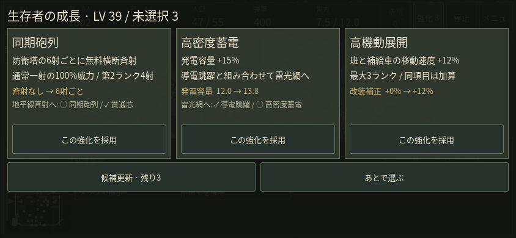
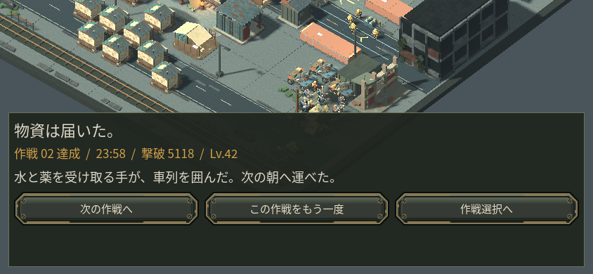

# タッチ操作と生存者の動作

タッチ画面では選択・採取・建設・生産・部隊指示・成長選択・保存・再開を画面から操作できます。タップで選択と指示、ドラッグで視点移動、2本指でズーム。「範囲」で囲み選択、「命令」で護衛・修理や集合地点、「追加」で作業予約、「取消」で入力モードを解除します。選択詳細から全作業員・全戦闘員・本部・ズームへ、目標欄から施設・輸送操作へ進めます。

スマホ向け入力と画面を実装した開発版です。実iPhone/Safari・Android端末での起動、性能、音の実聴、人間の初見操作は未検証です。以下はクラウドのネイティブGodot描画と、マウスからタッチを生成した操作検証です。実端末の確認とは区別してください。

## 画面と実操作

844×390の実画面で、本部から作業員2人を生産予約、待機作業員の選択、食料採取と搬入、住宅建設完了、人口8/10から10/15への変化を確認しました。部隊の攻撃移動、範囲選択、カメラ移動、メニューで保存してタイトルから再開も実行しています。ゲーム操作にはタッチ用ボタンとマウスからのタッチ入力を使い、画像保存だけF12を使いました。

獲得済みの第2作戦保存から成長候補を開き、蓄電の選択で発電容量12→13.8を確認。輸送路を選んで達成へ進みました。初期の結果画面は幅が潰れていたため、見出しと結果を縦に並べ、次の作戦へ進むボタンを修正。別の同じ獲得済み保存の通常命令による再生でも達成画面を描画し、「次の作戦」から第3作戦へ進めました。全キャンペーンをスマホ操作で通したという意味ではありません。

長いメニューでは、子ボタンがドラッグを止めていた問題を直しました。ボタン上からスクロールしても購入や発電切替を誤実行せず、普通のタップは働きます。ブラウザ中断・タッチ取消・複数指・画面回転時には保留中の入力を捨て、次の操作へ戻せます。Godot4.6 Webがtouchcancelを通常releaseとして送る仕様に合わせた処理を含みます。[公式資料と実装上の注意](MOBILE_TOUCH_RESEARCH.md)。

## 通常モーション

[以前の6秒比較](media/v37_survivor_before_offline.mp4) / [新しい6秒比較](media/v37_survivor_after_offline.mp4)

歩行の周期を実際の移動距離に合わせ、小さな位置調整では大きく足踏みしません。射撃は狙いを保った反動に変更し、毎発の大きな装填動作をやめました。作業員は採取量や建設・修復進捗が増えたときに道具を動かし、資源切れ・支払い待ち・修理資材不足では止まります。

比較は通常ズーム54の9人を描画した専用シーンです。6分割の共有モデルと描画バッチを維持し、銃口の8方向整合をネイティブ描画から確認しています。近距離では簡素な関節構成が分かります。動画の30fpsはオフライン出力仕様で、実行FPSの測定ではありません。

## 確認範囲

PCの地図命令・選択切替・部隊グループを回帰確認。移動/射撃/成長の81時点比較では、表示専用乱数と弾道表示原点を除く保存状態、ゲーム乱数、カード乱数が一致しました。[比較結果](measurements/v37_gameplay_invariance.json)。敵数、威力、射程、攻撃間隔、資源量を減らした軽量化ではありません。

ネイティブ描画環境はLinuxクラウドのMesa llvmpipeです。実スマホGPU性能やブラウザのメモリ余裕、Safariの中断・音声再開は未確認。Webは従来どおり単一スレッド・PWA無効です。PCのマウス/キーボード表示は保持しています。
