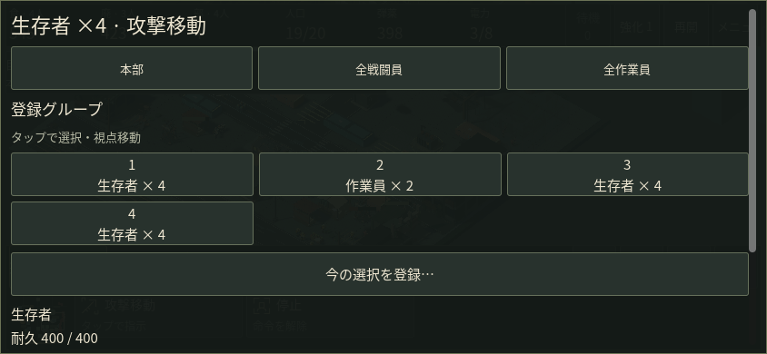
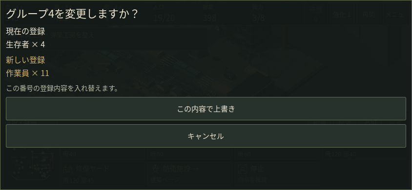
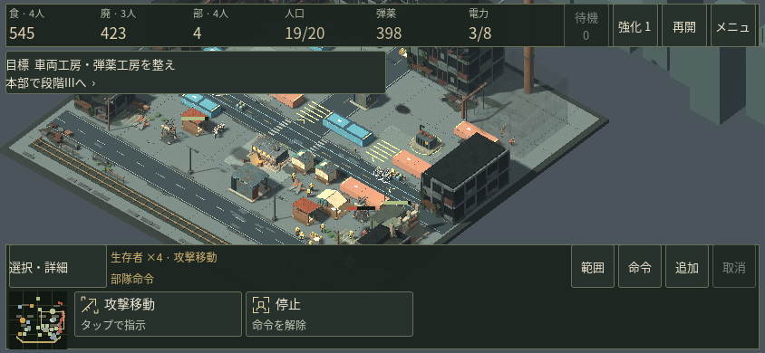

# 内政から同じ部隊へ戻る

タッチの「選択・詳細」から、部隊や建物を番号に登録し、後で呼び戻せます。呼出では選択と視点移動を同時に行います。PCのCtrl+1〜9／1〜9と同じ登録内容を使い、保存して再開しても残ります。

常時HUDのボタンは増やしていません。登録済みの枠だけを選択画面へ表示し、本部・全戦闘員・全作業員は上段へ配置しています。登録先9枠は別の一覧で選びます。空き枠はそのまま登録、既存枠は旧・新の内容を確認してから変更できます。

## 同じ戦闘場面の比較

獲得済みの第2作戦保存を変更せず読み込み、左4人・右4人を別々に指揮しました。採取班の実際の被弾を確認し、地図で本部へ戻り、作業員選択、住宅配置の取消、射程強化を経て右側の同じ4人へ戻っています。

以前はもう一度範囲を囲み、混ざった作業員を「戦闘員だけ」で外す必要がありました。登録後は「選択・詳細」→登録枠の2タップで同じ4人を選び、その位置へ戻れました。

保存・プロセスの再起動後にも同じ4人を呼出。作業員11人でその枠を変更しようとした際、確認画面を取り消すと元の4人を保持しました。19人の状態・資源・強化は従来の同じ操作結果と一致し、追加されたのは登録と呼戻し先の視点です。[確認結果](measurements/v38_touch_group_flow.json)。

この操作確認はクラウドのGodotにマウスからタッチを生成したものです。観察のため自然な被弾時に検証用の一時停止を入れています。実ゲームへ自動停止機能を加えたものではなく、人間の反応速度や実スマホの使いやすさを証明するものでもありません。

## 保存・入力の確認

既存の保存形式と部隊処理を再利用。死亡した隊員を除外し、建物も登録できます。変更確認の間に対象が変わった場合は内容を再表示します。タッチ用ダイアログ中にキー操作で部隊を変更したり、成長画面を重ねたりしないようにしました。Escapeで閉じた後は元の一時停止状態へ戻ります。

PCの部隊キー、タッチの命令、モーダル、保存再開を限定して回帰確認しています。通常モーションやv0.37の画面配置は保持。別途試したスマホ用描画省略は計測で悪化したため含めていません。

実iPhone/Safari・Android端末・実GPU性能・実聴・人間の初見評価は未確認です。この保存点は開発候補であり、配布／公開の完了を示すものではありません。
