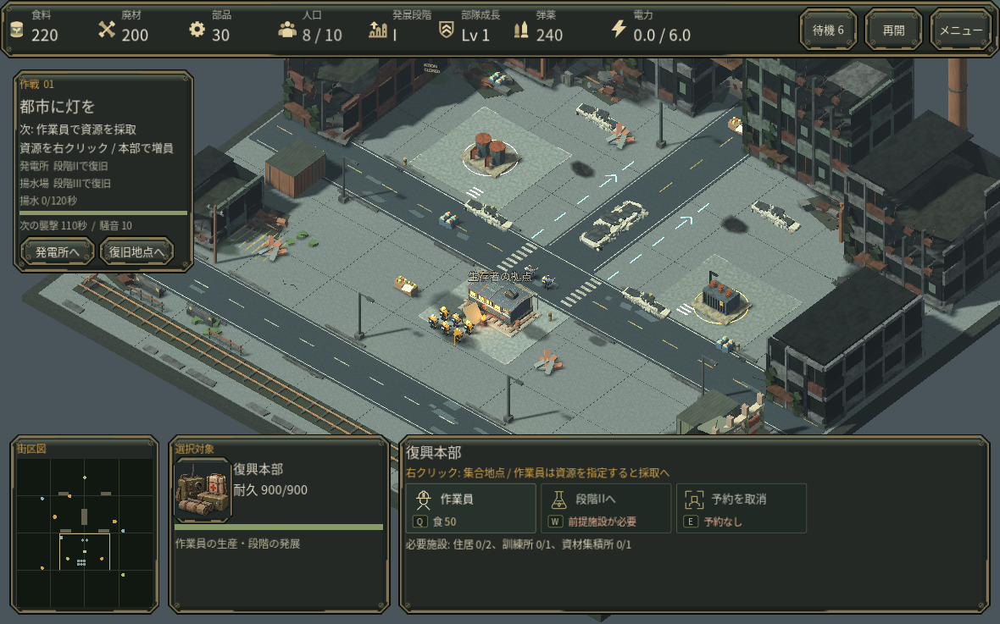
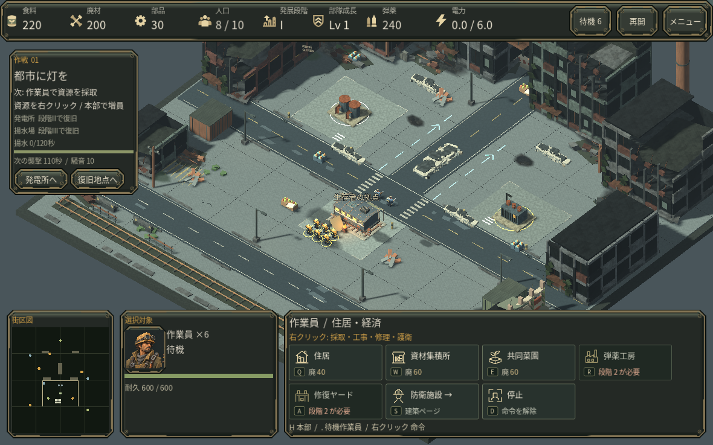
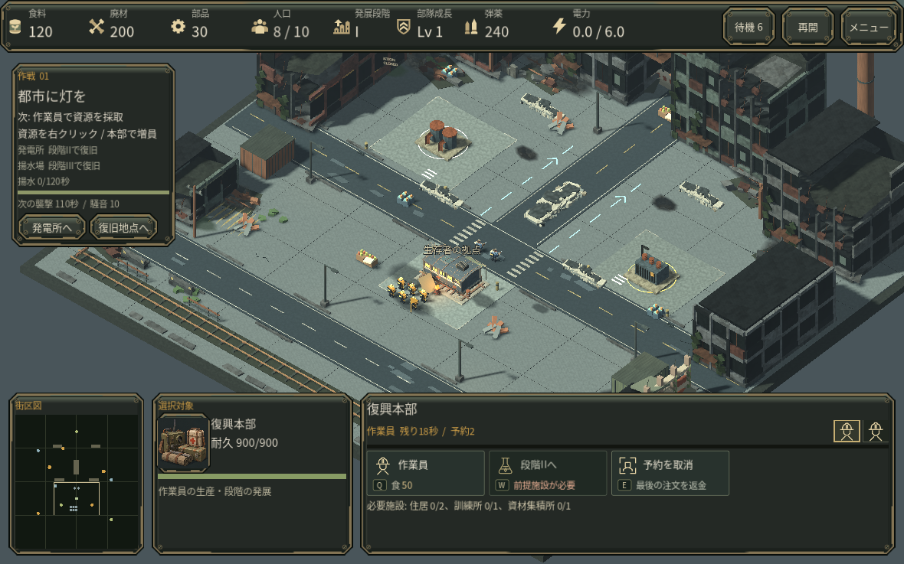

# 0.10 操作画面の読みやすさ

## 修正した原因

旧上部バーは、日本語の資源名を日本語グリフのない欧文フォントで描いていた。OS側の代替字体が使える環境では見えても、Web配布では保証されない。資源を8種の独自SVGと同梱日本語字体に分け、上部の日本語への欧文フォント指定を廃止した。欧文表示にも同梱日本語字体をフォールバックとして明示した。

## 画面

- 資源・人口・発展段階・部隊成長・弾薬・電力を固定位置に配置。形の違うSVG、意味のある日本語名、大きい数値で読む。
- 選択欄には対象の名前、肖像、耐久、役割・現在の命令のみを表示。全体の弾薬・電力・XPは混ぜない。
- 行動は4列の大きなタイル。名称、キー、費用を分離し、費用は食・廃・部の文字補助を付ける。不足する金額は赤、段階・施設条件はタイル内に表示。
- 本部では発展に足りない施設名と現在/必要数を常時表示。ホバーすると他の行動も詳しい条件と費用を確認できる。
- 生産中の名前・残り時間・進捗と予約アイコンを施設ごとに表示。人口上限など停止理由も同じ場所に表示する。
- 現在の行動を目的欄の上に配置。街区図を明記し、保存・作戦選択・設定はメニューへまとめた。

## 参照

公式の[Age of Empires II 操作・資源ガイド](https://www.ageofempires.com/learn-to-play/control-resources-aoe2/)と、公式の[資源バー画像](https://cdn.ageofempires.com/aoe/wp-content/uploads/2021/06/Resource-Bar.webp)、[選択欄画像](https://cdn.ageofempires.com/aoe/wp-content/uploads/2021/06/Selection-Bar.webp)を比較した。資源の固定配置と対象別の情報/命令という仕組みを参考にしており、画像やUI素材を流用していない。タイル、配色、隊列、目的表示は本作の設計。

## 確認

- Godotの実ゲーム画面1180×812ウィンドウ（ゲーム領域約1180×737）で、開始時、本部予約、作業員の建築2ページ、資源不足、完成した訓練所、メニュー開閉を確認。新規の通常初期資源で予約・建築・完成まで操作した。
- 92項目のUI回帰と、1,190文字分の同梱字体チェック、8種のSVG読込、タイル内の文字・費用幅を確認。既存65項目の選択/生産と9項目の実移動経済回帰、および自己テストも通過。
- 検出した迫撃車の予約アイコン欠落、メニューの重複生成による停止状態の破損を修正した。
- Mac実機やブラウザー上の描画・音・保存を確認したという意味ではない。今回の変更で全作戦の通し試遊や新しいGPU性能測定は行っていない。

実行例: `godot --headless --path . --script res://tests/check_v10_ui.gd`

## 実画面

