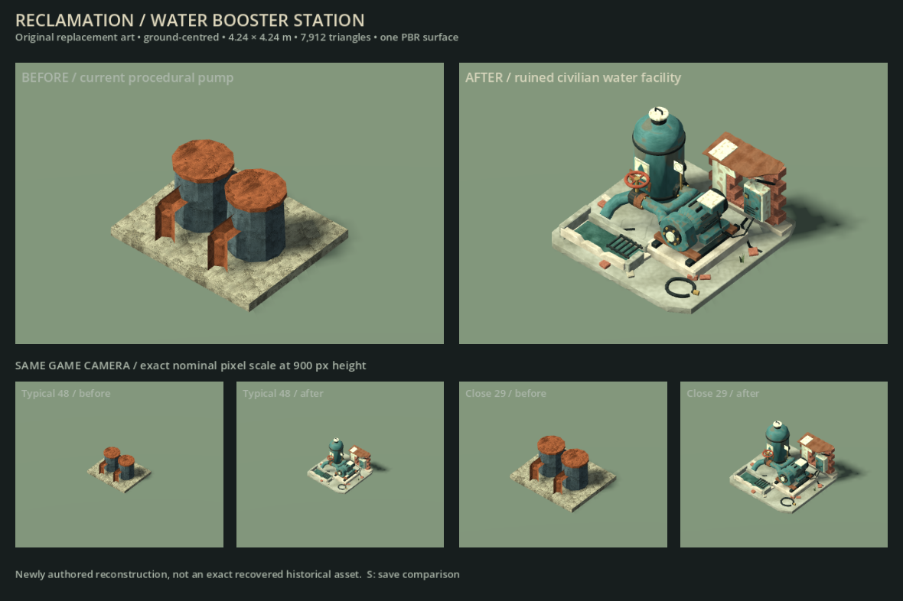
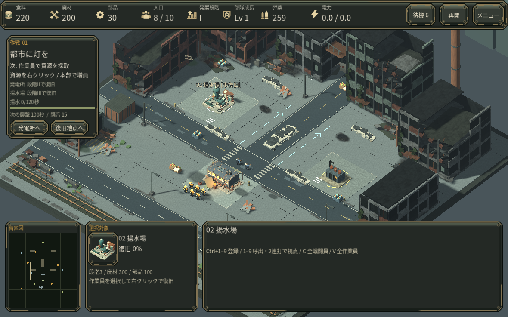

# 復旧する給水設備

第一作戦の給水設備を、二本の簡易円筒から圧力タンク、露出したポンプ、赤い弁、補修配管、壊れた管理壁を持つ専用モデルへ変更しました。選択欄の画像も実際のモデルから描画しています。第三作戦の中央送電設備には変電設備の外観を使います。

## 確認した範囲

Godot 4.6.3 の実描画で通常の俯瞰視点と選択操作を確認しました。復旧時と保存再開時の表示、作戦ごとの設備外観、配置と移動グリッドが変化しないことを制御した試験で確認しています。この試験は通常資源での作戦通しプレイではありません。描画環境は Linux / Mesa llvmpipe で、実 GPU・macOS・Web の動作や性能を保証するものではありません。

## 制作

Blender の編集可能な原型と生成スクリプトを `art_source/water_station/` に収録しました。近距離モデルは 7,912 三角形、1メッシュ・1マテリアルです。遠距離表示用の LOD を利用します。形状・表面画像はこの作品向けのオリジナル制作です。詳細は [出所の記録](../licenses/Water-Station-Provenance.md)を参照してください。
