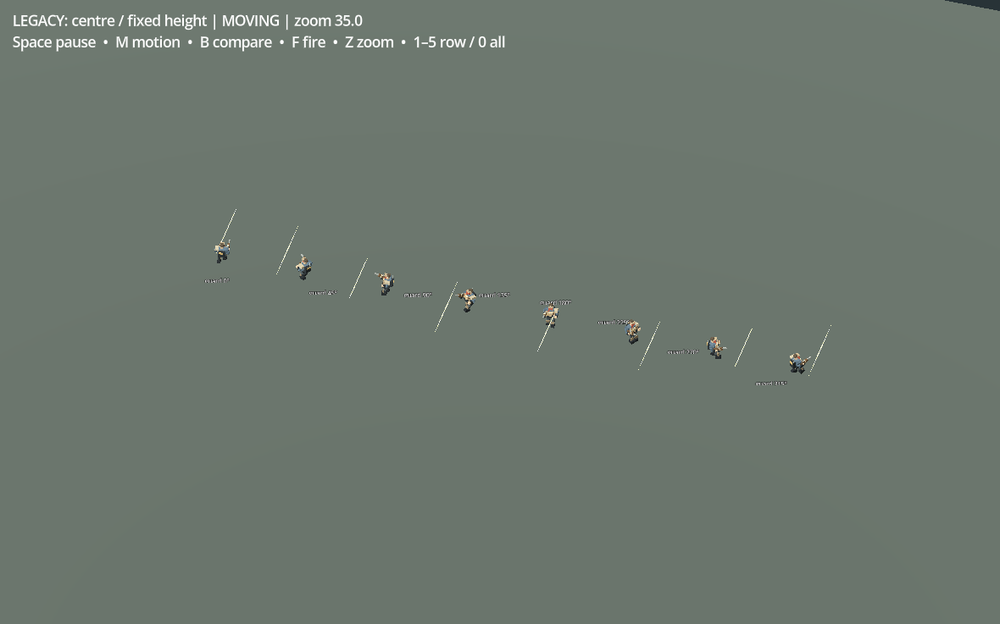
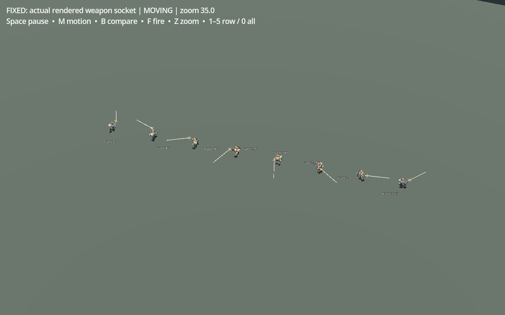

# 銃口から照準方向へ撃つ

「銃撃が変な位置から出る」という報告には、二つの原因が重なっていました。生存者と爆薬手は体の中心に固定高さを足した位置から発光し、実際に描画される腕・反動・移動補間を使っていませんでした。また、弾道を表す細長い立方体の伸縮が世界の軸に掛かり、射手が別方向を向いても線が同じ斜め向きへ伸びていました。

銃口は描画と同じ本体・右腕の変換から求め、短い閃光と弾道の射手側を追従させます。煙と砲弾は初めに銃口へ置いた後で離れます。防衛塔の二連銃口、迫撃砲、砲車も実モデルの先端を使用します。弾道の長さは局所軸に沿って伸ばし、実メッシュの両端が銃口と狙った位置に一致するよう修正しました。[Godot公式のBasis資料](https://docs.godotengine.org/en/stable/classes/class_basis.html#class-basis-method-scaled)で、世界軸と局所軸の伸縮の違いも確認しています。

同じ時刻・配置・カメラで、5兵器と8方向、停止姿勢と移動姿勢、広域と近景をクラウドの実描画で比較しました。この配置比較は検証用sceneで、通常プレイの画像ではありません。最初の修正では銃口だけ直り弾道の傾きが残ったため、その画像を根拠に再修正しています。最終的な実メッシュ端点の最大誤差は0.000000584mでした。

[通常操作で到達した戦闘保存の8秒再生](media/v34_ordinary_muzzle_defense_offline.mp4)でも、二人の射手から敵へ線がつながり、7体を倒す様子を確認しました。この無音クリップはGodot MovieWriterの30fpsオフライン記録で、実行速度の証拠ではありません。位置や敵を作り替えた保存ではありません。

ゲーム用の射撃原点・射程・威力・弾薬消費・敵数は維持しています。[同条件の実発砲比較](measurements/v34_muzzle_gameplay_comparison.json)でダメージ、弾薬、発砲時刻、乱数が一致しました。飛行中の視覚上の発射位置も保存・復元し、再開で弾が体の中心へ戻る副作用を防いでいます。新しいFX描画バッチは追加していませんが、実GPUや実ブラウザでの性能向上を確認したものではありません。

一部の短いheadless/録画fixture終了時には既存のObjectDB/resource終了警告が残ります。Mac・Web実プレイ、人間の初見評価、音の実聴は未確認です。
