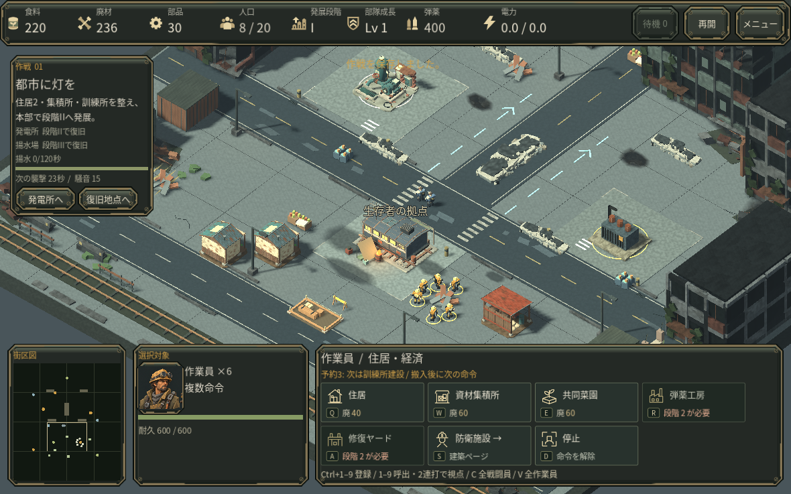
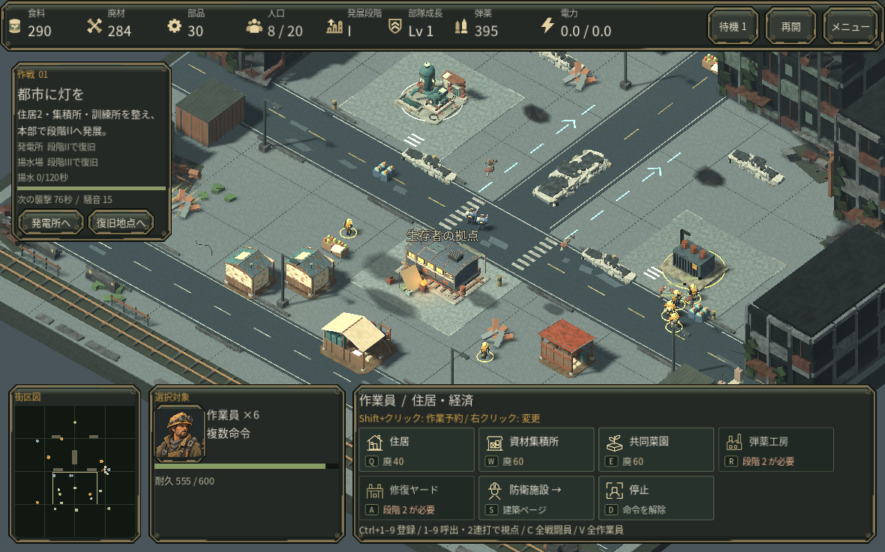

# RECLAMATION v0.26 — 作業員の連続命令

建設を順番に進め、そのあと採取へ。作業員に次の仕事を予約できるようになり、作業が終わるたびに指示し直す手間を減らします。

- **Shift＋右クリック**で、移動・建設・修理・採取を作業員ごとに最大16件予約できます。
- **建物の配置中にShift＋左クリック**すると建設を予約し、同じ建物のプレビューを残して続けて配置できます。費用は配置した1棟につき一度だけ支払います。Escか右クリックで、未配置のプレビューだけを取り消せます。
- 採取中に次の仕事を予約すると、次の搬入を終えてから切り替わります。予約から始めた採取は、その資源を実際に採取・搬入してから次へ進みます。建設・修理の予約が終わると元の採取に戻り、別の採取先を予約した場合はその指示を優先します。
- **通常の右クリック命令や通常の建設配置は、現在の命令と予約を置き換えます。**「停止」は予約も解除しますが、運搬中の資源は失いません。支払済みの基礎も残るので、取り消す場合は解体を使ってください。
- 画面下で現在の命令、予約件数、次の仕事を確認できます。予約・支払済みの基礎・運搬中の資源は途中保存からの再開時にも引き継ぎます。

対象は作業員です。混成選択の戦闘員にはShift予約を適用しません。護衛・復旧設備の予約と、護衛中の作業員への予約は未対応です。経路線は現在の仕事だけを表示します。失われた予約先や完了済みの建設は飛ばしますが、通路・作業場所が塞がれた仕事は待機し、搬入できない場合も資源と予約を保持します。

## 実操作の確認

Godot 4.6.3のクラウドLinux版を、通常のマウス・キーボードと初期資源で操作しました。6人に住宅2棟→集積所→廃材採取を予約し、軍を動かしている間に全て完成して採取へ移行しました。続けて廃材の搬入→訓練所→食料採取・搬入→部品採取が、追加指示なしで進むことを確認しました。

保存してプロセスを閉じた後も予約と運搬量を保持しました。1人の停止と別の1人への通常指示はその人だけの予約を解除し、残り4人は予約を続けました。複数人の共通予約が個別扱いで表示される問題も、この操作で修正しました。

予約は安全な経路や護衛を保証しません。部品場へ進んだ作業員は敵の接近で攻撃を受け、防衛判断は引き続き必要でした。

キューの課金・取消・搬入・到達不能・破壊済み対象・保存検証と、関連する経済・戦闘操作をヘッドレスで確認しています。今回は序盤の操作評価であり、全3作戦の再通し、初見の人間による使いやすさ評価、実GPU・Mac・Webの実行と音声の実聴は未確認です。画面はソフトウェア描画で、性能測定ではありません。
