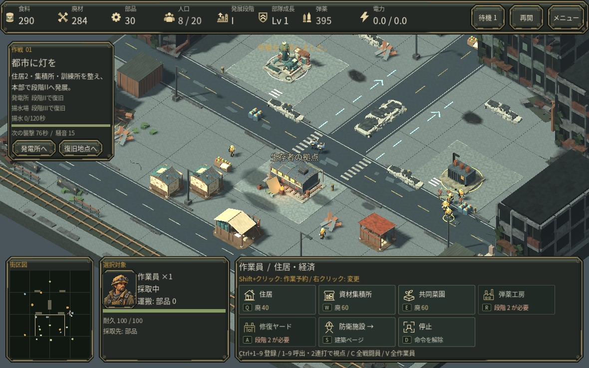
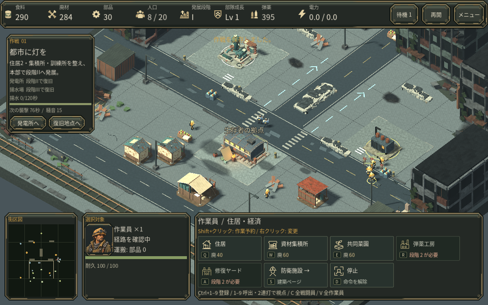
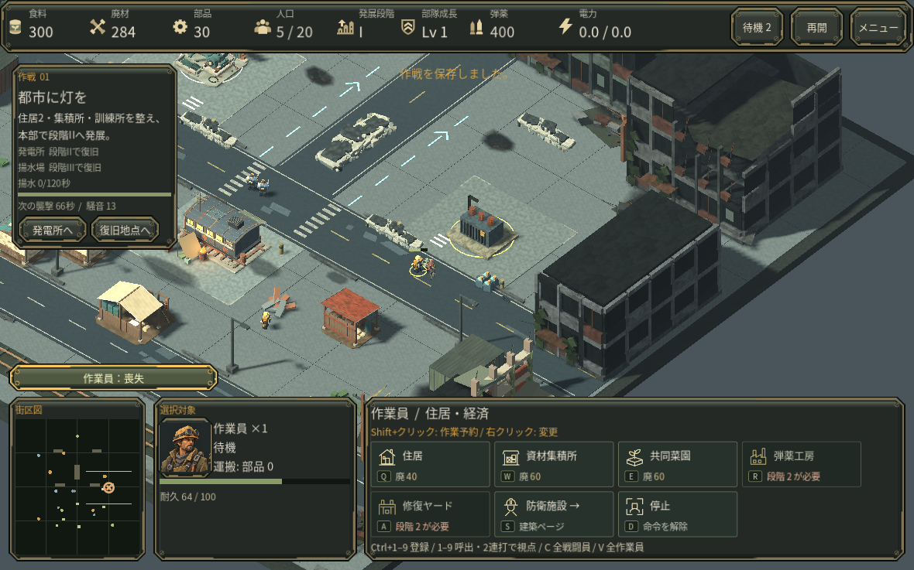

# 大群の近くでも作業員へ指示する

感染者の近くを右クリックしたとき、作業員だけを選択していても敵の判定が命令を打ち切り、採取を続ける問題を修正しました。戦闘員の集中攻撃は保ち、作業員だけの通常指示やShift予約は既存の移動・採取・工事判定へ進みます。

## 同じ場面での比較

通常操作から得た第一作戦128.3秒の保存を、修正前後それぞれ別プロファイルへ読み込みました。カメラ・選択対象・クリック位置を揃え、部品場で感染者に近い地面を右クリックしました。修正前は採取命令のまま、修正後は移動命令へ変わり、時間を進めると実際に移動しました。

## 採取場への攻撃を見つける

既存の攻撃通知と地図の位置表示を作業員にも適用しました。通知をクリックすると現場へ視点を移し、選択と命令は変えません。生きている作業員なら現在位置、失われた場合は最後の位置を示します。警告の表示・音の間隔制限と本部の優先度を保ちます。

比較では指示した作業員が移動し、採取を続けた別の作業員は攻撃で失われました。命令の受理と危険の発見を改善するもので、自動防衛や安全な退避先を保証する仕組みではありません。

確認はクラウドLinux版の通常操作と限定した回帰試験です。初見の人間による評価、実GPU・Mac・Webの実行、音声の実聴は未確認です。
