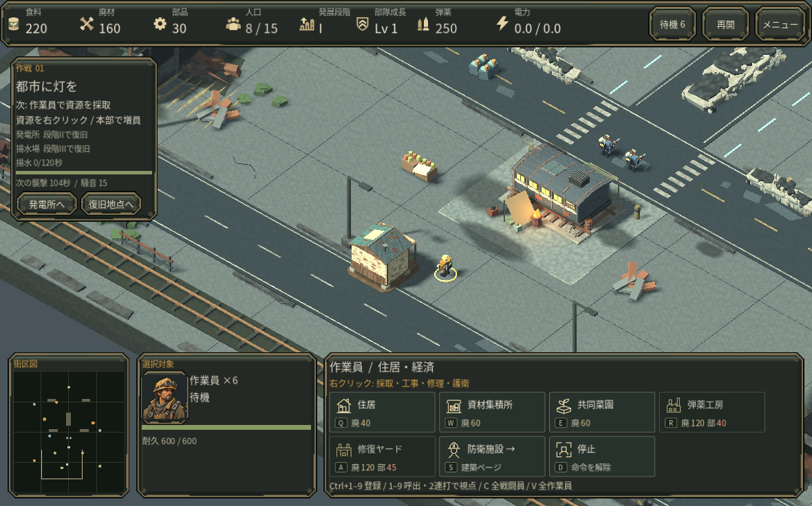
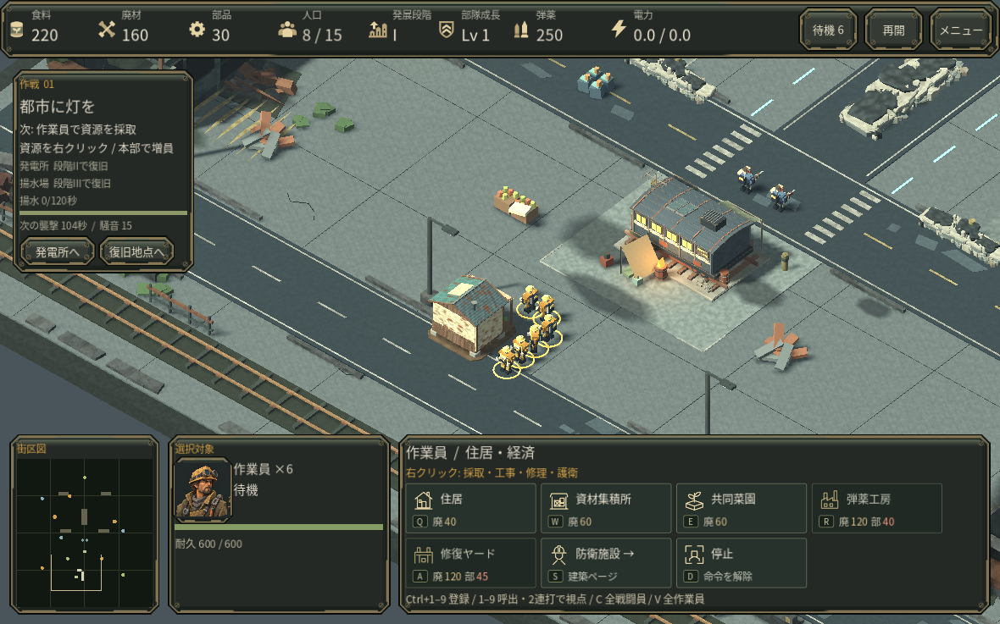

# 建設・修理・集合地点での部隊配置

6人の作業員が同じ場所へ重なり、1人に見えて個別に選びづらい問題を修正した。建設と修理では実際に到達できる施設の外周を一人ずつ確保し、空きがなければ待機する。場所が空けば通常の移動で進む。移動速度、資源費用、建築速度は変更していない。

建設完了・対象消失・新しい命令・死亡で不要な予約を解除する。作業場所を待っていた人も、完了した建設へ歩き続けず、以前の採取仕事か待機へ戻る。保存には通常の位置と命令を保存し、再開後に作業位置の予約を再構成する。

生産した生存者・爆薬手・迫撃車も集合地点の近くで別の空き位置へ向かう。作業員の資源を指定した集合地点は引き続き自動採取に使う。これは目的地の分散であり、移動中の全面的な衝突回避機構ではない。

## 同じ命令による比較

同じ個別移動命令で6人を集合させ、通常の費用を払って住居を建てる制御場面を使用した。座標の直接代入、無料資源、瞬間移動は使っていない。両画面の視点と拡大率は同一。

クラウドのネイティブGodot実行で比較し、修正後は北側と南側の別の人をクリックして一人ずつ選択できることも確認した。この比較は制御された建設場面であり、キャンペーン達成の証拠ではない。

## 検証

一人分しか空きのない外周での待機と解除、到達不能な封鎖、予約解除、実際の有料建設・修理、保存再開、完成・破壊時の作業員復帰、兵士の生産と集合地点を確認。経路探索は従来の論理ステップ当たり8回の上限を共有し、空き待ちだけで探索を繰り返さない。

試験: tests/check_work_positions.gd、tests/check_work_positions_integration.gd。画面比較: tests/review_work_positions.gd。各実行は独立したテスト用ユーザーデータで行う。

実GPU、macOS、Webでの操作と初見プレイヤー評価は未確認。クラウド画面はllvmpipeで、音声はDummy出力。
